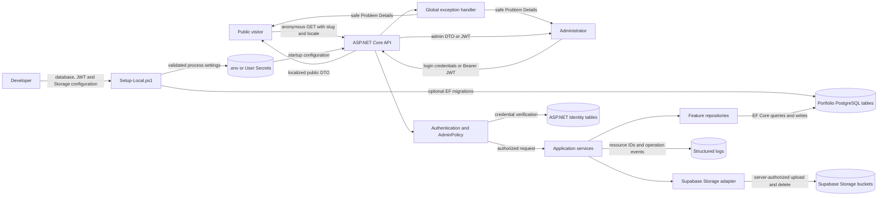
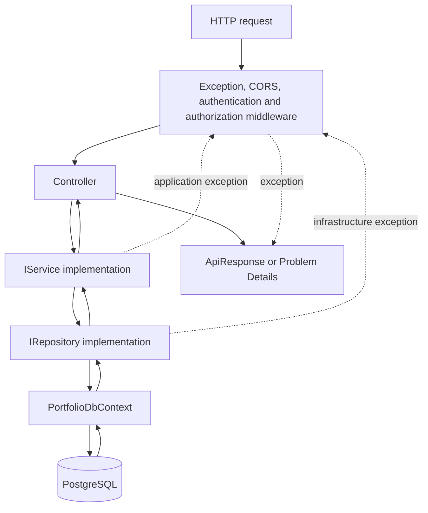
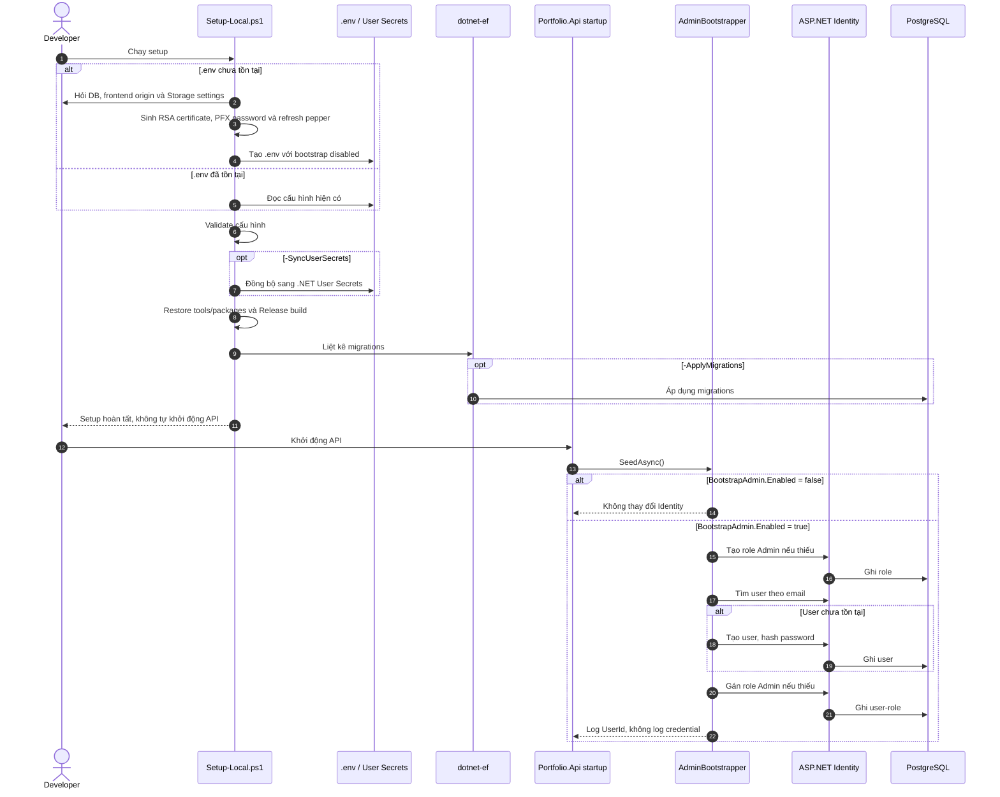
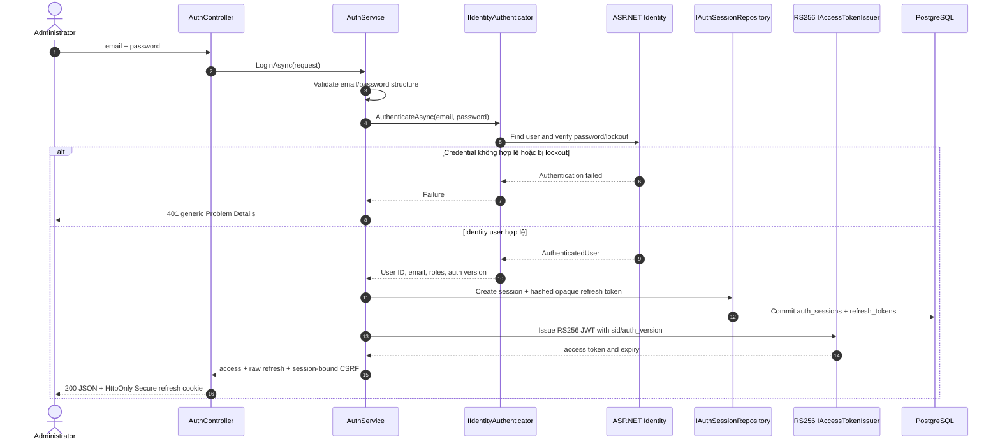
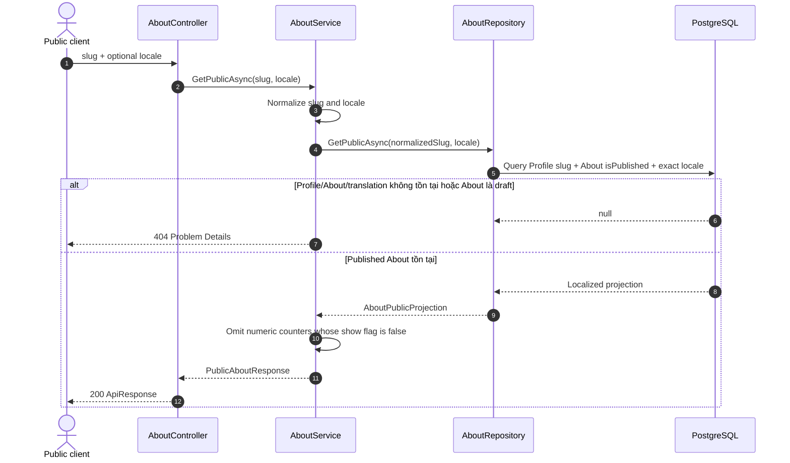
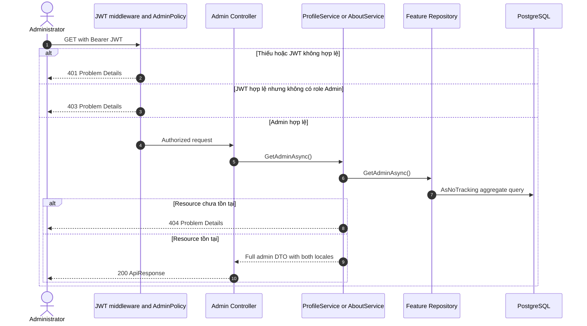
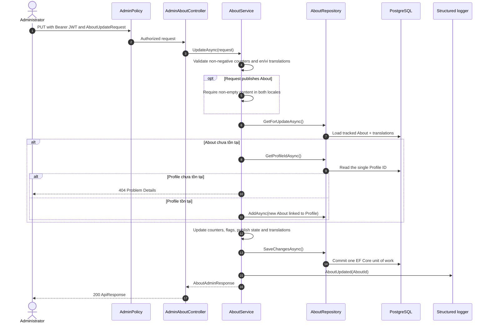
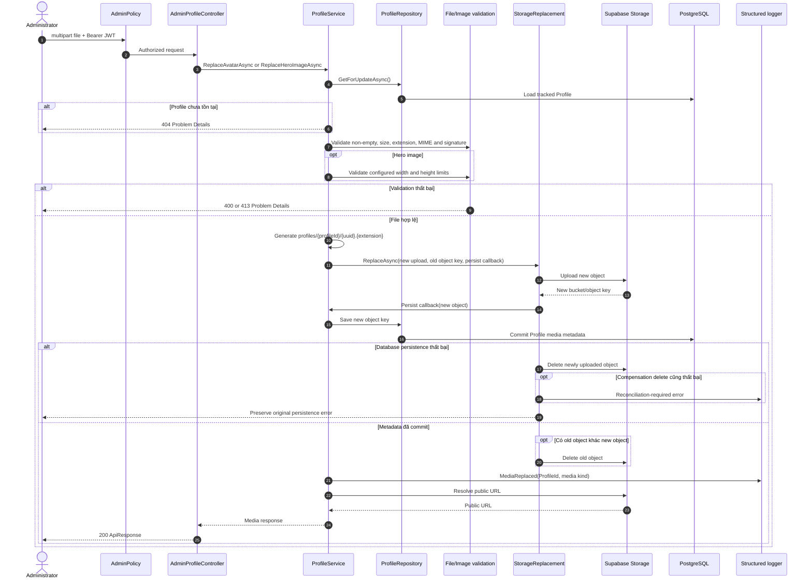
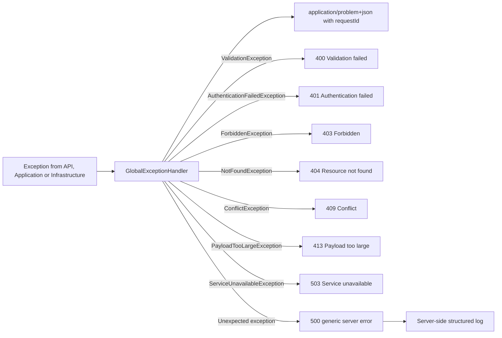

# CG03 AboutMe — Luồng xử lý hiện tại

Để học cách tự triển khai một feature Controller–Service–Repository, xem [Backend Onboarding Guide](NEW_MEMBER_BACKEND_GUIDE.md). Chi tiết Identity tables, Admin bootstrap, login và JWT nằm tại [Authentication Guide](../security/AUTHENTICATION_GUIDE.md).

## 1. Phạm vi

Tài liệu này mô tả hành vi đang được triển khai trong backend đến hết Sprint 2:

- thiết lập local, migration và bootstrap tài khoản Administrator;
- đăng nhập Administrator và phát hành JWT;
- đọc/cập nhật Profile và Social Links;
- đọc/cập nhật About;
- thay thế Avatar và Hero image;
- xử lý lỗi tập trung và ranh giới dữ liệu nhạy cảm.

Nguồn đối chiếu:

- `scripts/Setup-Local.ps1`;
- `src/Portfolio.Api/Program.cs` và các Controller;
- `src/Portfolio.Application/Authentication`, `Profiles`, `About`;
- `src/Portfolio.Infrastructure/Authentication`, `Persistence`, `Storage`;
- `docs/api/API_CONTRACT.md` và `docs/STORAGE.md`.

Các phần Skills, Experiences, Projects, Certificates, Resumes và Contacts có hợp đồng trong `API_CONTRACT.md` nhưng chưa thuộc luồng runtime Sprint 2 nên không được mô tả như chức năng đã hoàn thành ở đây.

## 2. Data Flow Diagram — mức hệ thống



### Quy tắc dữ liệu tại các ranh giới

| Ranh giới | Dữ liệu được phép đi qua | Dữ liệu không được trả/log |
| --- | --- | --- |
| Public API | Published content, đúng locale, contact fields được cho phép | Draft, locale khác, hidden email/phone, object key, secret |
| Admin API | DTO quản trị sau khi JWT có role `Admin` được xác thực | Password, signing key, Storage service-role key |
| PostgreSQL | Entity và object key bền vững | Signed URL tạm thời |
| Supabase Storage | Bucket, server-generated object key, file bytes | Client-supplied storage path |
| Structured logs | Request/trace ID, resource ID, loại thao tác | Nội dung Profile/About, password, JWT, file bytes |

## 3. Luồng kiến trúc request



Controller chỉ xử lý HTTP/model binding. Business rules nằm trong Service. EF Core và SQL nằm trong Repository. `CancellationToken` được truyền xuyên suốt chuỗi gọi.

## 4. Setup, migration và bootstrap Administrator



### Điều kiện vận hành

1. Bootstrap mặc định tắt và setup script không trực tiếp tạo tài khoản.
2. Identity tables phải tồn tại trước khi API bootstrap user; database mới cần chạy migrations.
3. Sau lần bootstrap thành công phải đặt `BootstrapAdmin__Enabled=false`, đồng bộ lại cấu hình và restart API.
4. Password thực tế phải thỏa Identity policy: tối thiểu 12 ký tự, có chữ hoa, chữ thường, chữ số và ký tự đặc biệt.

## 5. Đăng nhập Administrator

Endpoint: `POST /api/v1/auth/login`



Access JWT tiếp theo được gửi bằng header `Authorization: Bearer <token>`. Login xác thực Identity account; `AdminPolicy` ở các `/admin` endpoint mới quyết định role `Admin` và trả 403 nếu account hợp lệ không có role đó. Request body hoặc custom header không thể tự khai báo quyền Admin. MVP chỉ bootstrap Admin và không có public signup. Access token chỉ giữ trong memory; refresh token chỉ nằm trong cookie `__Host-refresh`. Luồng rotation/reuse chi tiết nằm trong [Authentication Guide](../security/AUTHENTICATION_GUIDE.md).

## 6. Đọc Public Profile

Endpoint: `GET /api/v1/portfolio/{slug}/profile?locale=en`

```mermaid
sequenceDiagram
    autonumber
    actor Client as Public client
    participant Controller as ProfileController
    participant Service as ProfileService
    participant Repo as ProfileRepository
    participant DB as PostgreSQL
    participant Storage as IFileStorage

    Client->>Controller: slug + optional locale
    Controller->>Service: GetPublicAsync(slug, locale)
    Service->>Service: Normalize slug and locale
    alt Slug hoặc locale không hợp lệ
        Service-->>Client: 400 Problem Details
    else Input hợp lệ
        Service->>Repo: GetPublicAsync(normalizedSlug, locale)
        Repo->>DB: AsNoTracking projection
        Note over Repo,DB: Exact locale; only published social links; order by displayOrder then id
        DB-->>Repo: Profile projection or null
        alt Không có profile hoặc requested translation
            Repo-->>Service: null
            Service-->>Client: 404 Problem Details
        else Tìm thấy
            Repo-->>Service: Projection with visibility flags and media keys
            Service->>Service: Omit email/phone when visibility is false
            Service->>Storage: Resolve public URLs from object keys
            Storage-->>Service: Avatar/Hero public URLs
            Service-->>Controller: PublicProfileResponse
            Controller-->>Client: 200 ApiResponse
        end
    end
```

Public response không chứa Translation collection, locale khác, social link draft hoặc storage object key.

## 7. Đọc Public About

Endpoint: `GET /api/v1/portfolio/{slug}/about?locale=en`



## 8. Đọc dữ liệu quản trị Profile/About

Endpoints:

- `GET /api/v1/admin/profile`;
- `GET /api/v1/admin/about`.



## 9. Upsert Profile và Social Links

Endpoint: `PUT /api/v1/admin/profile`


`avatarUrl` và `heroImageUrl` không nằm trong JSON write contract; media chỉ được thay đổi qua endpoint upload chuyên biệt.

## 10. Upsert About

Endpoint: `PUT /api/v1/admin/about`



## 11. Thay thế Avatar hoặc Hero image

Endpoints:

- `POST /api/v1/admin/profile/avatar`;
- `POST /api/v1/admin/profile/hero-image`.



### Trạng thái khi lỗi xóa old object sau commit

Database đã trỏ đến new object trước khi old object bị xóa. Nếu thao tác xóa old object thất bại, metadata mới không rollback; request nhận lỗi Storage và old object có thể cần reconciliation/cleanup sau đó.

## 12. Xử lý lỗi tập trung



Chỉ validation error có `errors` theo field. Mọi Problem Details có `requestId`. Unexpected exception được log server-side nhưng response không chứa stack trace, SQL/provider detail hoặc secret.

## 13. Ma trận endpoint và data store

| Endpoint | Quyền | Service | Data store/adapter chính | Public disclosure |
| --- | --- | --- | --- | --- |
| `POST /api/v1/auth/login` | Anonymous | `AuthService` | ASP.NET Identity, JWT issuer | Chỉ token thành công; lỗi credential dùng thông báo chung |
| `POST /api/v1/auth/refresh` | Cookie + Origin + CSRF | `AuthService` | PostgreSQL session/token, JWT issuer | Rotate token; reuse revoke toàn session |
| `POST /api/v1/auth/logout` | Authenticated + CSRF | `AuthService` | PostgreSQL session/token | Idempotent, xóa refresh cookie |
| `POST /api/v1/auth/logout-all` | Authenticated + CSRF | `AuthService` | PostgreSQL session/token, `AspNetUsers` | Revoke mọi session, tăng auth version |
| `GET /api/v1/auth/sessions` | Authenticated | `AuthService` | PostgreSQL session | Chỉ session của current user, không trả token/hash |
| `DELETE /api/v1/auth/sessions/{sessionId}` | Authenticated + CSRF | `AuthService` | PostgreSQL session/token | Scope bằng current user, chống IDOR |
| `GET /api/v1/admin/dashboard` | Admin | `DashboardService` | PostgreSQL | Không public |
| `GET /api/v1/portfolio/{slug}/profile` | Anonymous | `ProfileService` | PostgreSQL, public Storage URL resolver | Exact locale, published links, visibility flags |
| `GET /api/v1/admin/profile` | Admin | `ProfileService` | PostgreSQL | Full admin DTO |
| `PUT /api/v1/admin/profile` | Admin | `ProfileService` | PostgreSQL | Không cho client ghi media URL |
| `POST /api/v1/admin/profile/avatar` | Admin | `ProfileService` | PostgreSQL + Supabase Storage | Trả public URL, không trả object key |
| `POST /api/v1/admin/profile/hero-image` | Admin | `ProfileService` | PostgreSQL + Supabase Storage | Trả public URL, không trả object key |
| `GET /api/v1/portfolio/{slug}/about` | Anonymous | `AboutService` | PostgreSQL | Chỉ Published, exact locale, conditional counters |
| `GET /api/v1/admin/about` | Admin | `AboutService` | PostgreSQL | Full admin DTO |
| `PUT /api/v1/admin/about` | Admin | `AboutService` | PostgreSQL | Publishing yêu cầu content `en` và `vi` |

## 14. Điểm cần lưu ý khi vận hành

- Swagger phản ánh endpoint thực tế và chỉ bật trong Development tại `/swagger`.
- `docs/api/API_CONTRACT.md` là hợp đồng cho toàn MVP, bao gồm cả endpoint của sprint tương lai; không dùng riêng file đó để suy luận rằng mọi endpoint đã được triển khai.
- Public images dùng bucket public-read/server-write. Storage service-role key chỉ tồn tại phía backend.
- Các cột database `profiles.avatar_url` và `profiles.hero_image_url` hiện lưu object key theo Storage contract; public URL được tạo khi map response.
- PostgreSQL integration tests cần Docker và image `postgres:17-alpine`.
