# CG03 AboutMe — Luồng xử lý hiện tại

Để học cách tự triển khai một feature Controller–Service–Repository, xem [Backend Onboarding Guide](NEW_MEMBER_BACKEND_GUIDE.md). Chi tiết Identity tables, Admin bootstrap, login và JWT nằm tại [Authentication Guide](../security/AUTHENTICATION_GUIDE.md).

## 1. Phạm vi

Tài liệu này mô tả hành vi runtime đã được triển khai, review và kiểm thử đến hết Sprint 4:

- thiết lập local, migration và bootstrap tài khoản Administrator;
- đăng nhập Administrator và phát hành JWT;
- refresh/logout, quản lý phiên đăng nhập và thu hồi session;
- liveness/readiness/Supabase health checks;
- đọc thống kê Dashboard cho Administrator;
- đọc/cập nhật Profile và Social Links;
- đọc/cập nhật About;
- thay thế Avatar và Hero image;
- đọc/quản trị Skill Category và Technology, upload icon và sắp thứ tự;
- đọc/quản trị Work Experience, Translation, Highlight, Technology link và sắp thứ tự;
- xử lý lỗi tập trung và ranh giới dữ liệu nhạy cảm.

Nguồn đối chiếu:

- `scripts/Setup-Local.ps1`;
- `src/Portfolio.Api/Program.cs` và các Controller;
- `src/Portfolio.Application/Authentication`, `Dashboard`, `Profiles`, `About`, `Skills`, `Experiences`;
- `src/Portfolio.Infrastructure/Authentication`, `Persistence`, `Storage`;
- `tests/Portfolio.UnitTests` và `tests/Portfolio.IntegrationTests`;
- `docs/api/API_CONTRACT.md` và `docs/STORAGE.md`.

Các phần Projects, Certificates, Resumes và Contacts có hợp đồng trong `API_CONTRACT.md` nhưng chưa thuộc runtime đã hoàn thành đến hết Sprint 4, vì vậy chưa được mô tả như chức năng đã hoàn thành ở đây.

## 2. Data Flow Diagram — mức hệ thống

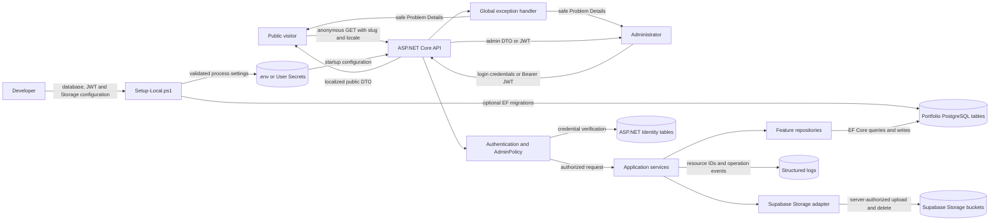
```mermaid
flowchart LR
    Public[Public visitor]
    Admin[Administrator]
    Dev[Developer]

    Setup[Setup-Local.ps1]
    API[ASP.NET Core API]
    Auth[Authentication and AdminPolicy]
    App[Application services]
    Repo[Feature repositories]
    StorageAdapter[Supabase Storage adapter]
    ErrorHandler[Global exception handler]

    Config[(.env or User Secrets)]
    Identity[(ASP.NET Identity tables)]
    Portfolio[(Portfolio PostgreSQL tables)]
    Objects[(Supabase Storage buckets)]
    Logs[(Structured logs)]

    Dev -->|database, JWT and Storage configuration| Setup
    Setup -->|validated process settings| Config
    Setup -->|optional EF migrations| Portfolio

    Public -->|anonymous GET with slug and locale| API
    Admin -->|login credentials or Bearer JWT| API
    Config -->|startup configuration| API

    API --> Auth
    Auth -->|credential verification| Identity
    Auth -->|authorized request| App
    App --> Repo
    Repo -->|EF Core queries and writes| Portfolio
    App --> StorageAdapter
    StorageAdapter -->|server-authorized upload and delete| Objects

    App -->|resource IDs and operation events| Logs
    API --> ErrorHandler
    ErrorHandler -->|safe Problem Details| Public
    ErrorHandler -->|safe Problem Details| Admin

    API -->|localized public DTO| Public
    API -->|admin DTO or JWT| Admin
```

### Quy tắc dữ liệu tại các ranh giới

| Ranh giới | Dữ liệu được phép đi qua | Dữ liệu không được trả/log |
| --- | --- | --- |
| Public API | Published content, đúng locale, contact fields được cho phép | Draft, locale khác, hidden email/phone, object key, secret |
| Admin API | DTO quản trị sau khi JWT có role `Admin` được xác thực | Password, signing key, Storage service-role key |
| PostgreSQL | Entity và object key bền vững | Signed URL tạm thời |
| Supabase Storage | Bucket, server-generated object key, file bytes | Client-supplied storage path |
| Structured logs | Request/trace ID, resource ID, loại thao tác | Nội dung portfolio/contact, password, JWT, refresh token, secret, file bytes |

### Health endpoints

- `GET /health` chỉ kiểm tra process còn phục vụ request; không gọi dependency.
- `GET /health/ready` chạy các check có tag `ready` để quyết định API đã sẵn sàng nhận traffic hay chưa.
- `GET /health/supabase` chạy các check có tag `supabase`, hiện gồm PostgreSQL và Supabase Storage, rồi trả JSON trạng thái qua `HealthCheckResponseWriter`.

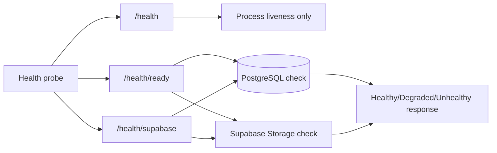
```mermaid
flowchart LR
    Probe[Health probe] --> Live["/health"]
    Probe --> Ready["/health/ready"]
    Probe --> Supabase["/health/supabase"]
    Live --> Process[Process liveness only]
    Ready --> PostgreSQL[(PostgreSQL check)]
    Ready --> Storage[Supabase Storage check]
    Supabase --> PostgreSQL
    Supabase --> Storage
    PostgreSQL --> Result[Healthy/Degraded/Unhealthy response]
    Storage --> Result
```

Trong Development thiếu cấu hình, dependency tương ứng được đăng ký dưới dạng unhealthy check/unavailable adapter để API vẫn khởi động và trả lỗi 503 an toàn khi feature cố sử dụng dependency đó. Ngoài Development, options bắt buộc được validate lúc startup.

## 3. Luồng kiến trúc request

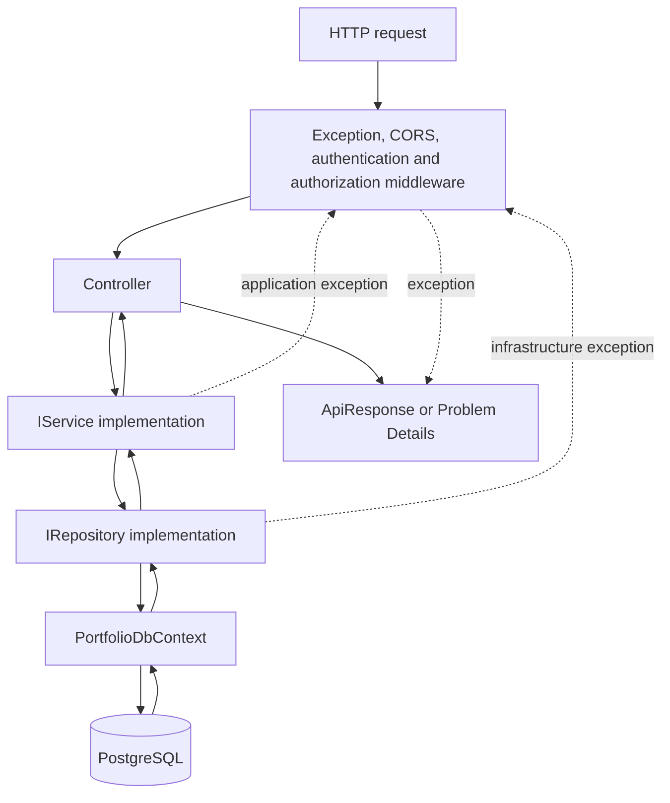
```mermaid
flowchart TD
    Request[HTTP request]
    Middleware[Exception, CORS, authentication and authorization middleware]
    Controller[Controller]
    Service[IService implementation]
    Repository[IRepository implementation]
    DbContext[PortfolioDbContext]
    PostgreSQL[(PostgreSQL)]
    Response[ApiResponse or Problem Details]

    Request --> Middleware
    Middleware --> Controller
    Controller --> Service
    Service --> Repository
    Repository --> DbContext
    DbContext --> PostgreSQL
    PostgreSQL --> DbContext
    DbContext --> Repository
    Repository --> Service
    Service --> Controller
    Controller --> Response

    Middleware -. exception .-> Response
    Service -. application exception .-> Middleware
    Repository -. infrastructure exception .-> Middleware
```

Controller chỉ xử lý HTTP/model binding. Business rules nằm trong Service. EF Core và SQL nằm trong Repository. `CancellationToken` được truyền xuyên suốt chuỗi gọi.

## 4. Setup, migration và bootstrap Administrator

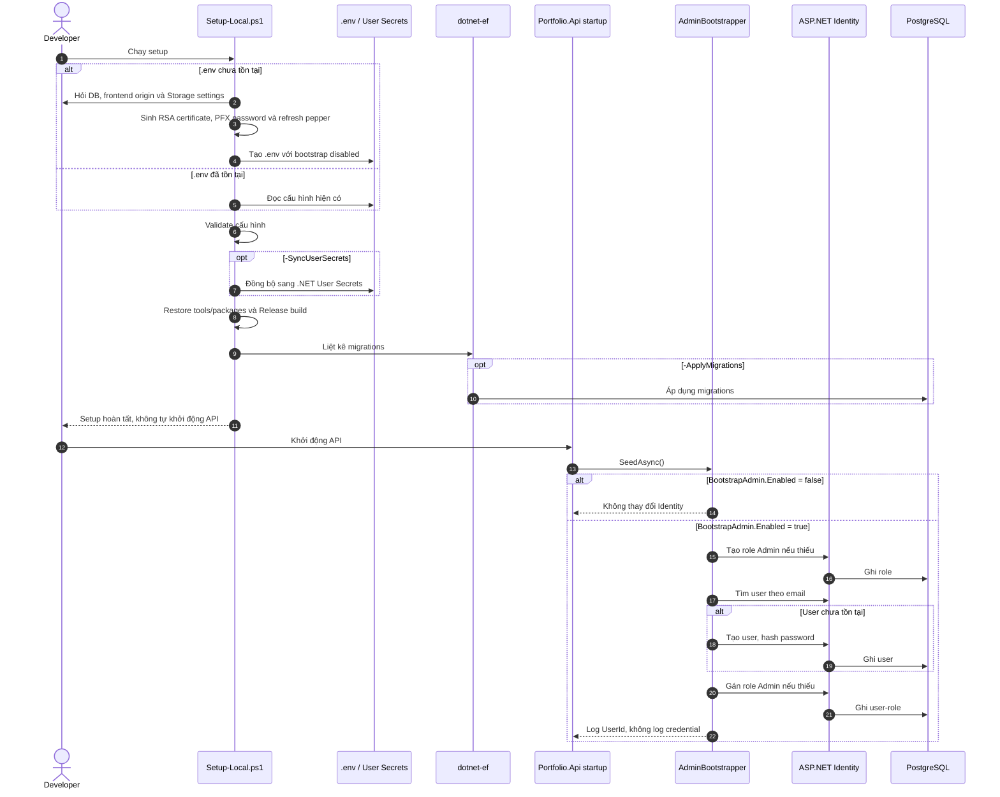
```mermaid
sequenceDiagram
    autonumber
    actor Dev as Developer
    participant Setup as Setup-Local.ps1
    participant Env as .env / User Secrets
    participant EF as dotnet-ef
    participant API as Portfolio.Api startup
    participant Boot as AdminBootstrapper
    participant Identity as ASP.NET Identity
    participant DB as PostgreSQL

    Dev->>Setup: Chạy setup
    alt .env chưa tồn tại
        Setup->>Dev: Hỏi DB, frontend origin và Storage settings
        Setup->>Setup: Sinh RSA certificate, PFX password và refresh pepper
        Setup->>Env: Tạo .env với bootstrap disabled
    else .env đã tồn tại
        Setup->>Env: Đọc cấu hình hiện có
    end

    Setup->>Setup: Validate cấu hình
    opt -SyncUserSecrets
        Setup->>Env: Đồng bộ sang .NET User Secrets
    end
    Setup->>Setup: Restore tools/packages và Release build
    Setup->>EF: Liệt kê migrations
    opt -ApplyMigrations
        EF->>DB: Áp dụng migrations
    end
    Setup-->>Dev: Setup hoàn tất, không tự khởi động API

    Dev->>API: Khởi động API
    API->>Boot: SeedAsync()
    alt BootstrapAdmin.Enabled = false
        Boot-->>API: Không thay đổi Identity
    else BootstrapAdmin.Enabled = true
        Boot->>Identity: Tạo role Admin nếu thiếu
        Identity->>DB: Ghi role
        Boot->>Identity: Tìm user theo email
        alt User chưa tồn tại
            Boot->>Identity: Tạo user, hash password
            Identity->>DB: Ghi user
        end
        Boot->>Identity: Gán role Admin nếu thiếu
        Identity->>DB: Ghi user-role
        Boot-->>API: Log UserId, không log credential
    end
```

### Điều kiện vận hành

1. Bootstrap mặc định tắt và setup script không trực tiếp tạo tài khoản.
2. Identity tables phải tồn tại trước khi API bootstrap user; database mới cần chạy migrations.
3. Sau lần bootstrap thành công phải đặt `BootstrapAdmin__Enabled=false`, đồng bộ lại cấu hình và restart API.
4. Password thực tế phải thỏa Identity policy: tối thiểu 12 ký tự, có chữ hoa, chữ thường, chữ số và ký tự đặc biệt.

## 5. Đăng nhập Administrator

Endpoint: `POST /api/v1/auth/login`

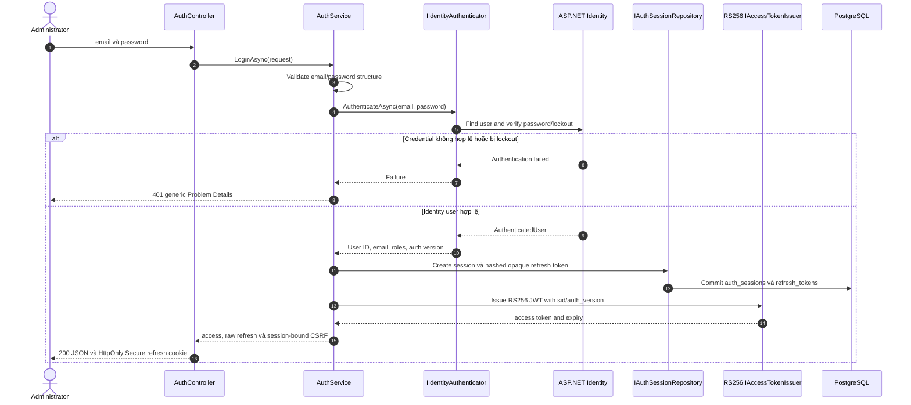
```mermaid
sequenceDiagram
    autonumber
    actor Admin as Administrator
    participant Controller as AuthController
    participant Service as AuthService
    participant Authenticator as IIdentityAuthenticator
    participant Identity as ASP.NET Identity
    participant SessionRepo as IAuthSessionRepository
    participant Issuer as RS256 IAccessTokenIssuer
    participant DB as PostgreSQL

    Admin->>Controller: email và password
    Controller->>Service: LoginAsync(request)
    Service->>Service: Validate email/password structure
    Service->>Authenticator: AuthenticateAsync(email, password)
    Authenticator->>Identity: Find user and verify password/lockout

    alt Credential không hợp lệ hoặc bị lockout
        Identity-->>Authenticator: Authentication failed
        Authenticator-->>Service: Failure
        Service-->>Admin: 401 generic Problem Details
    else Identity user hợp lệ
        Identity-->>Authenticator: AuthenticatedUser
        Authenticator-->>Service: User ID, email, roles, auth version
        Service->>SessionRepo: Create session và hashed opaque refresh token
        SessionRepo->>DB: Commit auth_sessions và refresh_tokens
        Service->>Issuer: Issue RS256 JWT with sid/auth_version
        Issuer-->>Service: access token and expiry
        Service-->>Controller: access, raw refresh và session-bound CSRF
        Controller-->>Admin: 200 JSON và HttpOnly Secure refresh cookie
    end
```

Access JWT tiếp theo được gửi bằng header `Authorization: Bearer <token>`. Login xác thực Identity account; `AdminPolicy` ở các `/admin` endpoint mới quyết định role `Admin` và trả 403 nếu account hợp lệ không có role đó. Request body hoặc custom header không thể tự khai báo quyền Admin. MVP chỉ bootstrap Admin và không có public signup. Access token chỉ giữ trong memory; refresh token chỉ nằm trong cookie `__Host-refresh`. Luồng rotation/reuse chi tiết nằm trong [Authentication Guide](../security/AUTHENTICATION_GUIDE.md).

## 6. Refresh, logout và quản lý session

Endpoints:

- `POST /api/v1/auth/refresh` — anonymous về mặt bearer token nhưng bắt buộc refresh cookie, Origin và `X-CSRF-Token`;
- `POST /api/v1/auth/logout` — authenticated, bắt buộc `X-CSRF-Token`;
- `POST /api/v1/auth/logout-all` — authenticated, bắt buộc `X-CSRF-Token`;
- `GET /api/v1/auth/sessions` — authenticated;
- `DELETE /api/v1/auth/sessions/{sessionId}` — authenticated, bắt buộc `X-CSRF-Token`.

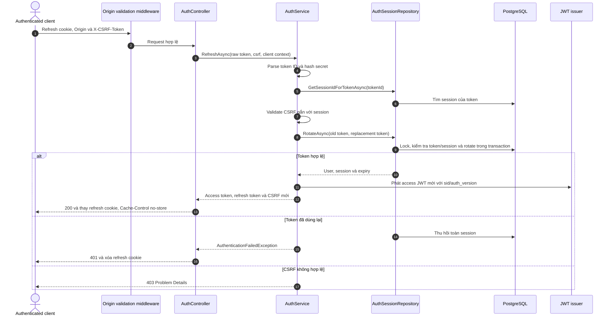
```mermaid
sequenceDiagram
    autonumber
    actor Client as Authenticated client
    participant Origin as Origin validation middleware
    participant Controller as AuthController
    participant Service as AuthService
    participant SessionRepo as AuthSessionRepository
    participant DB as PostgreSQL
    participant Issuer as JWT issuer

    Client->>Origin: Refresh cookie, Origin và X-CSRF-Token
    Origin->>Controller: Request hợp lệ
    Controller->>Service: RefreshAsync(raw token, csrf, client context)
    Service->>Service: Parse token ID và hash secret
    Service->>SessionRepo: GetSessionIdForTokenAsync(tokenId)
    SessionRepo->>DB: Tìm session của token
    Service->>Service: Validate CSRF gắn với session
    Service->>SessionRepo: RotateAsync(old token, replacement token)
    SessionRepo->>DB: Lock, kiểm tra token/session và rotate trong transaction
    alt Token hợp lệ
        SessionRepo-->>Service: User, session và expiry
        Service->>Issuer: Phát access JWT mới với sid/auth_version
        Service-->>Controller: Access token, refresh token và CSRF mới
        Controller-->>Client: 200 và thay refresh cookie, Cache-Control no-store
    else Token đã dùng lại
        SessionRepo->>DB: Thu hồi toàn session
        Service-->>Controller: AuthenticationFailedException
        Controller-->>Client: 401 và xóa refresh cookie
    else CSRF không hợp lệ
        Service-->>Client: 403 Problem Details
    end
```

Logout thu hồi session hiện tại; logout-all thu hồi mọi session của user và làm mất hiệu lực access token thông qua `auth_version`. Danh sách session luôn scope theo `currentUser.UserId`, không trả raw refresh token hoặc hash. Thu hồi một session cũng scope theo current user để chống IDOR; nếu session hiện tại bị thu hồi, Controller xóa refresh cookie.

## 7. Đọc Dashboard quản trị

Endpoint: `GET /api/v1/admin/dashboard`

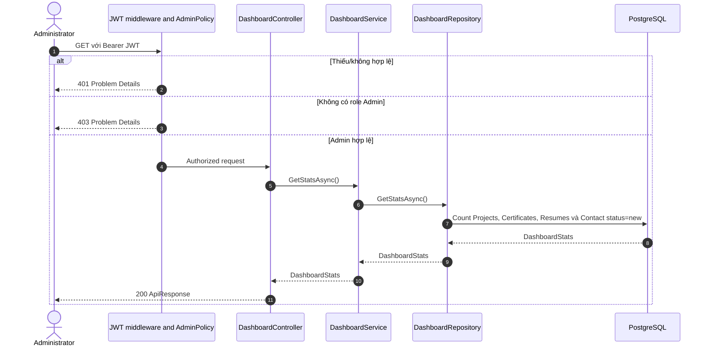
```mermaid
sequenceDiagram
    autonumber
    actor Admin as Administrator
    participant Policy as JWT middleware and AdminPolicy
    participant Controller as DashboardController
    participant Service as DashboardService
    participant Repo as DashboardRepository
    participant DB as PostgreSQL

    Admin->>Policy: GET với Bearer JWT
    alt Thiếu/không hợp lệ
        Policy-->>Admin: 401 Problem Details
    else Không có role Admin
        Policy-->>Admin: 403 Problem Details
    else Admin hợp lệ
        Policy->>Controller: Authorized request
        Controller->>Service: GetStatsAsync()
        Service->>Repo: GetStatsAsync()
        Repo->>DB: Count Projects, Certificates, Resumes và Contact status=new
        DB-->>Repo: DashboardStats
        Repo-->>Service: DashboardStats
        Service-->>Controller: DashboardStats
        Controller-->>Admin: 200 ApiResponse
    end
```

Dashboard chỉ trả số đếm, không trả nội dung Contact hoặc dữ liệu draft chi tiết.

## 8. Đọc Public Profile

Endpoint: `GET /api/v1/portfolio/{slug}/profile?locale=en`

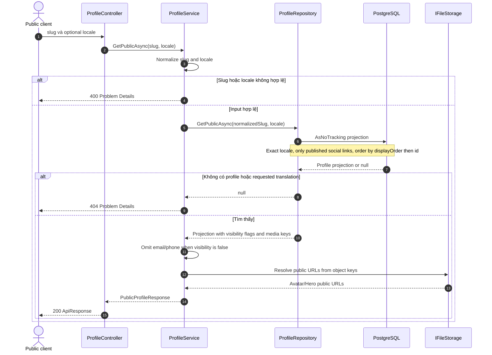
```mermaid
sequenceDiagram
    autonumber
    actor Client as Public client
    participant Controller as ProfileController
    participant Service as ProfileService
    participant Repo as ProfileRepository
    participant DB as PostgreSQL
    participant Storage as IFileStorage

    Client->>Controller: slug và optional locale
    Controller->>Service: GetPublicAsync(slug, locale)
    Service->>Service: Normalize slug and locale
    alt Slug hoặc locale không hợp lệ
        Service-->>Client: 400 Problem Details
    else Input hợp lệ
        Service->>Repo: GetPublicAsync(normalizedSlug, locale)
        Repo->>DB: AsNoTracking projection
        Note over Repo,DB: Exact locale, only published social links, order by displayOrder then id
        DB-->>Repo: Profile projection or null
        alt Không có profile hoặc requested translation
            Repo-->>Service: null
            Service-->>Client: 404 Problem Details
        else Tìm thấy
            Repo-->>Service: Projection with visibility flags and media keys
            Service->>Service: Omit email/phone when visibility is false
            Service->>Storage: Resolve public URLs from object keys
            Storage-->>Service: Avatar/Hero public URLs
            Service-->>Controller: PublicProfileResponse
            Controller-->>Client: 200 ApiResponse
        end
    end
```

Public response không chứa Translation collection, locale khác, social link draft hoặc storage object key.

## 9. Đọc Public About

Endpoint: `GET /api/v1/portfolio/{slug}/about?locale=en`

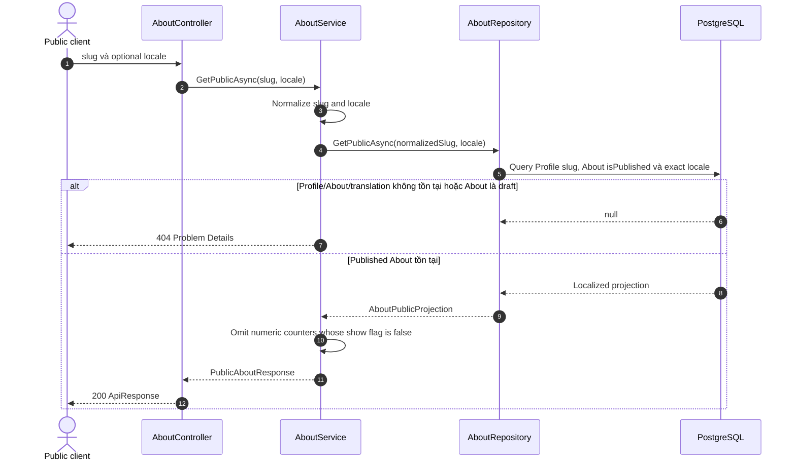
```mermaid
sequenceDiagram
    autonumber
    actor Client as Public client
    participant Controller as AboutController
    participant Service as AboutService
    participant Repo as AboutRepository
    participant DB as PostgreSQL

    Client->>Controller: slug và optional locale
    Controller->>Service: GetPublicAsync(slug, locale)
    Service->>Service: Normalize slug and locale
    Service->>Repo: GetPublicAsync(normalizedSlug, locale)
    Repo->>DB: Query Profile slug, About isPublished và exact locale
    alt Profile/About/translation không tồn tại hoặc About là draft
        DB-->>Repo: null
        Service-->>Client: 404 Problem Details
    else Published About tồn tại
        DB-->>Repo: Localized projection
        Repo-->>Service: AboutPublicProjection
        Service->>Service: Omit numeric counters whose show flag is false
        Service-->>Controller: PublicAboutResponse
        Controller-->>Client: 200 ApiResponse
    end
```

## 10. Đọc dữ liệu quản trị Profile/About

Endpoints:

- `GET /api/v1/admin/profile`;
- `GET /api/v1/admin/about`.

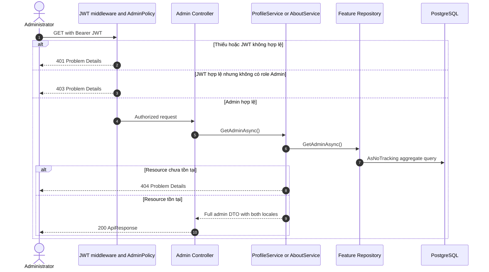
```mermaid
sequenceDiagram
    autonumber
    actor Admin as Administrator
    participant Auth as JWT middleware and AdminPolicy
    participant Controller as Admin Controller
    participant Service as ProfileService or AboutService
    participant Repo as Feature Repository
    participant DB as PostgreSQL

    Admin->>Auth: GET with Bearer JWT
    alt Thiếu hoặc JWT không hợp lệ
        Auth-->>Admin: 401 Problem Details
    else JWT hợp lệ nhưng không có role Admin
        Auth-->>Admin: 403 Problem Details
    else Admin hợp lệ
        Auth->>Controller: Authorized request
        Controller->>Service: GetAdminAsync()
        Service->>Repo: GetAdminAsync()
        Repo->>DB: AsNoTracking aggregate query
        alt Resource chưa tồn tại
            Service-->>Admin: 404 Problem Details
        else Resource tồn tại
            Service-->>Controller: Full admin DTO with both locales
            Controller-->>Admin: 200 ApiResponse
        end
    end
```

## 11. Upsert Profile và Social Links

Endpoint: `PUT /api/v1/admin/profile`

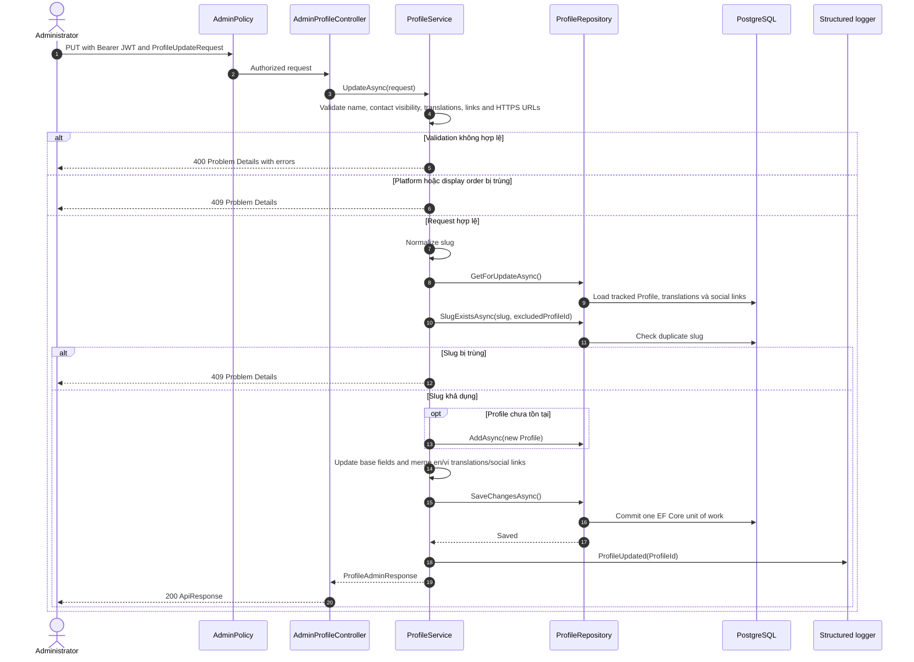
```mermaid
sequenceDiagram
    autonumber
    actor Admin as Administrator
    participant Policy as AdminPolicy
    participant Controller as AdminProfileController
    participant Service as ProfileService
    participant Repo as ProfileRepository
    participant DB as PostgreSQL
    participant Log as Structured logger

    Admin->>Policy: PUT with Bearer JWT and ProfileUpdateRequest
    Policy->>Controller: Authorized request
    Controller->>Service: UpdateAsync(request)
    Service->>Service: Validate name, contact visibility, translations, links and HTTPS URLs
    alt Validation không hợp lệ
        Service-->>Admin: 400 Problem Details with errors
    else Platform hoặc display order bị trùng
        Service-->>Admin: 409 Problem Details
    else Request hợp lệ
        Service->>Service: Normalize slug
        Service->>Repo: GetForUpdateAsync()
        Repo->>DB: Load tracked Profile, translations và social links
        Service->>Repo: SlugExistsAsync(slug, excludedProfileId)
        Repo->>DB: Check duplicate slug
        alt Slug bị trùng
            Service-->>Admin: 409 Problem Details
        else Slug khả dụng
            opt Profile chưa tồn tại
                Service->>Repo: AddAsync(new Profile)
            end
            Service->>Service: Update base fields and merge en/vi translations/social links
            Service->>Repo: SaveChangesAsync()
            Repo->>DB: Commit one EF Core unit of work
            Repo-->>Service: Saved
            Service->>Log: ProfileUpdated(ProfileId)
            Service-->>Controller: ProfileAdminResponse
            Controller-->>Admin: 200 ApiResponse
        end
    end
```

`avatarUrl` và `heroImageUrl` không nằm trong JSON write contract; media chỉ được thay đổi qua endpoint upload chuyên biệt.

## 12. Upsert About

Endpoint: `PUT /api/v1/admin/about`

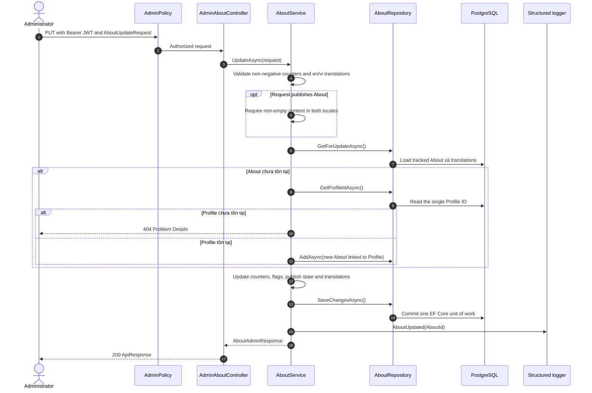
```mermaid
sequenceDiagram
    autonumber
    actor Admin as Administrator
    participant Policy as AdminPolicy
    participant Controller as AdminAboutController
    participant Service as AboutService
    participant Repo as AboutRepository
    participant DB as PostgreSQL
    participant Log as Structured logger

    Admin->>Policy: PUT with Bearer JWT and AboutUpdateRequest
    Policy->>Controller: Authorized request
    Controller->>Service: UpdateAsync(request)
    Service->>Service: Validate non-negative counters and en/vi translations
    opt Request publishes About
        Service->>Service: Require non-empty content in both locales
    end
    Service->>Repo: GetForUpdateAsync()
    Repo->>DB: Load tracked About và translations

    alt About chưa tồn tại
        Service->>Repo: GetProfileIdAsync()
        Repo->>DB: Read the single Profile ID
        alt Profile chưa tồn tại
            Service-->>Admin: 404 Problem Details
        else Profile tồn tại
            Service->>Repo: AddAsync(new About linked to Profile)
        end
    end

    Service->>Service: Update counters, flags, publish state and translations
    Service->>Repo: SaveChangesAsync()
    Repo->>DB: Commit one EF Core unit of work
    Service->>Log: AboutUpdated(AboutId)
    Service-->>Controller: AboutAdminResponse
    Controller-->>Admin: 200 ApiResponse
```

## 13. Thay thế Avatar hoặc Hero image

Endpoints:

- `POST /api/v1/admin/profile/avatar`;
- `POST /api/v1/admin/profile/hero-image`.

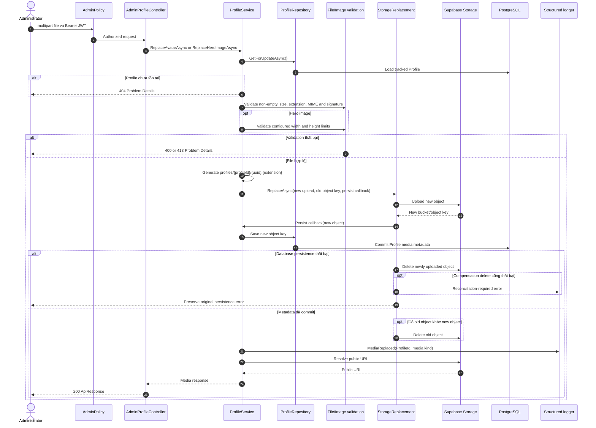
```mermaid
sequenceDiagram
    autonumber
    actor Admin as Administrator
    participant Policy as AdminPolicy
    participant Controller as AdminProfileController
    participant Service as ProfileService
    participant Repo as ProfileRepository
    participant Validator as File/Image validation
    participant Replace as StorageReplacement
    participant Storage as Supabase Storage
    participant DB as PostgreSQL
    participant Log as Structured logger

    Admin->>Policy: multipart file và Bearer JWT
    Policy->>Controller: Authorized request
    Controller->>Service: ReplaceAvatarAsync or ReplaceHeroImageAsync
    Service->>Repo: GetForUpdateAsync()
    Repo->>DB: Load tracked Profile
    alt Profile chưa tồn tại
        Service-->>Admin: 404 Problem Details
    end

    Service->>Validator: Validate non-empty, size, extension, MIME and signature
    opt Hero image
        Service->>Validator: Validate configured width and height limits
    end
    alt Validation thất bại
        Validator-->>Admin: 400 or 413 Problem Details
    else File hợp lệ
        Service->>Service: Generate profiles/{profileId}/{uuid}.{extension}
        Service->>Replace: ReplaceAsync(new upload, old object key, persist callback)
        Replace->>Storage: Upload new object
        Storage-->>Replace: New bucket/object key
        Replace->>Service: Persist callback(new object)
        Service->>Repo: Save new object key
        Repo->>DB: Commit Profile media metadata

        alt Database persistence thất bại
            Replace->>Storage: Delete newly uploaded object
            opt Compensation delete cũng thất bại
                Replace->>Log: Reconciliation-required error
            end
            Replace-->>Admin: Preserve original persistence error
        else Metadata đã commit
            opt Có old object khác new object
                Replace->>Storage: Delete old object
            end
            Service->>Log: MediaReplaced(ProfileId, media kind)
            Service->>Storage: Resolve public URL
            Storage-->>Service: Public URL
            Service-->>Controller: Media response
            Controller-->>Admin: 200 ApiResponse
        end
    end
```

### Trạng thái khi lỗi xóa old object sau commit

Database đã trỏ đến new object trước khi old object bị xóa. Nếu thao tác xóa old object thất bại, metadata mới không rollback; request nhận lỗi Storage và old object có thể cần reconciliation/cleanup sau đó.

## 14. Đọc Public Skills

Endpoint: `GET /api/v1/portfolio/{slug}/skills?locale=en`

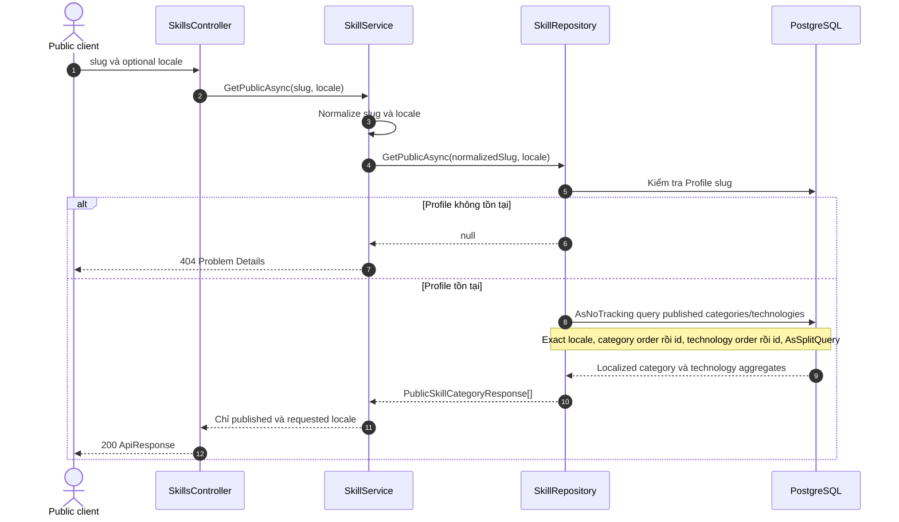
```mermaid
sequenceDiagram
    autonumber
    actor Client as Public client
    participant Controller as SkillsController
    participant Service as SkillService
    participant Repo as SkillRepository
    participant DB as PostgreSQL

    Client->>Controller: slug và optional locale
    Controller->>Service: GetPublicAsync(slug, locale)
    Service->>Service: Normalize slug và locale
    Service->>Repo: GetPublicAsync(normalizedSlug, locale)
    Repo->>DB: Kiểm tra Profile slug
    alt Profile không tồn tại
        Repo-->>Service: null
        Service-->>Client: 404 Problem Details
    else Profile tồn tại
        Repo->>DB: AsNoTracking query published categories/technologies
        Note over Repo,DB: Exact locale, category order rồi id, technology order rồi id, AsSplitQuery
        DB-->>Repo: Localized category và technology aggregates
        Repo-->>Service: PublicSkillCategoryResponse[]
        Service-->>Controller: Chỉ published và requested locale
        Controller-->>Client: 200 ApiResponse
    end
```

Public response nhóm Technology theo Skill Category. Category draft, Technology draft, translation sai locale và dữ liệu quản trị không đi qua public boundary.

## 15. Quản trị Skill Category và Technology

Endpoints:

- `GET|POST /api/v1/admin/skill-categories`;
- `PUT|DELETE /api/v1/admin/skill-categories/{id}`;
- `GET|POST /api/v1/admin/skills`;
- `GET|PUT|DELETE /api/v1/admin/skills/{id}`;
- `PATCH /api/v1/admin/skills/reorder?categoryId={id}`.

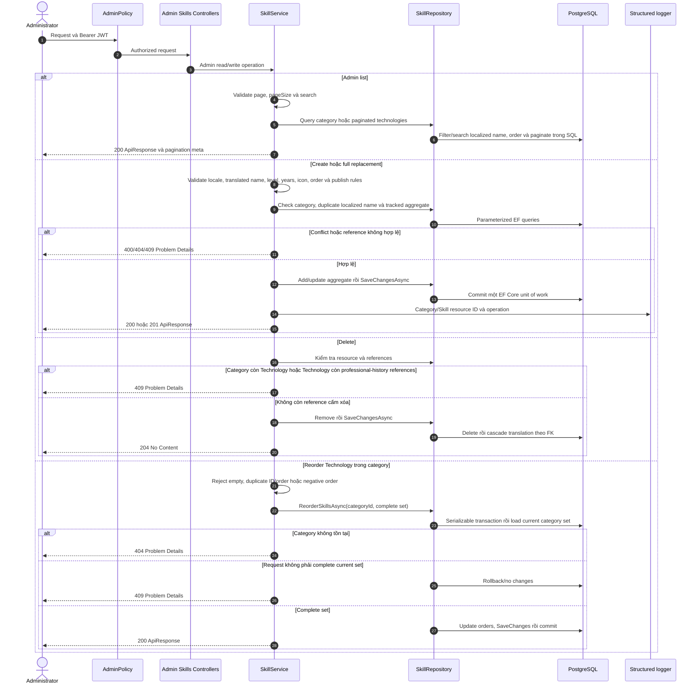
```mermaid
sequenceDiagram
    autonumber
    actor Admin as Administrator
    participant Policy as AdminPolicy
    participant Controller as Admin Skills Controllers
    participant Service as SkillService
    participant Repo as SkillRepository
    participant DB as PostgreSQL
    participant Log as Structured logger

    Admin->>Policy: Request và Bearer JWT
    Policy->>Controller: Authorized request
    Controller->>Service: Admin read/write operation
    alt Admin list
        Service->>Service: Validate page, pageSize và search
        Service->>Repo: Query category hoặc paginated technologies
        Repo->>DB: Filter/search localized name, order và paginate trong SQL
        Service-->>Admin: 200 ApiResponse và pagination meta
    else Create hoặc full replacement
        Service->>Service: Validate locale, translated name, level, years, icon, order và publish rules
        Service->>Repo: Check category, duplicate localized name và tracked aggregate
        Repo->>DB: Parameterized EF queries
        alt Conflict hoặc reference không hợp lệ
            Service-->>Admin: 400/404/409 Problem Details
        else Hợp lệ
            Service->>Repo: Add/update aggregate rồi SaveChangesAsync
            Repo->>DB: Commit một EF Core unit of work
            Service->>Log: Category/Skill resource ID và operation
            Service-->>Admin: 200 hoặc 201 ApiResponse
        end
    else Delete
        Service->>Repo: Kiểm tra resource và references
        alt Category còn Technology hoặc Technology còn professional-history references
            Service-->>Admin: 409 Problem Details
        else Không còn reference cấm xóa
            Service->>Repo: Remove rồi SaveChangesAsync
            Repo->>DB: Delete rồi cascade translation theo FK
            Service-->>Admin: 204 No Content
        end
    else Reorder Technology trong category
        Service->>Service: Reject empty, duplicate ID/order hoặc negative order
        Service->>Repo: ReorderSkillsAsync(categoryId, complete set)
        Repo->>DB: Serializable transaction rồi load current category set
        alt Category không tồn tại
            Service-->>Admin: 404 Problem Details
        else Request không phải complete current set
            Repo->>DB: Rollback/no changes
            Service-->>Admin: 409 Problem Details
        else Complete set
            Repo->>DB: Update orders, SaveChanges rồi commit
            Service-->>Admin: 200 ApiResponse
        end
    end
```

Published Technology bắt buộc thuộc published Category và có cả translation `en`/`vi`. Reorder luôn scope theo một Category và phải chứa đầy đủ tập Technology hiện tại của Category đó.

## 16. Thay thế Skill icon

Endpoint: `POST /api/v1/admin/skills/{id}/icon`

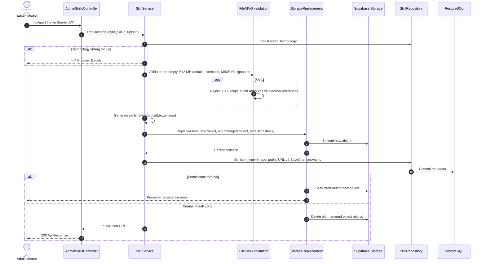
```mermaid
sequenceDiagram
    autonumber
    actor Admin as Administrator
    participant Controller as AdminSkillsController
    participant Service as SkillService
    participant Validator as File/SVG validation
    participant Replace as StorageReplacement
    participant Storage as Supabase Storage
    participant Repo as SkillRepository
    participant DB as PostgreSQL

    Admin->>Controller: multipart file và Bearer JWT
    Controller->>Service: ReplaceIconAsync(skillId, upload)
    Service->>Repo: Load tracked Technology
    alt Technology không tồn tại
        Service-->>Admin: 404 Problem Details
    end
    Service->>Validator: Validate non-empty, 512 KiB default, extension, MIME và signature
    opt SVG
        Validator->>Validator: Reject DTD, script, event attributes và external references
    end
    Service->>Service: Generate skills/{skillId}/{uuid}.{extension}
    Service->>Replace: ReplaceAsync(new object, old managed object, persist callback)
    Replace->>Storage: Upload new object
    Replace->>Service: Persist callback
    Service->>Repo: Set icon_type=image, public URL và SaveChangesAsync
    Repo->>DB: Commit metadata
    alt Persistence thất bại
        Replace->>Storage: Best-effort delete new object
        Replace-->>Admin: Preserve persistence error
    else Commit thành công
        Replace->>Storage: Delete old managed object nếu có
        Service-->>Controller: Public icon URL
        Controller-->>Admin: 200 ApiResponse
    end
```

JSON create/update chỉ chấp nhận Lucide allowlist, text hợp lệ, managed public image URL hoặc HTTPS host nằm trong allowlist cấu hình; client không được gửi storage object key.

## 17. Đọc Public Work Experience

Endpoint: `GET /api/v1/portfolio/{slug}/experiences?locale=en`

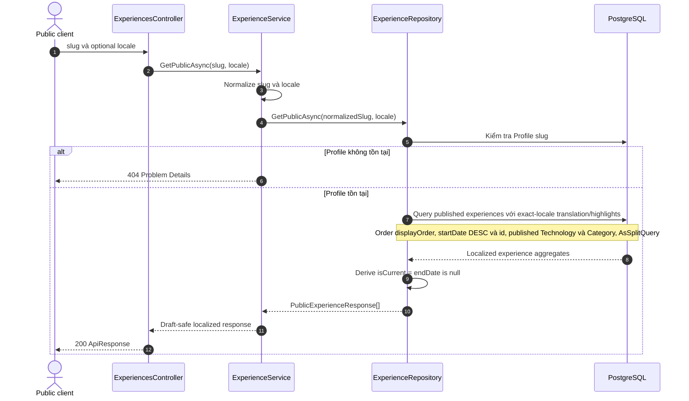
```mermaid
sequenceDiagram
    autonumber
    actor Client as Public client
    participant Controller as ExperiencesController
    participant Service as ExperienceService
    participant Repo as ExperienceRepository
    participant DB as PostgreSQL

    Client->>Controller: slug và optional locale
    Controller->>Service: GetPublicAsync(slug, locale)
    Service->>Service: Normalize slug và locale
    Service->>Repo: GetPublicAsync(normalizedSlug, locale)
    Repo->>DB: Kiểm tra Profile slug
    alt Profile không tồn tại
        Service-->>Client: 404 Problem Details
    else Profile tồn tại
        Repo->>DB: Query published experiences với exact-locale translation/highlights
        Note over Repo,DB: Order displayOrder, startDate DESC và id, published Technology và Category, AsSplitQuery
        DB-->>Repo: Localized experience aggregates
        Repo->>Repo: Derive isCurrent = endDate is null
        Repo-->>Service: PublicExperienceResponse[]
        Service-->>Controller: Draft-safe localized response
        Controller-->>Client: 200 ApiResponse
    end
```

Public DTO không chứa translation của locale khác hoặc draft. Technology summary chỉ xuất hiện khi Technology, Category và requested-locale Technology translation đều public/hợp lệ.

## 18. Quản trị Work Experience

Endpoints:

- `GET|POST /api/v1/admin/experiences`;
- `GET|PUT|DELETE /api/v1/admin/experiences/{id}`;
- `PATCH /api/v1/admin/experiences/reorder`.

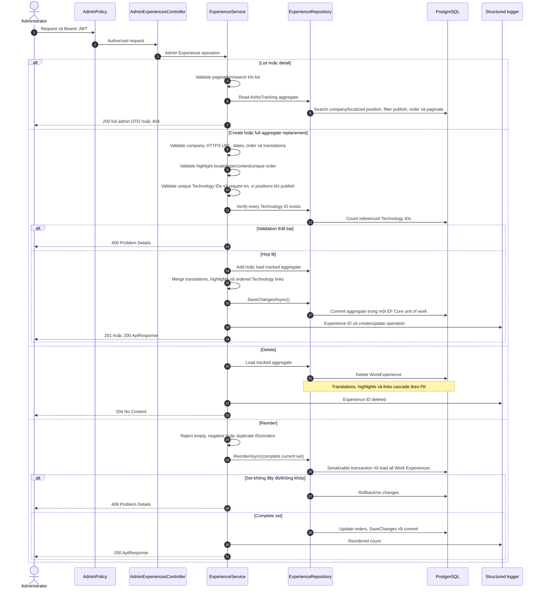
```mermaid
sequenceDiagram
    autonumber
    actor Admin as Administrator
    participant Policy as AdminPolicy
    participant Controller as AdminExperiencesController
    participant Service as ExperienceService
    participant Repo as ExperienceRepository
    participant DB as PostgreSQL
    participant Log as Structured logger

    Admin->>Policy: Request và Bearer JWT
    Policy->>Controller: Authorized request
    Controller->>Service: Admin Experience operation
    alt List hoặc detail
        Service->>Service: Validate pagination/search khi list
        Service->>Repo: Read AsNoTracking aggregate
        Repo->>DB: Search company/localized position, filter publish, order và paginate
        Service-->>Admin: 200 full admin DTO hoặc 404
    else Create hoặc full aggregate replacement
        Service->>Service: Validate company, HTTPS URL, dates, order và translations
        Service->>Service: Validate highlight locale/type/content/unique order
        Service->>Service: Validate unique Technology IDs và require en, vi positions khi publish
        Service->>Repo: Verify every Technology ID exists
        Repo->>DB: Count referenced Technology IDs
        alt Validation thất bại
            Service-->>Admin: 400 Problem Details
        else Hợp lệ
            Service->>Repo: Add hoặc load tracked aggregate
            Service->>Service: Merge translations, highlights và ordered Technology links
            Service->>Repo: SaveChangesAsync()
            Repo->>DB: Commit aggregate trong một EF Core unit of work
            Service->>Log: Experience ID và create/update operation
            Service-->>Admin: 201 hoặc 200 ApiResponse
        end
    else Delete
        Service->>Repo: Load tracked aggregate
        Repo->>DB: Delete WorkExperience
        Note over Repo,DB: Translations, highlights và links cascade theo FK
        Service->>Log: Experience ID deleted
        Service-->>Admin: 204 No Content
    else Reorder
        Service->>Service: Reject empty, negative hoặc duplicate IDs/orders
        Service->>Repo: ReorderAsync(complete current set)
        Repo->>DB: Serializable transaction rồi load all Work Experiences
        alt Set không đầy đủ/không khớp
            Repo->>DB: Rollback/no changes
            Service-->>Admin: 409 Problem Details
        else Complete set
            Repo->>DB: Update orders, SaveChanges rồi commit
            Service->>Log: Reordered count
            Service-->>Admin: 200 ApiResponse
        end
    end
```

`isCurrent` không phải trường client điều khiển; response luôn suy ra từ `endDate == null`. `endDate`, nếu có, phải lớn hơn hoặc bằng `startDate`. Highlight order chỉ cần duy nhất trong cùng cặp `(locale, highlightType)`; thứ tự Technology link được suy ra từ vị trí trong `technologyIds`.

## 19. Xử lý lỗi tập trung

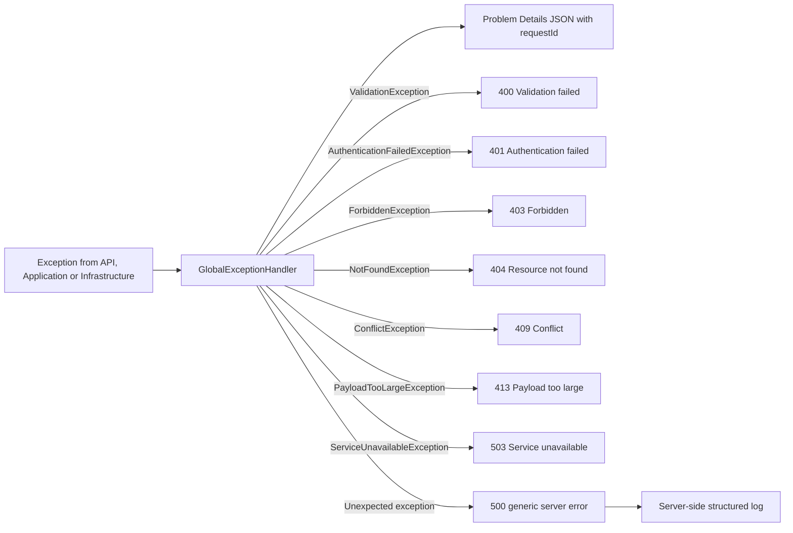
```mermaid
flowchart LR
    Failure[Exception from API, Application or Infrastructure]
    Handler[GlobalExceptionHandler]
    Log[Server-side structured log]
    Problem["Problem Details JSON with requestId"]

    Failure --> Handler
    Handler -->|ValidationException| E400[400 Validation failed]
    Handler -->|AuthenticationFailedException| E401[401 Authentication failed]
    Handler -->|ForbiddenException| E403[403 Forbidden]
    Handler -->|NotFoundException| E404[404 Resource not found]
    Handler -->|ConflictException| E409[409 Conflict]
    Handler -->|PayloadTooLargeException| E413[413 Payload too large]
    Handler -->|ServiceUnavailableException| E503[503 Service unavailable]
    Handler -->|Unexpected exception| E500[500 generic server error]
    Handler --> Problem
    E500 --> Log
```

Chỉ validation error có `errors` theo field. Mọi Problem Details có `requestId`. Unexpected exception được log server-side nhưng response không chứa stack trace, SQL/provider detail hoặc secret.

## 20. Ma trận endpoint và data store

| Endpoint | Quyền | Service | Data store/adapter chính | Public disclosure |
| --- | --- | --- | --- | --- |
| `GET /health` | Anonymous | ASP.NET Core Health Checks | Không gọi dependency | Chỉ process liveness |
| `GET /health/ready` | Anonymous | ASP.NET Core Health Checks | PostgreSQL + Supabase Storage | Chỉ trạng thái readiness |
| `GET /health/supabase` | Anonymous | `HealthCheckResponseWriter` | PostgreSQL + Supabase Storage | JSON health status, không trả secret |
| `POST /api/v1/auth/login` | Anonymous | `AuthService` | ASP.NET Identity, JWT issuer | Chỉ token thành công; lỗi credential dùng thông báo chung |
| `POST /api/v1/auth/refresh` | Cookie + Origin + CSRF | `AuthService` | PostgreSQL session/token, JWT issuer | Rotate token; reuse revoke toàn session |
| `POST /api/v1/auth/logout` | Authenticated + CSRF | `AuthService` | PostgreSQL session/token | Idempotent, xóa refresh cookie |
| `POST /api/v1/auth/logout-all` | Authenticated + CSRF | `AuthService` | PostgreSQL session/token, `AspNetUsers` | Revoke mọi session, tăng auth version |
| `GET /api/v1/auth/sessions` | Authenticated | `AuthService` | PostgreSQL session | Chỉ session của current user, không trả token/hash |
| `DELETE /api/v1/auth/sessions/{sessionId}` | Authenticated + CSRF | `AuthService` | PostgreSQL session/token | Scope bằng current user, chống IDOR |
| `GET /api/v1/admin/dashboard` | Admin | `DashboardService` | PostgreSQL | Không public |
| `GET /api/v1/portfolio/{slug}/profile` | Anonymous | `ProfileService` | PostgreSQL, public Storage URL resolver | Exact locale, published links, visibility flags |
| `GET /api/v1/admin/profile` | Admin | `ProfileService` | PostgreSQL | Full admin DTO |
| `PUT /api/v1/admin/profile` | Admin | `ProfileService` | PostgreSQL | Không cho client ghi media URL |
| `POST /api/v1/admin/profile/avatar` | Admin | `ProfileService` | PostgreSQL + Supabase Storage | Trả public URL, không trả object key |
| `POST /api/v1/admin/profile/hero-image` | Admin | `ProfileService` | PostgreSQL + Supabase Storage | Trả public URL, không trả object key |
| `GET /api/v1/portfolio/{slug}/about` | Anonymous | `AboutService` | PostgreSQL | Chỉ Published, exact locale, conditional counters |
| `GET /api/v1/admin/about` | Admin | `AboutService` | PostgreSQL | Full admin DTO |
| `PUT /api/v1/admin/about` | Admin | `AboutService` | PostgreSQL | Publishing yêu cầu content `en` và `vi` |
| `GET /api/v1/portfolio/{slug}/skills` | Anonymous | `SkillService` | PostgreSQL | Chỉ published Category/Technology, exact locale |
| `GET /api/v1/admin/skill-categories` | Admin | `SkillService` | PostgreSQL | Full category DTO với mọi translation |
| `POST /api/v1/admin/skill-categories` | Admin | `SkillService` | PostgreSQL | Tạo category; validate publish/translation/order |
| `PUT /api/v1/admin/skill-categories/{id}` | Admin | `SkillService` | PostgreSQL | Full mutable replacement |
| `DELETE /api/v1/admin/skill-categories/{id}` | Admin | `SkillService` | PostgreSQL | 409 khi còn Technology |
| `GET /api/v1/admin/skills` | Admin | `SkillService` | PostgreSQL | Search/filter/pagination; full translation DTO |
| `POST /api/v1/admin/skills` | Admin | `SkillService` | PostgreSQL | Validate category, level, icon và publish rules |
| `GET /api/v1/admin/skills/{id}` | Admin | `SkillService` | PostgreSQL | Full Technology admin DTO |
| `PUT /api/v1/admin/skills/{id}` | Admin | `SkillService` | PostgreSQL | Full mutable replacement |
| `DELETE /api/v1/admin/skills/{id}` | Admin | `SkillService` | PostgreSQL | 409 khi còn Experience/Project/Certificate reference |
| `PATCH /api/v1/admin/skills/reorder` | Admin | `SkillService` | PostgreSQL transaction | Atomic complete-set reorder trong một Category |
| `POST /api/v1/admin/skills/{id}/icon` | Admin | `SkillService` | PostgreSQL + Supabase Storage | Trả public URL, không trả object key |
| `GET /api/v1/portfolio/{slug}/experiences` | Anonymous | `ExperienceService` | PostgreSQL | Chỉ published, exact locale, `isCurrent` được suy ra |
| `GET /api/v1/admin/experiences` | Admin | `ExperienceService` | PostgreSQL | Search/filter/pagination; full aggregate DTO |
| `POST /api/v1/admin/experiences` | Admin | `ExperienceService` | PostgreSQL | Atomic aggregate create |
| `GET /api/v1/admin/experiences/{id}` | Admin | `ExperienceService` | PostgreSQL | Full translations/highlights/technology IDs |
| `PUT /api/v1/admin/experiences/{id}` | Admin | `ExperienceService` | PostgreSQL | Atomic full aggregate replacement |
| `DELETE /api/v1/admin/experiences/{id}` | Admin | `ExperienceService` | PostgreSQL | Aggregate children cascade theo FK |
| `PATCH /api/v1/admin/experiences/reorder` | Admin | `ExperienceService` | PostgreSQL transaction | Atomic complete-set reorder |

## 21. Điểm cần lưu ý khi vận hành

- Swagger phản ánh endpoint thực tế và chỉ bật trong Development tại `/swagger`.
- `docs/api/API_CONTRACT.md` là hợp đồng cho toàn MVP, bao gồm cả endpoint của sprint tương lai; không dùng riêng file đó để suy luận rằng mọi endpoint đã được triển khai.
- Public images dùng bucket public-read/server-write. Storage service-role key chỉ tồn tại phía backend.
- Các cột database `profiles.avatar_url` và `profiles.hero_image_url` hiện lưu object key theo Storage contract; public URL được tạo khi map response.
- PostgreSQL integration tests cần Docker và image `postgres:17-alpine`.

## 22. Cổng hoàn thành sprint và quy tắc đồng bộ tài liệu

Một sprint backend chỉ được xem là **hoàn thành** khi đồng thời đáp ứng tất cả điều kiện sau:

1. Code của phạm vi sprint đã được triển khai theo contract và kiến trúc đã phê duyệt.
2. Code review đã hoàn tất; không còn finding blocker/high-severity chưa xử lý hoặc chưa được chấp nhận rõ ràng.
3. Release build và toàn bộ test liên quan đã chạy thành công; PostgreSQL behavior phải dùng integration test thật khi có query, constraint hoặc transaction.
4. `docs/architecture/CURRENT_PROCESS_FLOWS.md` đã được cập nhật theo runtime thực tế, bao gồm:
   - endpoint và quyền truy cập;
   - Controller → Service → Repository → data store/adapter;
   - validation, publish/disclosure và transaction quan trọng;
   - success/error/compensation path;
   - endpoint matrix;
   - mọi Mermaid diagram parse/render thành công, không chỉ cân bằng code fence.
5. `API_CONTRACT.md`, database documentation, threat model hoặc runbook đã được cập nhật nếu sprint thay đổi các contract tương ứng.
6. Chỉ sau các bước trên mới đánh dấu checklist sprint là `[x]` trong roadmap/implementation plan.

Nếu code, migration và tài liệu luồng không khớp, chưa được phép mô tả sprint là hoàn thành. Phải đối chiếu source code, EF Core migrations và test evidence, sau đó sửa tài liệu hoặc implementation trước khi đóng sprint.

Mỗi sprint sau Sprint 4 phải bổ sung hoặc cập nhật section luồng xử lý và endpoint matrix trong file này ngay trong cùng thay đổi triển khai; đây là một phần của Definition of Done, không phải công việc tài liệu làm sau.
