# CG03 AboutMe — Luồng xử lý hiện tại

Để học cách tự triển khai một feature Controller–Service–Repository, xem [Backend Onboarding Guide](NEW_MEMBER_BACKEND_GUIDE.md). Chi tiết Identity tables, Admin bootstrap, login và JWT nằm tại [Authentication Guide](../security/AUTHENTICATION_GUIDE.md). Cách thiết kế, cấu hình và kiểm thử rate limiting được trình bày tại [Rate Limiting Guide](RATE_LIMITING_GUIDE.md).

## 1. Phạm vi

Tài liệu này mô tả hành vi runtime và các cổng an toàn đã được triển khai đến hết Sprint 9; các kiểm thử PostgreSQL cần Docker đang chạy:

- thiết lập local, migration và bootstrap tài khoản Administrator;
- đăng nhập Administrator và phát hành JWT;
- refresh/logout, quản lý phiên đăng nhập và thu hồi session;
- liveness/readiness/Supabase health checks;
- đọc thống kê Dashboard cho Administrator;
- đọc/cập nhật Profile và Social Links;
- đọc/cập nhật About;
- thay thế Avatar và Hero image;
- đọc/quản trị Skill Category và Technology, upload icon và sắp thứ tự;
- đọc/quản trị Work Experience, Translation, Highlight, Technology link và sắp thứ tự;
- đọc/quản trị Project, Translation, Highlight, Technology link, disclosure, gallery và sắp thứ tự;
- đọc/quản trị Certificate, Translation, Technology link, quyền hiển thị credential và minh chứng riêng tư;
- upload/quản trị Resume version, chuyển bản current và cung cấp CV hiện hành bằng signed URL;
- tiếp nhận Contact công khai có rate limit, body-size limit, validation, honeypot và notification best effort;
- quản trị Contact inbox: lọc/tìm kiếm/phân trang, xem chi tiết, đổi trạng thái và xóa;
- xử lý lỗi tập trung và ranh giới dữ liệu nhạy cảm;
- fail-fast khi cấu hình ngoài Development không đạt yêu cầu an toàn;
- kiểm soát hồi quy quyền Admin, exact-locale và public disclosure trên toàn bộ feature;
- tách quyền PostgreSQL runtime/migration khỏi Supabase Data API roles và chốt ma trận quyền Storage;
- ghi audit tối thiểu cho thay đổi publication/current của Resume.

Nguồn đối chiếu:

- `scripts/Setup-Local.ps1`;
- `src/Portfolio.Api/Program.cs` và các Controller;
- `src/Portfolio.Application/Authentication`, `Dashboard`, `Profiles`, `About`, `Skills`, `Experiences`, `Projects`, `Certificates`, `Resumes`, `Contacts`;
- `src/Portfolio.Infrastructure/Authentication`, `Persistence`, `Storage`, `Notifications`;
- `tests/Portfolio.UnitTests` và `tests/Portfolio.IntegrationTests`;
- `docs/api/API_CONTRACT.md`, `docs/STORAGE.md`;
- `docs/security/SPRINT_9_SECURITY_CHECKLIST.md` và `docs/supabase`.

## 2. Data Flow Diagram — mức hệ thống

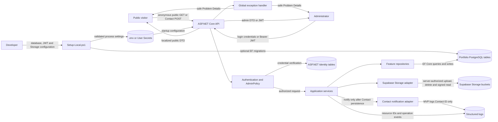
```mermaid
flowchart LR
    Public[Public visitor]
    Admin[Administrator]
    Dev[Developer]

    Setup[Setup-Local.ps1]
    API[ASP.NET Core API]
    Auth[Authentication and AdminPolicy]
    App[Application services]
    Repo[Feature repositories]
    StorageAdapter[Supabase Storage adapter]
    ContactNotifier[Contact notification adapter]
    ErrorHandler[Global exception handler]

    Config[(.env or User Secrets)]
    Identity[(ASP.NET Identity tables)]
    Portfolio[(Portfolio PostgreSQL tables)]
    Objects[(Supabase Storage buckets)]
    Logs[(Structured logs)]

    Dev -->|database, JWT and Storage configuration| Setup
    Setup -->|validated process settings| Config
    Setup -->|optional EF migrations| Portfolio

    Public -->|anonymous public GET or Contact POST| API
    Admin -->|login credentials or Bearer JWT| API
    Config -->|startup configuration| API

    API --> Auth
    Auth -->|credential verification| Identity
    Auth -->|authorized request| App
    App --> Repo
    Repo -->|EF Core queries and writes| Portfolio
    App --> StorageAdapter
    StorageAdapter -->|server-authorized upload, delete and signed read| Objects
    App -->|notify only after Contact persistence| ContactNotifier
    ContactNotifier -->|MVP logs Contact ID only| Logs

    App -->|resource IDs and operation events| Logs
    API --> ErrorHandler
    ErrorHandler -->|safe Problem Details| Public
    ErrorHandler -->|safe Problem Details| Admin

    API -->|localized public DTO| Public
    API -->|admin DTO or JWT| Admin
```

### Quy tắc dữ liệu tại các ranh giới

| Ranh giới | Dữ liệu được phép đi qua | Dữ liệu không được trả/log |
| --- | --- | --- |
| Public API | Published content, đúng locale, Project fields theo disclosure level, signed URL 5 phút của CV Published và Active | Draft, locale khác, hidden email/phone, limited Project fields, object key, secret |
| Admin API | DTO quản trị sau khi JWT có role `Admin` được xác thực | Password, signing key, Storage service-role key |
| PostgreSQL | Entity và object key bền vững | Signed URL tạm thời |
| Supabase Storage | Bucket, server-generated object key, file bytes | Client-supplied storage path |
| Structured logs | Request/trace ID, resource ID, loại thao tác | Nội dung portfolio/contact, password, JWT, refresh token, secret, file bytes |

### Health endpoints

- `GET /health` chỉ kiểm tra process còn phục vụ request; không gọi dependency.
- `GET /health/ready` chạy các check có tag `ready` để quyết định API đã sẵn sàng nhận traffic hay chưa.
- `GET /health/supabase` chạy các check có tag `supabase`, hiện gồm PostgreSQL và Supabase Storage, rồi trả JSON trạng thái qua `HealthCheckResponseWriter`.

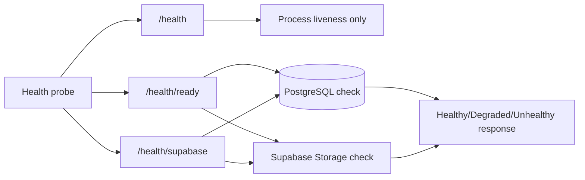
```mermaid
flowchart LR
    Probe[Health probe] --> Live["/health"]
    Probe --> Ready["/health/ready"]
    Probe --> Supabase["/health/supabase"]
    Live --> Process[Process liveness only]
    Ready --> PostgreSQL[(PostgreSQL check)]
    Ready --> Storage[Supabase Storage check]
    Supabase --> PostgreSQL
    Supabase --> Storage
    PostgreSQL --> Result[Healthy/Degraded/Unhealthy response]
    Storage --> Result
```

Trong Development thiếu cấu hình, dependency tương ứng được đăng ký dưới dạng unhealthy check/unavailable adapter để API vẫn khởi động và trả lỗi 503 an toàn khi feature cố sử dụng dependency đó. Ngoài Development, options bắt buộc được validate lúc startup.

## 3. Luồng kiến trúc request

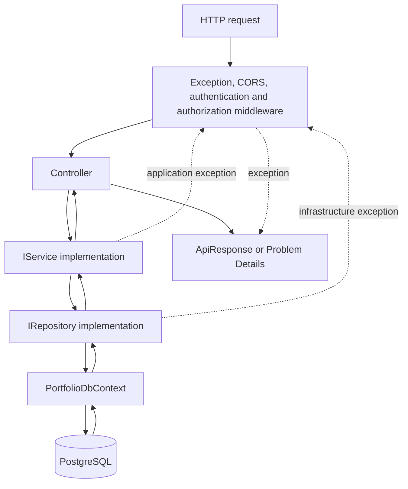
```mermaid
flowchart TD
    Request[HTTP request]
    Middleware[Exception, CORS, authentication and authorization middleware]
    Controller[Controller]
    Service[IService implementation]
    Repository[IRepository implementation]
    DbContext[PortfolioDbContext]
    PostgreSQL[(PostgreSQL)]
    Response[ApiResponse or Problem Details]

    Request --> Middleware
    Middleware --> Controller
    Controller --> Service
    Service --> Repository
    Repository --> DbContext
    DbContext --> PostgreSQL
    PostgreSQL --> DbContext
    DbContext --> Repository
    Repository --> Service
    Service --> Controller
    Controller --> Response

    Middleware -. exception .-> Response
    Service -. application exception .-> Middleware
    Repository -. infrastructure exception .-> Middleware
```

Controller chỉ xử lý HTTP/model binding. Business rules nằm trong Service. EF Core và SQL nằm trong Repository. `CancellationToken` được truyền xuyên suốt chuỗi gọi.

## 4. Setup, migration và bootstrap Administrator

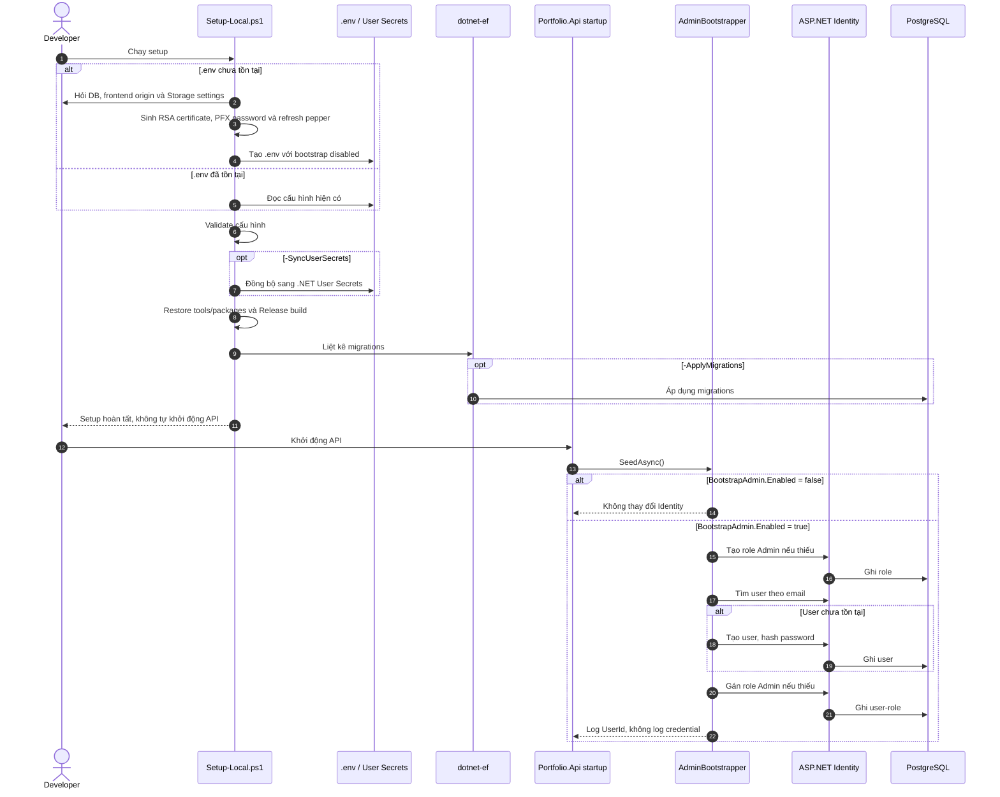
```mermaid
sequenceDiagram
    autonumber
    actor Dev as Developer
    participant Setup as Setup-Local.ps1
    participant Env as .env / User Secrets
    participant EF as dotnet-ef
    participant API as Portfolio.Api startup
    participant Boot as AdminBootstrapper
    participant Identity as ASP.NET Identity
    participant DB as PostgreSQL

    Dev->>Setup: Chạy setup
    alt .env chưa tồn tại
        Setup->>Dev: Hỏi DB, frontend origin và Storage settings
        Setup->>Setup: Sinh RSA certificate, PFX password và refresh pepper
        Setup->>Env: Tạo .env với bootstrap disabled
    else .env đã tồn tại
        Setup->>Env: Đọc cấu hình hiện có
    end

    Setup->>Setup: Validate cấu hình
    opt -SyncUserSecrets
        Setup->>Env: Đồng bộ sang .NET User Secrets
    end
    Setup->>Setup: Restore tools/packages và Release build
    Setup->>EF: Liệt kê migrations
    opt -ApplyMigrations
        EF->>DB: Áp dụng migrations
    end
    Setup-->>Dev: Setup hoàn tất, không tự khởi động API

    Dev->>API: Khởi động API
    API->>Boot: SeedAsync()
    alt BootstrapAdmin.Enabled = false
        Boot-->>API: Không thay đổi Identity
    else BootstrapAdmin.Enabled = true
        Boot->>Identity: Tạo role Admin nếu thiếu
        Identity->>DB: Ghi role
        Boot->>Identity: Tìm user theo email
        alt User chưa tồn tại
            Boot->>Identity: Tạo user, hash password
            Identity->>DB: Ghi user
        end
        Boot->>Identity: Gán role Admin nếu thiếu
        Identity->>DB: Ghi user-role
        Boot-->>API: Log UserId, không log credential
    end
```

### Điều kiện vận hành

1. Bootstrap mặc định tắt và setup script không trực tiếp tạo tài khoản.
2. Identity tables phải tồn tại trước khi API bootstrap user; database mới cần chạy migrations.
3. Sau lần bootstrap thành công phải đặt `BootstrapAdmin__Enabled=false`, đồng bộ lại cấu hình và restart API.
4. Password thực tế phải thỏa Identity policy: tối thiểu 12 ký tự, có chữ hoa, chữ thường, chữ số và ký tự đặc biệt.

## 5. Đăng nhập Administrator

Endpoint: `POST /api/v1/auth/login`

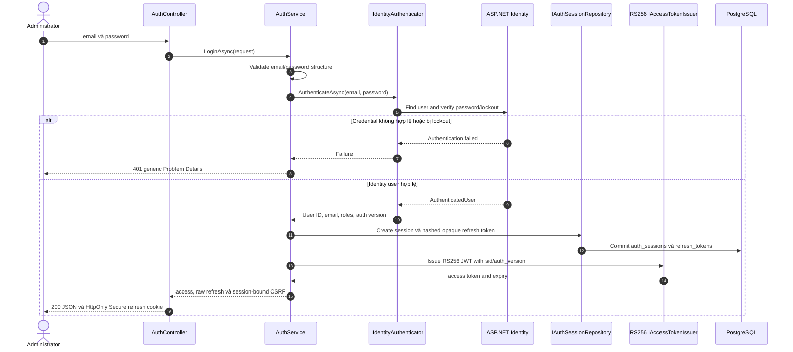
```mermaid
sequenceDiagram
    autonumber
    actor Admin as Administrator
    participant Controller as AuthController
    participant Service as AuthService
    participant Authenticator as IIdentityAuthenticator
    participant Identity as ASP.NET Identity
    participant SessionRepo as IAuthSessionRepository
    participant Issuer as RS256 IAccessTokenIssuer
    participant DB as PostgreSQL

    Admin->>Controller: email và password
    Controller->>Service: LoginAsync(request)
    Service->>Service: Validate email/password structure
    Service->>Authenticator: AuthenticateAsync(email, password)
    Authenticator->>Identity: Find user and verify password/lockout

    alt Credential không hợp lệ hoặc bị lockout
        Identity-->>Authenticator: Authentication failed
        Authenticator-->>Service: Failure
        Service-->>Admin: 401 generic Problem Details
    else Identity user hợp lệ
        Identity-->>Authenticator: AuthenticatedUser
        Authenticator-->>Service: User ID, email, roles, auth version
        Service->>SessionRepo: Create session và hashed opaque refresh token
        SessionRepo->>DB: Commit auth_sessions và refresh_tokens
        Service->>Issuer: Issue RS256 JWT with sid/auth_version
        Issuer-->>Service: access token and expiry
        Service-->>Controller: access, raw refresh và session-bound CSRF
        Controller-->>Admin: 200 JSON và HttpOnly Secure refresh cookie
    end
```

Access JWT tiếp theo được gửi bằng header `Authorization: Bearer <token>`. Login xác thực Identity account; `AdminPolicy` ở các `/admin` endpoint mới quyết định role `Admin` và trả 403 nếu account hợp lệ không có role đó. Request body hoặc custom header không thể tự khai báo quyền Admin. MVP chỉ bootstrap Admin và không có public signup. Access token chỉ giữ trong memory; refresh token chỉ nằm trong cookie `__Host-refresh`. Luồng rotation/reuse chi tiết nằm trong [Authentication Guide](../security/AUTHENTICATION_GUIDE.md).

## 6. Refresh, logout và quản lý session

Endpoints:

- `POST /api/v1/auth/refresh` — anonymous về mặt bearer token nhưng bắt buộc refresh cookie, Origin và `X-CSRF-Token`;
- `POST /api/v1/auth/logout` — authenticated, bắt buộc `X-CSRF-Token`;
- `POST /api/v1/auth/logout-all` — authenticated, bắt buộc `X-CSRF-Token`;
- `GET /api/v1/auth/sessions` — authenticated;
- `DELETE /api/v1/auth/sessions/{sessionId}` — authenticated, bắt buộc `X-CSRF-Token`.

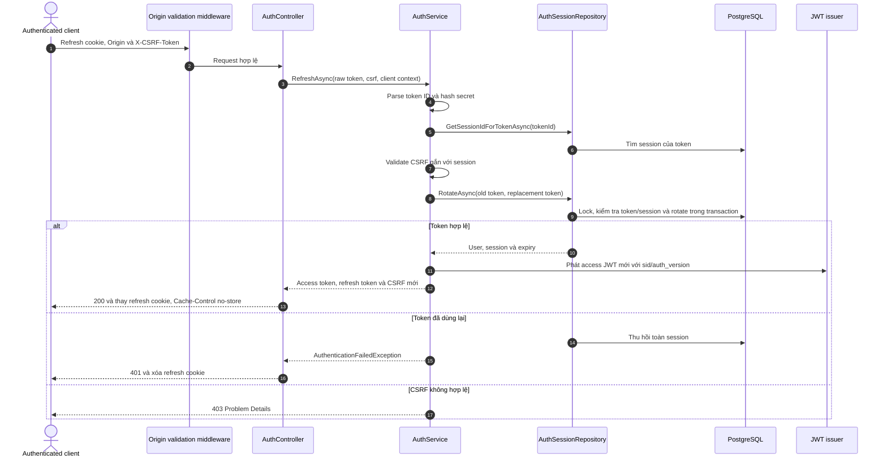
```mermaid
sequenceDiagram
    autonumber
    actor Client as Authenticated client
    participant Origin as Origin validation middleware
    participant Controller as AuthController
    participant Service as AuthService
    participant SessionRepo as AuthSessionRepository
    participant DB as PostgreSQL
    participant Issuer as JWT issuer

    Client->>Origin: Refresh cookie, Origin và X-CSRF-Token
    Origin->>Controller: Request hợp lệ
    Controller->>Service: RefreshAsync(raw token, csrf, client context)
    Service->>Service: Parse token ID và hash secret
    Service->>SessionRepo: GetSessionIdForTokenAsync(tokenId)
    SessionRepo->>DB: Tìm session của token
    Service->>Service: Validate CSRF gắn với session
    Service->>SessionRepo: RotateAsync(old token, replacement token)
    SessionRepo->>DB: Lock, kiểm tra token/session và rotate trong transaction
    alt Token hợp lệ
        SessionRepo-->>Service: User, session và expiry
        Service->>Issuer: Phát access JWT mới với sid/auth_version
        Service-->>Controller: Access token, refresh token và CSRF mới
        Controller-->>Client: 200 và thay refresh cookie, Cache-Control no-store
    else Token đã dùng lại
        SessionRepo->>DB: Thu hồi toàn session
        Service-->>Controller: AuthenticationFailedException
        Controller-->>Client: 401 và xóa refresh cookie
    else CSRF không hợp lệ
        Service-->>Client: 403 Problem Details
    end
```

Logout thu hồi session hiện tại; logout-all thu hồi mọi session của user và làm mất hiệu lực access token thông qua `auth_version`. Danh sách session luôn scope theo `currentUser.UserId`, không trả raw refresh token hoặc hash. Thu hồi một session cũng scope theo current user để chống IDOR; nếu session hiện tại bị thu hồi, Controller xóa refresh cookie.

## 7. Đọc Dashboard quản trị

Endpoint: `GET /api/v1/admin/dashboard`

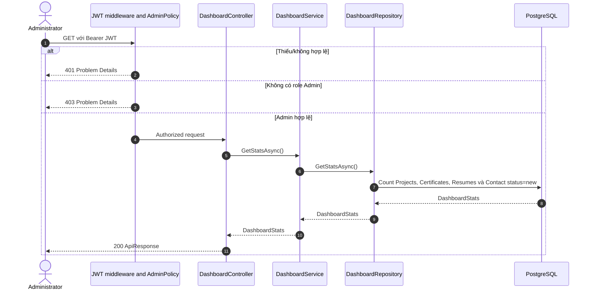
```mermaid
sequenceDiagram
    autonumber
    actor Admin as Administrator
    participant Policy as JWT middleware and AdminPolicy
    participant Controller as DashboardController
    participant Service as DashboardService
    participant Repo as DashboardRepository
    participant DB as PostgreSQL

    Admin->>Policy: GET với Bearer JWT
    alt Thiếu/không hợp lệ
        Policy-->>Admin: 401 Problem Details
    else Không có role Admin
        Policy-->>Admin: 403 Problem Details
    else Admin hợp lệ
        Policy->>Controller: Authorized request
        Controller->>Service: GetStatsAsync()
        Service->>Repo: GetStatsAsync()
        Repo->>DB: Count Projects, Certificates, Resumes và Contact status=new
        DB-->>Repo: DashboardStats
        Repo-->>Service: DashboardStats
        Service-->>Controller: DashboardStats
        Controller-->>Admin: 200 ApiResponse
    end
```

Dashboard chỉ trả số đếm, không trả nội dung Contact hoặc dữ liệu draft chi tiết.

## 8. Đọc Public Profile

Endpoint: `GET /api/v1/portfolio/{slug}/profile?locale=en`

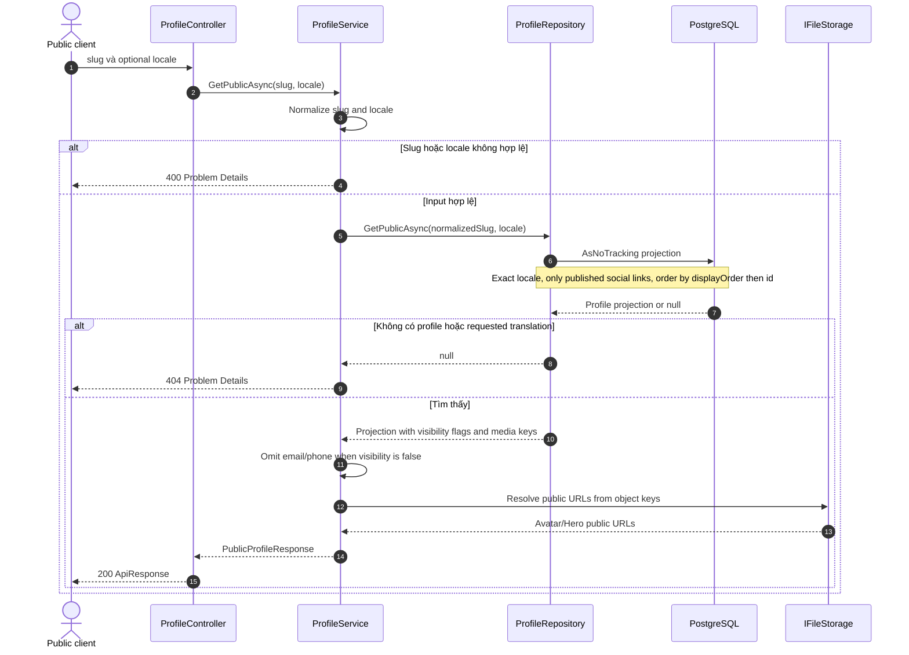
```mermaid
sequenceDiagram
    autonumber
    actor Client as Public client
    participant Controller as ProfileController
    participant Service as ProfileService
    participant Repo as ProfileRepository
    participant DB as PostgreSQL
    participant Storage as IFileStorage

    Client->>Controller: slug và optional locale
    Controller->>Service: GetPublicAsync(slug, locale)
    Service->>Service: Normalize slug and locale
    alt Slug hoặc locale không hợp lệ
        Service-->>Client: 400 Problem Details
    else Input hợp lệ
        Service->>Repo: GetPublicAsync(normalizedSlug, locale)
        Repo->>DB: AsNoTracking projection
        Note over Repo,DB: Exact locale, only published social links, order by displayOrder then id
        DB-->>Repo: Profile projection or null
        alt Không có profile hoặc requested translation
            Repo-->>Service: null
            Service-->>Client: 404 Problem Details
        else Tìm thấy
            Repo-->>Service: Projection with visibility flags and media keys
            Service->>Service: Omit email/phone when visibility is false
            Service->>Storage: Resolve public URLs from object keys
            Storage-->>Service: Avatar/Hero public URLs
            Service-->>Controller: PublicProfileResponse
            Controller-->>Client: 200 ApiResponse
        end
    end
```

Public response không chứa Translation collection, locale khác, social link draft hoặc storage object key.

## 9. Đọc Public About

Endpoint: `GET /api/v1/portfolio/{slug}/about?locale=en`

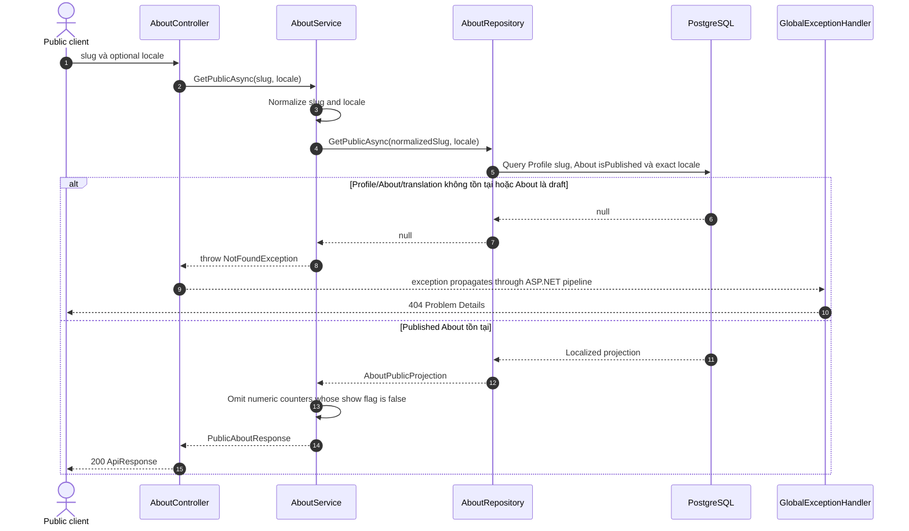
```mermaid
sequenceDiagram
    autonumber
    actor Client as Public client
    participant Controller as AboutController
    participant Service as AboutService
    participant Repo as AboutRepository
    participant DB as PostgreSQL
    participant Handler as GlobalExceptionHandler

    Client->>Controller: slug và optional locale
    Controller->>Service: GetPublicAsync(slug, locale)
    Service->>Service: Normalize slug and locale
    Service->>Repo: GetPublicAsync(normalizedSlug, locale)
    Repo->>DB: Query Profile slug, About isPublished và exact locale
    alt Profile/About/translation không tồn tại hoặc About là draft
        DB-->>Repo: null
        Repo-->>Service: null
        Service-->>Controller: throw NotFoundException
        Controller-->>Handler: exception propagates through ASP.NET pipeline
        Handler-->>Client: 404 Problem Details
    else Published About tồn tại
        DB-->>Repo: Localized projection
        Repo-->>Service: AboutPublicProjection
        Service->>Service: Omit numeric counters whose show flag is false
        Service-->>Controller: PublicAboutResponse
        Controller-->>Client: 200 ApiResponse
    end
```

## 10. Đọc dữ liệu quản trị Profile/About

Endpoints:

- `GET /api/v1/admin/profile`;
- `GET /api/v1/admin/about`.

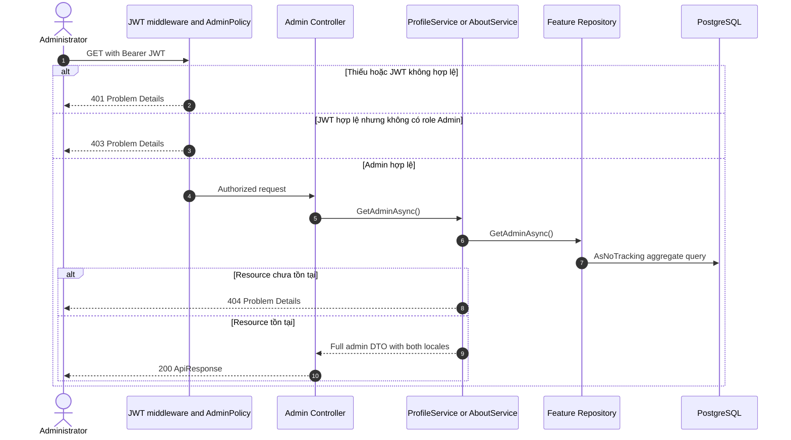
```mermaid
sequenceDiagram
    autonumber
    actor Admin as Administrator
    participant Auth as JWT middleware and AdminPolicy
    participant Controller as Admin Controller
    participant Service as ProfileService or AboutService
    participant Repo as Feature Repository
    participant DB as PostgreSQL

    Admin->>Auth: GET with Bearer JWT
    alt Thiếu hoặc JWT không hợp lệ
        Auth-->>Admin: 401 Problem Details
    else JWT hợp lệ nhưng không có role Admin
        Auth-->>Admin: 403 Problem Details
    else Admin hợp lệ
        Auth->>Controller: Authorized request
        Controller->>Service: GetAdminAsync()
        Service->>Repo: GetAdminAsync()
        Repo->>DB: AsNoTracking aggregate query
        alt Resource chưa tồn tại
            Service-->>Admin: 404 Problem Details
        else Resource tồn tại
            Service-->>Controller: Full admin DTO with both locales
            Controller-->>Admin: 200 ApiResponse
        end
    end
```

## 11. Upsert Profile và Social Links

Endpoint: `PUT /api/v1/admin/profile`

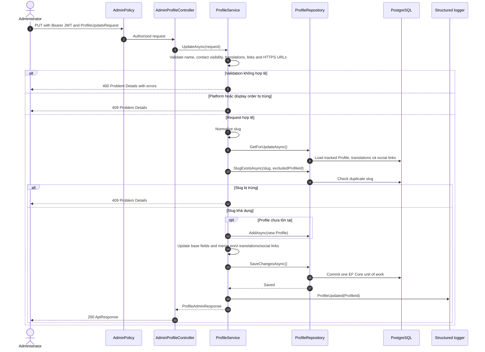
```mermaid
sequenceDiagram
    autonumber
    actor Admin as Administrator
    participant Policy as AdminPolicy
    participant Controller as AdminProfileController
    participant Service as ProfileService
    participant Repo as ProfileRepository
    participant DB as PostgreSQL
    participant Log as Structured logger

    Admin->>Policy: PUT with Bearer JWT and ProfileUpdateRequest
    Policy->>Controller: Authorized request
    Controller->>Service: UpdateAsync(request)
    Service->>Service: Validate name, contact visibility, translations, links and HTTPS URLs
    alt Validation không hợp lệ
        Service-->>Admin: 400 Problem Details with errors
    else Platform hoặc display order bị trùng
        Service-->>Admin: 409 Problem Details
    else Request hợp lệ
        Service->>Service: Normalize slug
        Service->>Repo: GetForUpdateAsync()
        Repo->>DB: Load tracked Profile, translations và social links
        Service->>Repo: SlugExistsAsync(slug, excludedProfileId)
        Repo->>DB: Check duplicate slug
        alt Slug bị trùng
            Service-->>Admin: 409 Problem Details
        else Slug khả dụng
            opt Profile chưa tồn tại
                Service->>Repo: AddAsync(new Profile)
            end
            Service->>Service: Update base fields and merge en/vi translations/social links
            Service->>Repo: SaveChangesAsync()
            Repo->>DB: Commit one EF Core unit of work
            Repo-->>Service: Saved
            Service->>Log: ProfileUpdated(ProfileId)
            Service-->>Controller: ProfileAdminResponse
            Controller-->>Admin: 200 ApiResponse
        end
    end
```

`avatarUrl` và `heroImageUrl` không nằm trong JSON write contract; media chỉ được thay đổi qua endpoint upload chuyên biệt.

## 12. Upsert About

Endpoint: `PUT /api/v1/admin/about`

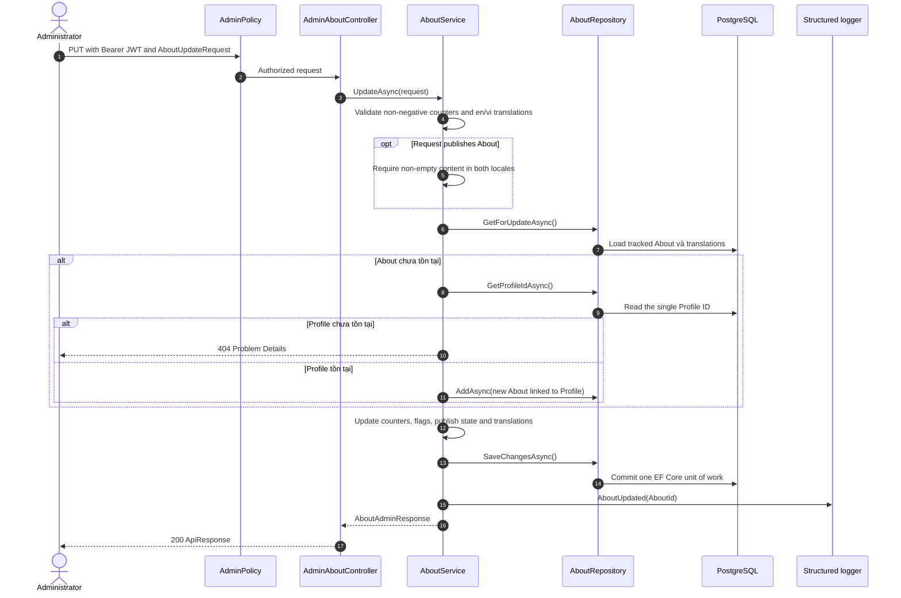
```mermaid
sequenceDiagram
    autonumber
    actor Admin as Administrator
    participant Policy as AdminPolicy
    participant Controller as AdminAboutController
    participant Service as AboutService
    participant Repo as AboutRepository
    participant DB as PostgreSQL
    participant Log as Structured logger

    Admin->>Policy: PUT with Bearer JWT and AboutUpdateRequest
    Policy->>Controller: Authorized request
    Controller->>Service: UpdateAsync(request)
    Service->>Service: Validate non-negative counters and en/vi translations
    opt Request publishes About
        Service->>Service: Require non-empty content in both locales
    end
    Service->>Repo: GetForUpdateAsync()
    Repo->>DB: Load tracked About và translations

    alt About chưa tồn tại
        Service->>Repo: GetProfileIdAsync()
        Repo->>DB: Read the single Profile ID
        alt Profile chưa tồn tại
            Service-->>Admin: 404 Problem Details
        else Profile tồn tại
            Service->>Repo: AddAsync(new About linked to Profile)
        end
    end

    Service->>Service: Update counters, flags, publish state and translations
    Service->>Repo: SaveChangesAsync()
    Repo->>DB: Commit one EF Core unit of work
    Service->>Log: AboutUpdated(AboutId)
    Service-->>Controller: AboutAdminResponse
    Controller-->>Admin: 200 ApiResponse
```

## 13. Thay thế Avatar hoặc Hero image

Endpoints:

- `POST /api/v1/admin/profile/avatar`;
- `POST /api/v1/admin/profile/hero-image`.

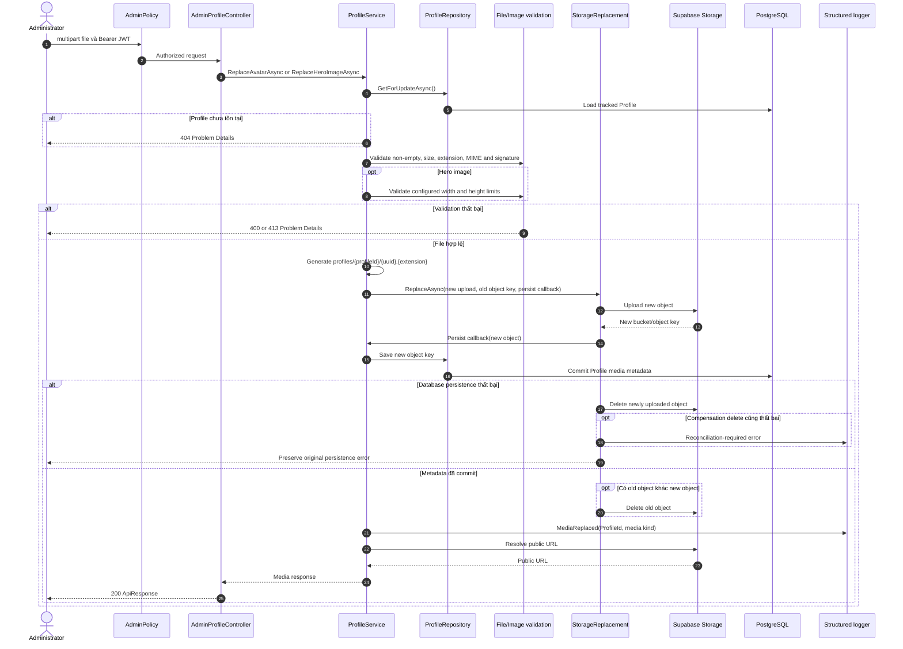
```mermaid
sequenceDiagram
    autonumber
    actor Admin as Administrator
    participant Policy as AdminPolicy
    participant Controller as AdminProfileController
    participant Service as ProfileService
    participant Repo as ProfileRepository
    participant Validator as File/Image validation
    participant Replace as StorageReplacement
    participant Storage as Supabase Storage
    participant DB as PostgreSQL
    participant Log as Structured logger

    Admin->>Policy: multipart file và Bearer JWT
    Policy->>Controller: Authorized request
    Controller->>Service: ReplaceAvatarAsync or ReplaceHeroImageAsync
    Service->>Repo: GetForUpdateAsync()
    Repo->>DB: Load tracked Profile
    alt Profile chưa tồn tại
        Service-->>Admin: 404 Problem Details
    end

    Service->>Validator: Validate non-empty, size, extension, MIME and signature
    opt Hero image
        Service->>Validator: Validate configured width and height limits
    end
    alt Validation thất bại
        Validator-->>Admin: 400 or 413 Problem Details
    else File hợp lệ
        Service->>Service: Generate profiles/{profileId}/{uuid}.{extension}
        Service->>Replace: ReplaceAsync(new upload, old object key, persist callback)
        Replace->>Storage: Upload new object
        Storage-->>Replace: New bucket/object key
        Replace->>Service: Persist callback(new object)
        Service->>Repo: Save new object key
        Repo->>DB: Commit Profile media metadata

        alt Database persistence thất bại
            Replace->>Storage: Delete newly uploaded object
            opt Compensation delete cũng thất bại
                Replace->>Log: Reconciliation-required error
            end
            Replace-->>Admin: Preserve original persistence error
        else Metadata đã commit
            opt Có old object khác new object
                Replace->>Storage: Delete old object
            end
            Service->>Log: MediaReplaced(ProfileId, media kind)
            Service->>Storage: Resolve public URL
            Storage-->>Service: Public URL
            Service-->>Controller: Media response
            Controller-->>Admin: 200 ApiResponse
        end
    end
```

### Trạng thái khi lỗi xóa old object sau commit

Database đã trỏ đến new object trước khi old object bị xóa. Nếu thao tác xóa old object thất bại, metadata mới không rollback; request nhận lỗi Storage và old object có thể cần reconciliation/cleanup sau đó.

## 14. Đọc Public Skills

Endpoint: `GET /api/v1/portfolio/{slug}/skills?locale=en`

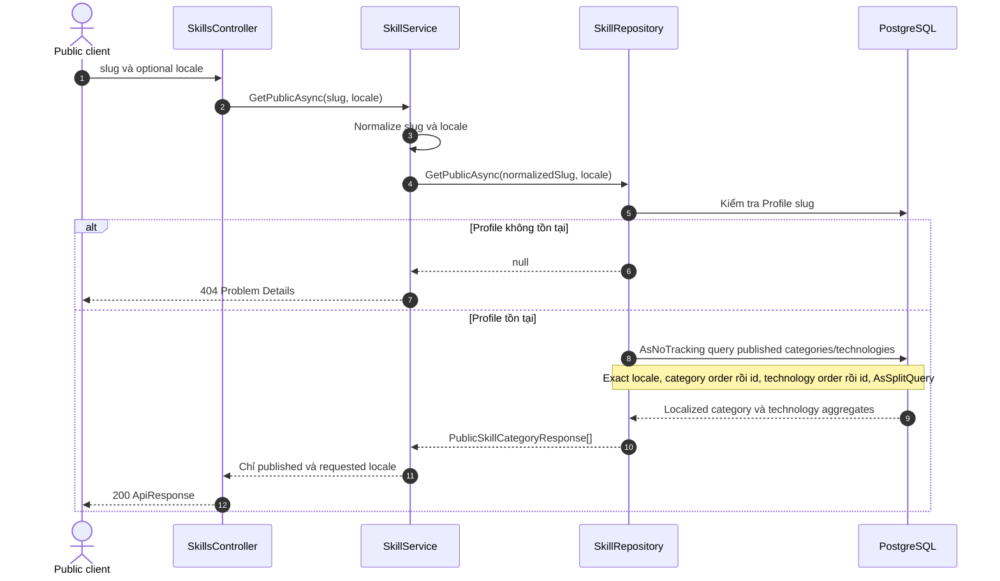
```mermaid
sequenceDiagram
    autonumber
    actor Client as Public client
    participant Controller as SkillsController
    participant Service as SkillService
    participant Repo as SkillRepository
    participant DB as PostgreSQL

    Client->>Controller: slug và optional locale
    Controller->>Service: GetPublicAsync(slug, locale)
    Service->>Service: Normalize slug và locale
    Service->>Repo: GetPublicAsync(normalizedSlug, locale)
    Repo->>DB: Kiểm tra Profile slug
    alt Profile không tồn tại
        Repo-->>Service: null
        Service-->>Client: 404 Problem Details
    else Profile tồn tại
        Repo->>DB: AsNoTracking query published categories/technologies
        Note over Repo,DB: Exact locale, category order rồi id, technology order rồi id, AsSplitQuery
        DB-->>Repo: Localized category và technology aggregates
        Repo-->>Service: PublicSkillCategoryResponse[]
        Service-->>Controller: Chỉ published và requested locale
        Controller-->>Client: 200 ApiResponse
    end
```

Public response nhóm Technology theo Skill Category. Category draft, Technology draft, translation sai locale và dữ liệu quản trị không đi qua public boundary.

## 15. Quản trị Skill Category và Technology

Endpoints:

- `GET|POST /api/v1/admin/skill-categories`;
- `PUT|DELETE /api/v1/admin/skill-categories/{id}`;
- `GET|POST /api/v1/admin/skills`;
- `GET|PUT|DELETE /api/v1/admin/skills/{id}`;
- `PATCH /api/v1/admin/skills/reorder?categoryId={id}`.

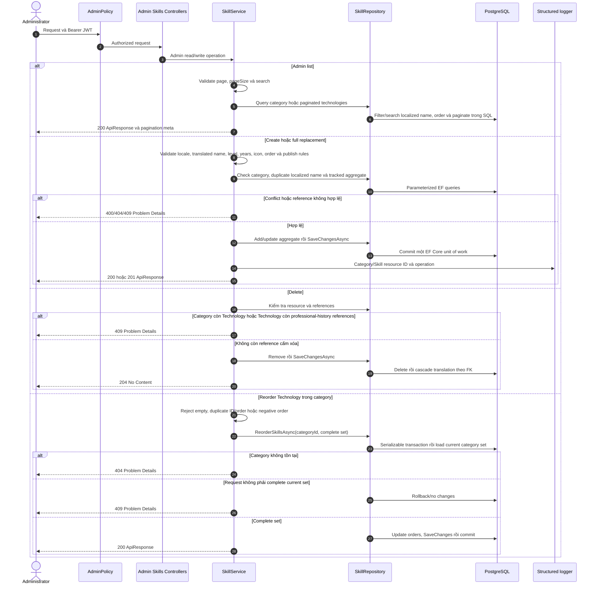
```mermaid
sequenceDiagram
    autonumber
    actor Admin as Administrator
    participant Policy as AdminPolicy
    participant Controller as Admin Skills Controllers
    participant Service as SkillService
    participant Repo as SkillRepository
    participant DB as PostgreSQL
    participant Log as Structured logger

    Admin->>Policy: Request và Bearer JWT
    Policy->>Controller: Authorized request
    Controller->>Service: Admin read/write operation
    alt Admin list
        Service->>Service: Validate page, pageSize và search
        Service->>Repo: Query category hoặc paginated technologies
        Repo->>DB: Filter/search localized name, order và paginate trong SQL
        Service-->>Admin: 200 ApiResponse và pagination meta
    else Create hoặc full replacement
        Service->>Service: Validate locale, translated name, level, years, icon, order và publish rules
        Service->>Repo: Check category, duplicate localized name và tracked aggregate
        Repo->>DB: Parameterized EF queries
        alt Conflict hoặc reference không hợp lệ
            Service-->>Admin: 400/404/409 Problem Details
        else Hợp lệ
            Service->>Repo: Add/update aggregate rồi SaveChangesAsync
            Repo->>DB: Commit một EF Core unit of work
            Service->>Log: Category/Skill resource ID và operation
            Service-->>Admin: 200 hoặc 201 ApiResponse
        end
    else Delete
        Service->>Repo: Kiểm tra resource và references
        alt Category còn Technology hoặc Technology còn professional-history references
            Service-->>Admin: 409 Problem Details
        else Không còn reference cấm xóa
            Service->>Repo: Remove rồi SaveChangesAsync
            Repo->>DB: Delete rồi cascade translation theo FK
            Service-->>Admin: 204 No Content
        end
    else Reorder Technology trong category
        Service->>Service: Reject empty, duplicate ID/order hoặc negative order
        Service->>Repo: ReorderSkillsAsync(categoryId, complete set)
        Repo->>DB: Serializable transaction rồi load current category set
        alt Category không tồn tại
            Service-->>Admin: 404 Problem Details
        else Request không phải complete current set
            Repo->>DB: Rollback/no changes
            Service-->>Admin: 409 Problem Details
        else Complete set
            Repo->>DB: Update orders, SaveChanges rồi commit
            Service-->>Admin: 200 ApiResponse
        end
    end
```

Published Technology bắt buộc thuộc published Category và có cả translation `en`/`vi`. Reorder luôn scope theo một Category và phải chứa đầy đủ tập Technology hiện tại của Category đó.

## 16. Thay thế Skill icon

Endpoint: `POST /api/v1/admin/skills/{id}/icon`

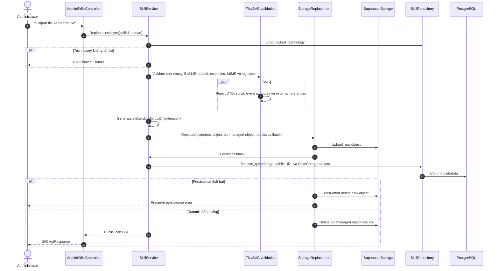
```mermaid
sequenceDiagram
    autonumber
    actor Admin as Administrator
    participant Controller as AdminSkillsController
    participant Service as SkillService
    participant Validator as File/SVG validation
    participant Replace as StorageReplacement
    participant Storage as Supabase Storage
    participant Repo as SkillRepository
    participant DB as PostgreSQL

    Admin->>Controller: multipart file và Bearer JWT
    Controller->>Service: ReplaceIconAsync(skillId, upload)
    Service->>Repo: Load tracked Technology
    alt Technology không tồn tại
        Service-->>Admin: 404 Problem Details
    end
    Service->>Validator: Validate non-empty, 512 KiB default, extension, MIME và signature
    opt SVG
        Validator->>Validator: Reject DTD, script, event attributes và external references
    end
    Service->>Service: Generate skills/{skillId}/{uuid}.{extension}
    Service->>Replace: ReplaceAsync(new object, old managed object, persist callback)
    Replace->>Storage: Upload new object
    Replace->>Service: Persist callback
    Service->>Repo: Set icon_type=image, public URL và SaveChangesAsync
    Repo->>DB: Commit metadata
    alt Persistence thất bại
        Replace->>Storage: Best-effort delete new object
        Replace-->>Admin: Preserve persistence error
    else Commit thành công
        Replace->>Storage: Delete old managed object nếu có
        Service-->>Controller: Public icon URL
        Controller-->>Admin: 200 ApiResponse
    end
```

JSON create/update chỉ chấp nhận Lucide allowlist, text hợp lệ, managed public image URL hoặc HTTPS host nằm trong allowlist cấu hình; client không được gửi storage object key.

## 17. Đọc Public Work Experience

Endpoint: `GET /api/v1/portfolio/{slug}/experiences?locale=en`

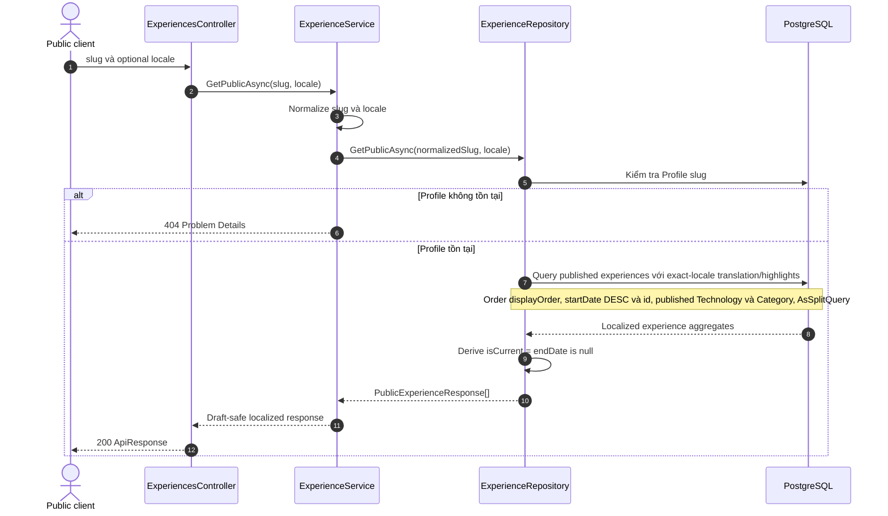
```mermaid
sequenceDiagram
    autonumber
    actor Client as Public client
    participant Controller as ExperiencesController
    participant Service as ExperienceService
    participant Repo as ExperienceRepository
    participant DB as PostgreSQL

    Client->>Controller: slug và optional locale
    Controller->>Service: GetPublicAsync(slug, locale)
    Service->>Service: Normalize slug và locale
    Service->>Repo: GetPublicAsync(normalizedSlug, locale)
    Repo->>DB: Kiểm tra Profile slug
    alt Profile không tồn tại
        Service-->>Client: 404 Problem Details
    else Profile tồn tại
        Repo->>DB: Query published experiences với exact-locale translation/highlights
        Note over Repo,DB: Order displayOrder, startDate DESC và id, published Technology và Category, AsSplitQuery
        DB-->>Repo: Localized experience aggregates
        Repo->>Repo: Derive isCurrent = endDate is null
        Repo-->>Service: PublicExperienceResponse[]
        Service-->>Controller: Draft-safe localized response
        Controller-->>Client: 200 ApiResponse
    end
```

Public DTO không chứa translation của locale khác hoặc draft. Technology summary chỉ xuất hiện khi Technology, Category và requested-locale Technology translation đều public/hợp lệ.

## 18. Quản trị Work Experience

Endpoints:

- `GET|POST /api/v1/admin/experiences`;
- `GET|PUT|DELETE /api/v1/admin/experiences/{id}`;
- `PATCH /api/v1/admin/experiences/reorder`.

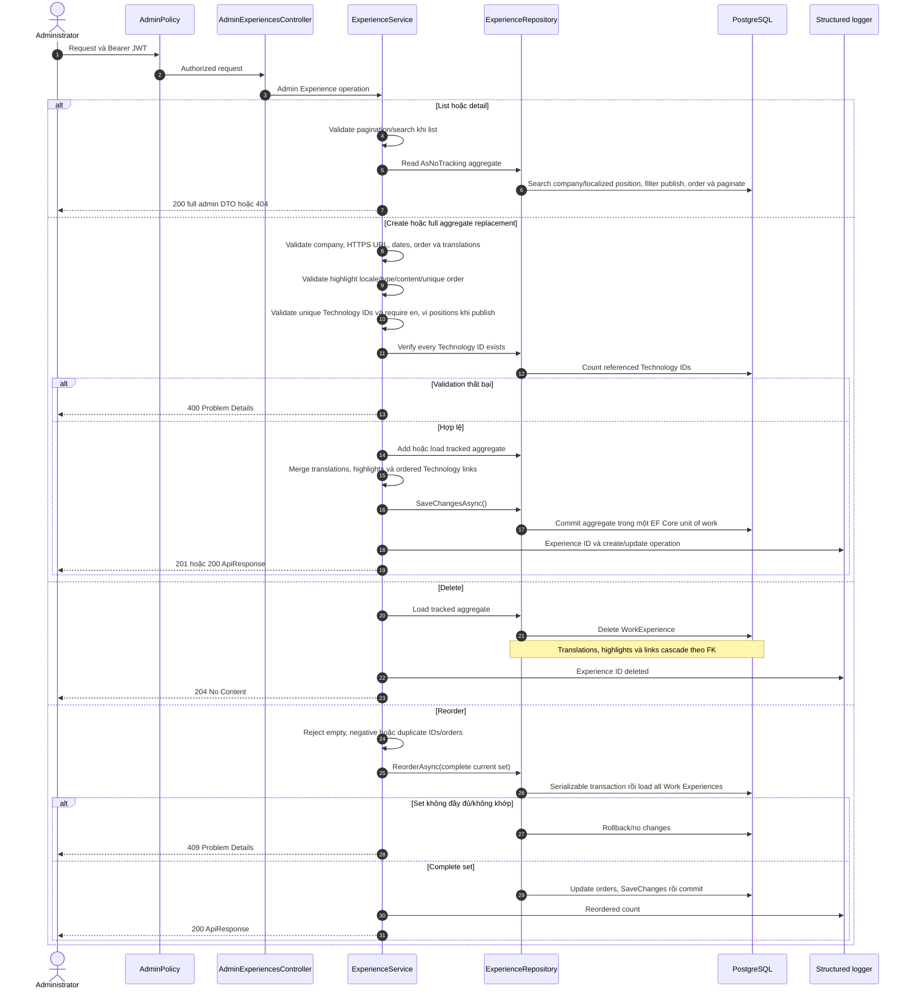
```mermaid
sequenceDiagram
    autonumber
    actor Admin as Administrator
    participant Policy as AdminPolicy
    participant Controller as AdminExperiencesController
    participant Service as ExperienceService
    participant Repo as ExperienceRepository
    participant DB as PostgreSQL
    participant Log as Structured logger

    Admin->>Policy: Request và Bearer JWT
    Policy->>Controller: Authorized request
    Controller->>Service: Admin Experience operation
    alt List hoặc detail
        Service->>Service: Validate pagination/search khi list
        Service->>Repo: Read AsNoTracking aggregate
        Repo->>DB: Search company/localized position, filter publish, order và paginate
        Service-->>Admin: 200 full admin DTO hoặc 404
    else Create hoặc full aggregate replacement
        Service->>Service: Validate company, HTTPS URL, dates, order và translations
        Service->>Service: Validate highlight locale/type/content/unique order
        Service->>Service: Validate unique Technology IDs và require en, vi positions khi publish
        Service->>Repo: Verify every Technology ID exists
        Repo->>DB: Count referenced Technology IDs
        alt Validation thất bại
            Service-->>Admin: 400 Problem Details
        else Hợp lệ
            Service->>Repo: Add hoặc load tracked aggregate
            Service->>Service: Merge translations, highlights và ordered Technology links
            Service->>Repo: SaveChangesAsync()
            Repo->>DB: Commit aggregate trong một EF Core unit of work
            Service->>Log: Experience ID và create/update operation
            Service-->>Admin: 201 hoặc 200 ApiResponse
        end
    else Delete
        Service->>Repo: Load tracked aggregate
        Repo->>DB: Delete WorkExperience
        Note over Repo,DB: Translations, highlights và links cascade theo FK
        Service->>Log: Experience ID deleted
        Service-->>Admin: 204 No Content
    else Reorder
        Service->>Service: Reject empty, negative hoặc duplicate IDs/orders
        Service->>Repo: ReorderAsync(complete current set)
        Repo->>DB: Serializable transaction rồi load all Work Experiences
        alt Set không đầy đủ/không khớp
            Repo->>DB: Rollback/no changes
            Service-->>Admin: 409 Problem Details
        else Complete set
            Repo->>DB: Update orders, SaveChanges rồi commit
            Service->>Log: Reordered count
            Service-->>Admin: 200 ApiResponse
        end
    end
```

`isCurrent` không phải trường client điều khiển; response luôn suy ra từ `endDate == null`. `endDate`, nếu có, phải lớn hơn hoặc bằng `startDate`. Highlight order chỉ cần duy nhất trong cùng cặp `(locale, highlightType)`; thứ tự Technology link được suy ra từ vị trí trong `technologyIds`.

## 19. Đọc Public Projects

Endpoints:

- `GET /api/v1/portfolio/{slug}/projects?locale=en`;
- `GET /api/v1/portfolio/{slug}/projects/{projectSlug}?locale=en`.

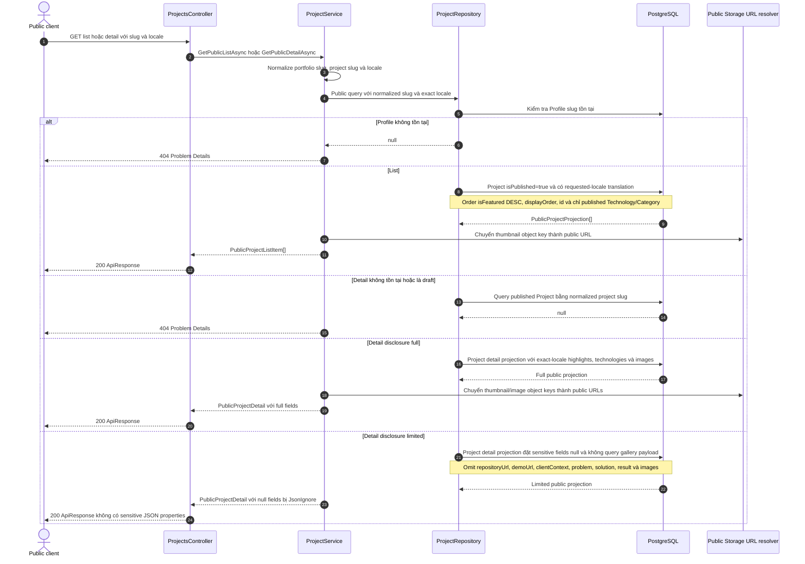
```mermaid
sequenceDiagram
    autonumber
    actor Client as Public client
    participant Controller as ProjectsController
    participant Service as ProjectService
    participant Repo as ProjectRepository
    participant DB as PostgreSQL
    participant Storage as Public Storage URL resolver

    Client->>Controller: GET list hoặc detail với slug và locale
    Controller->>Service: GetPublicListAsync hoặc GetPublicDetailAsync
    Service->>Service: Normalize portfolio slug, project slug và locale
    Service->>Repo: Public query với normalized slug và exact locale
    Repo->>DB: Kiểm tra Profile slug tồn tại
    alt Profile không tồn tại
        Repo-->>Service: null
        Service-->>Client: 404 Problem Details
    else List
        Repo->>DB: Project isPublished=true và có requested-locale translation
        Note over Repo,DB: Order isFeatured DESC, displayOrder, id và chỉ published Technology/Category
        DB-->>Repo: PublicProjectProjection[]
        Service->>Storage: Chuyển thumbnail object key thành public URL
        Service-->>Controller: PublicProjectListItem[]
        Controller-->>Client: 200 ApiResponse
    else Detail không tồn tại hoặc là draft
        Repo->>DB: Query published Project bằng normalized project slug
        DB-->>Repo: null
        Service-->>Client: 404 Problem Details
    else Detail disclosure full
        Repo->>DB: Project detail projection với exact-locale highlights, technologies và images
        DB-->>Repo: Full public projection
        Service->>Storage: Chuyển thumbnail/image object keys thành public URLs
        Service-->>Controller: PublicProjectDetail với full fields
        Controller-->>Client: 200 ApiResponse
    else Detail disclosure limited
        Repo->>DB: Project detail projection đặt sensitive fields null và không query gallery payload
        Note over Repo,DB: Omit repositoryUrl, demoUrl, clientContext, problem, solution, result và images
        DB-->>Repo: Limited public projection
        Service-->>Controller: PublicProjectDetail với null fields bị JsonIgnore
        Controller-->>Client: 200 ApiResponse không có sensitive JSON properties
    end
```

Public list/detail dùng DTO riêng với Admin DTO. Draft bị loại ngay trong repository predicate. Với Project `limited`, các property nhạy cảm bị loại ở server-side projection và tiếp tục bị bỏ ở serialization; frontend không chịu trách nhiệm che dữ liệu. Enum công khai dùng đúng giá trị camel-case `personal|professional` và `full|limited`.

## 20. Quản trị Projects

Endpoints:

- `GET|POST /api/v1/admin/projects`;
- `GET|PUT|DELETE /api/v1/admin/projects/{id}`;
- `PATCH /api/v1/admin/projects/{id}/publish`;
- `PATCH /api/v1/admin/projects/reorder`.

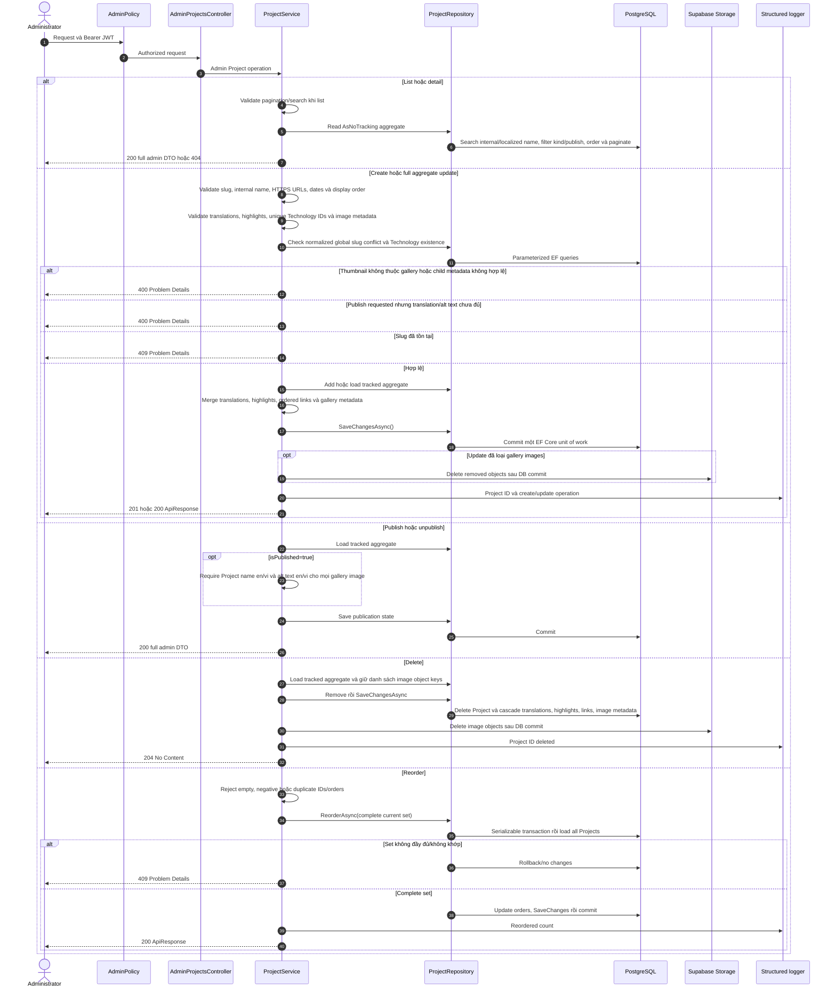
```mermaid
sequenceDiagram
    autonumber
    actor Admin as Administrator
    participant Policy as AdminPolicy
    participant Controller as AdminProjectsController
    participant Service as ProjectService
    participant Repo as ProjectRepository
    participant DB as PostgreSQL
    participant Storage as Supabase Storage
    participant Log as Structured logger

    Admin->>Policy: Request và Bearer JWT
    Policy->>Controller: Authorized request
    Controller->>Service: Admin Project operation
    alt List hoặc detail
        Service->>Service: Validate pagination/search khi list
        Service->>Repo: Read AsNoTracking aggregate
        Repo->>DB: Search internal/localized name, filter kind/publish, order và paginate
        Service-->>Admin: 200 full admin DTO hoặc 404
    else Create hoặc full aggregate update
        Service->>Service: Validate slug, internal name, HTTPS URLs, dates và display order
        Service->>Service: Validate translations, highlights, unique Technology IDs và image metadata
        Service->>Repo: Check normalized global slug conflict và Technology existence
        Repo->>DB: Parameterized EF queries
        alt Thumbnail không thuộc gallery hoặc child metadata không hợp lệ
            Service-->>Admin: 400 Problem Details
        else Publish requested nhưng translation/alt text chưa đủ
            Service-->>Admin: 400 Problem Details
        else Slug đã tồn tại
            Service-->>Admin: 409 Problem Details
        else Hợp lệ
            Service->>Repo: Add hoặc load tracked aggregate
            Service->>Service: Merge translations, highlights, ordered links và gallery metadata
            Service->>Repo: SaveChangesAsync()
            Repo->>DB: Commit một EF Core unit of work
            opt Update đã loại gallery images
                Service->>Storage: Delete removed objects sau DB commit
            end
            Service->>Log: Project ID và create/update operation
            Service-->>Admin: 201 hoặc 200 ApiResponse
        end
    else Publish hoặc unpublish
        Service->>Repo: Load tracked aggregate
        opt isPublished=true
            Service->>Service: Require Project name en/vi và alt text en/vi cho mọi gallery image
        end
        Service->>Repo: Save publication state
        Repo->>DB: Commit
        Service-->>Admin: 200 full admin DTO
    else Delete
        Service->>Repo: Load tracked aggregate và giữ danh sách image object keys
        Service->>Repo: Remove rồi SaveChangesAsync
        Repo->>DB: Delete Project và cascade translations, highlights, links, image metadata
        Service->>Storage: Delete image objects sau DB commit
        Service->>Log: Project ID deleted
        Service-->>Admin: 204 No Content
    else Reorder
        Service->>Service: Reject empty, negative hoặc duplicate IDs/orders
        Service->>Repo: ReorderAsync(complete current set)
        Repo->>DB: Serializable transaction rồi load all Projects
        alt Set không đầy đủ/không khớp
            Repo->>DB: Rollback/no changes
            Service-->>Admin: 409 Problem Details
        else Complete set
            Repo->>DB: Update orders, SaveChanges rồi commit
            Service->>Log: Reordered count
            Service-->>Admin: 200 ApiResponse
        end
    end
```

Project slug được normalize trước khi kiểm tra unique toàn cục vì MVP chỉ có một Portfolio. `thumbnailImageId` phải trỏ đến image còn thuộc cùng Project; database lưu object key tương ứng trong `thumbnail_url`, còn admin response chỉ trả public URL. Xóa Project hoặc loại image khỏi full replacement luôn commit metadata trước rồi mới xóa Storage object.

## 21. Upload Project gallery và compensation

Endpoint: `POST /api/v1/admin/projects/{id}/images`

```mermaid
sequenceDiagram
    autonumber
    actor Admin as Administrator
    participant Controller as AdminProjectsController
    participant Service as ProjectService
    participant Validator as File and metadata validation
    participant Repo as ProjectRepository
    participant Storage as Supabase Storage
    participant DB as PostgreSQL
    participant Log as Structured logger

    Admin->>Controller: multipart files + metadata JSON + Bearer JWT
    Controller->>Controller: Parse metadata và map fileIndex theo zero-based file order
    Controller->>Service: UploadGalleryAsync(projectId, files, metadata)
    Service->>Validator: Validate 1..configured count, unique fileIndex/order và altText en/vi
    Service->>Repo: Load tracked Project aggregate
    alt Project không tồn tại
        Service-->>Admin: 404 Problem Details
    end
    loop Mọi file trước khi upload
        Service->>Validator: Validate non-empty, size, PNG/JPEG/WebP extension, MIME và signature
    end
    loop Mỗi validated file
        Service->>Service: Generate projects/{projectId}/{uuid}.{extension}
        Service->>Storage: Upload object
        alt Upload hiện tại thất bại
            Service->>Storage: Best-effort delete mọi object đã upload trong request
            Service-->>Admin: Safe provider error
        end
    end
    Service->>Repo: Add ProjectImage + alt translations rồi SaveChangesAsync
    Repo->>DB: Commit gallery metadata
    alt Persistence thất bại
        Service->>Storage: Best-effort delete mọi object mới
        Service->>Log: Log reconciliation error nếu compensation delete thất bại
        Service-->>Admin: Preserve persistence error
    else Commit thành công
        Service->>Storage: Resolve public image URLs
        Service->>Log: Project ID và uploaded count
        Service-->>Controller: Public image DTOs, không có object keys
        Controller-->>Admin: 200 ApiResponse
    end
```

Mặc định mỗi request nhận tối đa 10 file và cấu hình bị chặn ở khoảng 1–20. Tất cả file được validate trước lần upload đầu tiên. Nếu một upload ở giữa batch hoặc DB commit thất bại, service cố gắng xóa toàn bộ object mới của request bằng cancellation token độc lập để client cancellation không bỏ dở compensation.

## 22. Đọc Public CV hiện hành

Endpoint: `GET /api/v1/portfolio/{slug}/cv/current?language=en`

```mermaid
sequenceDiagram
    autonumber
    actor Client as Public client
    participant Controller as ResumesController
    participant Service as ResumeService
    participant Repo as ResumeRepository
    participant DB as PostgreSQL
    participant Storage as IFileStorage

    Client->>Controller: GET với slug và language bắt buộc
    Controller->>Service: GetPublicCurrentAsync(slug, language)
    Service->>Service: Normalize slug và validate language đúng en hoặc vi
    alt Slug hoặc language không hợp lệ
        Service-->>Client: 400 Problem Details
    else Input hợp lệ
        Service->>Repo: GetPublicCurrentAsync(normalizedSlug, language)
        Repo->>DB: Kiểm tra Profile slug và query Resume Published, Active, đúng language
        DB-->>Repo: Public projection hoặc null
        alt Không có Portfolio hoặc CV Published và Active
            Repo-->>Service: null
            Service-->>Client: 404 Problem Details
        else Tìm thấy CV hiện hành
            Repo-->>Service: Metadata, requested-language description và private object key
            Service->>Storage: CreateSignedReadUrlAsync với lifetime 5 phút
            alt Storage provider không khả dụng
                Storage-->>Service: ServiceUnavailableException
                Service-->>Client: 503 Problem Details
            else Ký URL thành công
                Storage-->>Service: Signed URL
                Service->>Service: Format version v{year}_{sequence:00} và tính expiresAt
                Service-->>Controller: ResumePublicResponse không có object key
                Controller-->>Client: 200 ApiResponse
            end
        end
    end
```

`language` không có giá trị mặc định ở endpoint này. Response chỉ được tạo từ Resume vừa `IsPublished=true` vừa `IsActive=true`; signed URL hết hạn sau 5 phút và không được lưu vào PostgreSQL.

## 23. Upload Resume version và cấp version transaction-safe

Endpoint: `POST /api/v1/admin/cv`

```mermaid
sequenceDiagram
    autonumber
    actor Admin as Administrator
    participant Auth as JWT middleware and AdminPolicy
    participant Controller as AdminResumesController
    participant Service as ResumeService
    participant Storage as IFileStorage
    participant Repo as ResumeRepository
    participant DB as PostgreSQL
    participant Log as Structured log

    Admin->>Auth: Multipart request với Bearer JWT
    Auth->>Controller: Authorized request
    Controller->>Controller: Inspect forbidden version fields
    alt Client gửi version, versionYear hoặc versionSequence
        Controller-->>Admin: 400 Problem Details
    else Version fields vắng mặt
        Controller->>Service: UploadAsync(file, language, descriptions, flags)
        Service->>Service: Validate en hoặc vi, description length và active requires published
        Service->>Service: Validate non-empty PDF size, extension, MIME và signature
        alt Validation thất bại
            Service-->>Admin: 400 hoặc 413 Problem Details
        else File hợp lệ
            Service->>Service: Tạo Resume ID và object key resumes/{id}/{uuid}.pdf
            Service->>Storage: Upload object vào private cv-files bucket
            alt Storage upload thất bại
                Storage-->>Service: Storage application exception
                Service-->>Admin: 409, 413 hoặc 503 Problem Details
            else Storage upload thành công
                Storage-->>Service: Stored object identity
                Service->>Service: Lấy version year theo Asia/Ho_Chi_Minh
                Service->>Repo: CreateVersionAsync(resume, versionYear)
                Repo->>DB: Begin transaction
                Repo->>DB: INSERT counter ON CONFLICT DO UPDATE RETURNING sequence
                opt Upload yêu cầu IsActive=true
                    Repo->>DB: Deactivate Resume current cũ cùng language
                end
                Repo->>DB: Insert Resume metadata và en/vi translation rows
                alt Persistence thất bại
                    Repo->>DB: Rollback counter, metadata và active switch
                    Repo-->>Service: Preserve persistence exception
                    Service->>Storage: Best-effort delete object mới với independent token
                    opt Compensation delete thất bại
                        Service->>Log: Log reconciliation-required với bucket và object key
                    end
                    Service-->>Admin: Safe Problem Details
                else Commit thành công
                    Repo->>DB: Commit transaction
                    Repo-->>Service: Resume với server-generated sequence
                    Service->>Service: Format version v{year}_{sequence:00}
                    Service-->>Controller: ResumeAdminResponse không có object key
                    Controller-->>Admin: 201 ApiResponse
                end
            end
        end
    end
```

Mỗi upload tạo một hàng Resume và một object mới, không có endpoint ghi đè file lịch sử. Counter độc lập theo `(language_code, version_year)`; xóa version cũ không tái sử dụng sequence và khoảng trống sequence sau commit là hợp lệ.

## 24. Quản trị danh sách, publication, current và xóa Resume

Endpoints:

- `GET /api/v1/admin/cv?language=&page=1&pageSize=20`;
- `PATCH /api/v1/admin/cv/{id}/current`;
- `PATCH /api/v1/admin/cv/{id}/publish`;
- `DELETE /api/v1/admin/cv/{id}`.

```mermaid
sequenceDiagram
    autonumber
    actor Admin as Administrator
    participant Controller as AdminResumesController
    participant Service as ResumeService
    participant Repo as ResumeRepository
    participant DB as PostgreSQL
    participant Storage as IFileStorage
    participant Log as Structured log

    alt List Resume versions
        Admin->>Controller: GET optional language và pagination
        Controller->>Service: GetResumesAsync(query)
        Service->>Service: Validate language, page và pageSize
        Service->>Repo: GetResumesAsync(query)
        Repo->>DB: AsNoTracking query ordered by language, year desc, sequence desc
        Repo-->>Service: Entity page với translations
        Service-->>Admin: 200 paged admin DTOs không có object key
    else Set current
        Admin->>Controller: PATCH current với isCurrent=true
        Controller->>Service: SetCurrentAsync(id, request)
        alt isCurrent=false
            Service-->>Admin: 400 Problem Details
        else isCurrent=true
            Service->>Repo: SetCurrentAsync(id, updatedAt)
            Repo->>DB: Begin transaction và load target
            alt Target không tồn tại
                Repo-->>Service: NotFound
                Service-->>Admin: 404 Problem Details
            else Target chưa Published
                Repo-->>Service: NotPublished
                Service-->>Admin: 400 Problem Details
            else Target Published
                Repo->>DB: Deactivate current cũ rồi activate target trong cùng transaction
                Repo->>DB: Commit transaction
                Service->>Log: Event 2704 với ResumeId sau khi activate thành công
                Service-->>Admin: 200 ResumeAdminResponse, version không đổi
            end
        end
    else Change publication
        Admin->>Controller: PATCH publish với isPublished
        Controller->>Service: SetPublishedAsync(id, request)
        Service->>Repo: Get tracked Resume
        alt Unpublish Resume đang Active
            Service-->>Admin: 409 Problem Details
        else State hợp lệ
            Service->>Repo: SaveChangesAsync()
            Repo->>DB: Update is_published, không cấp version mới
            Service->>Log: Event 2705 với ResumeId và IsPublished sau khi lưu thành công
            Service-->>Admin: 200 ResumeAdminResponse
        end
    else Delete version
        Admin->>Controller: DELETE Resume ID
        Controller->>Service: DeleteAsync(id)
        Service->>Repo: Get tracked Resume
        alt Resume không tồn tại
            Service-->>Admin: 404 Problem Details
        else Resume đang Active
            Service-->>Admin: 409 Problem Details
        else Resume không Active
            Service->>Repo: Remove và SaveChangesAsync()
            Repo->>DB: Commit metadata delete và translation cascade
            Service->>Storage: DeleteIfExistsAsync sau commit
            opt Storage cleanup thất bại
                Service->>Log: Log reconciliation-required, không rollback metadata
            end
            Service-->>Controller: Completed
            Controller-->>Admin: 204 No Content
        end
    end
```

Toàn bộ endpoint `/api/v1/admin/cv` yêu cầu `AdminPolicy`: thiếu hoặc JWT không hợp lệ trả 401, còn tài khoản không có role Admin trả 403 trước khi vào Controller. Đổi publication hoặc current không tạo version mới. Chỉ sau khi persistence thành công, service mới phát audit event 2704 hoặc 2705; event chỉ chứa Resume ID và trạng thái boolean cần thiết, không chứa tên file, object key, signed URL hay nội dung CV. Partial unique index `ux_resumes_one_active_per_language` bảo vệ invariant tối đa một Resume Active cho mỗi ngôn ngữ ở database; application rule bổ sung rằng Resume Active phải Published.

## 25. Contact submission và quản trị inbox

Hướng dẫn nhập môn về thuật toán, partition key, cấu hình, reverse proxy và kiểm thử nằm tại [Rate Limiting Guide](RATE_LIMITING_GUIDE.md). Section này tập trung vào behavior runtime của Contact trong Sprint 8.

### Public Contact submission

```mermaid
sequenceDiagram
    autonumber
    actor Visitor as Public visitor
    participant Limiter as ContactSubmission rate limiter
    participant Size as ContactRequestSizeMiddleware
    participant Controller as ContactsController
    participant Service as ContactService
    participant Repo as ContactRepository
    participant DB as PostgreSQL
    participant Notifier as IContactNotifier
    participant Log as Structured log

    Visitor->>Limiter: POST /api/v1/contact
    alt Hết quota theo connection IP
        Limiter-->>Visitor: 429 Problem Details + Retry-After nếu có
    else Còn quota
        Limiter->>Size: Chuyển request tiếp
        alt Body lớn hơn 65,536 bytes
            Size-->>Visitor: 413 Problem Details
        else Body trong giới hạn
            Size->>Controller: Buffered body
            alt Model binding/DTO validation lỗi
                Controller-->>Visitor: 400 Validation Problem
            else DTO hợp lệ
                Controller->>Service: Request + SHA-256 IP hash + User-Agent
                Service->>Service: Trim, validate và kiểm tra honeypot website
                Service->>Repo: Add Contact status=New
                Repo->>DB: SaveChangesAsync
                alt Persistence thất bại
                    DB-->>Visitor: 500/503 Problem Details qua exception handler
                else Persist thành công và honeypot có dữ liệu
                    Service->>Log: Contact ID + isSpam=true
                    Service-->>Controller: Receipt
                    Controller-->>Visitor: 201 Message received
                else Persist thành công và không phải spam
                    Service->>Notifier: NotifyAsync sau commit
                    alt Notification thất bại
                        Service->>Log: Warning chỉ chứa Contact ID
                    end
                    Service-->>Controller: Receipt
                    Controller-->>Visitor: 201 Message received
                end
            end
        end
    end
```

Named policy `ContactSubmission` dùng fixed window, partition theo `HttpContext.Connection.RemoteIpAddress` đã chuẩn hóa, `QueueLimit=0` và tự replenishment. Giá trị mặc định/production là 5 request trong 60 giây; Development dùng 20 request trong 60 giây. Request vượt quota bị từ chối trước khi body được buffer hoặc gọi Service.

Ứng dụng không tin trực tiếp `X-Forwarded-For`. Nếu production chạy sau reverse proxy, phải thiết lập trusted proxy/network và Forwarded Headers Middleware trước khi kỳ vọng `RemoteIpAddress` là IP visitor; nếu chưa làm, quota có thể áp dụng cho IP proxy. Raw IP không được lưu. Controller chuẩn hóa IPv4-mapped IPv6 rồi lưu lowercase SHA-256 hash; User-Agent được Service trim và giới hạn 500 ký tự.

DTO và Application cùng bảo vệ các giới hạn quan trọng: `senderName` 150, `senderEmail` 320 và đúng định dạng email, `subject` 200, `message` 5,000, `website` 200 ký tự. `website` là honeypot: khi có dữ liệu, Service vẫn persist record với `isSpam=true` và trả cùng receipt `201` như submission bình thường, nhưng không gọi notifier. Cách trả giống nhau tránh cung cấp tín hiệu giúp bot điều chỉnh hành vi.

Persistence là bước bắt buộc; notification chỉ là side effect best effort sau commit. Nếu notification thất bại, message không bị rollback và client vẫn nhận `201`. MVP dùng `LoggingContactNotifier`, chưa gửi nội dung sang email provider. Response thành công chỉ có `id` và `receivedAt`, không echo tên, email, subject hoặc message.

### Đọc Contact inbox

```mermaid
sequenceDiagram
    autonumber
    actor Admin as Administrator
    participant Auth as Authentication + AdminPolicy
    participant Controller as AdminContactsController
    participant Service as ContactService
    participant Repo as ContactRepository
    participant DB as PostgreSQL

    Admin->>Auth: GET /api/v1/admin/contacts?page&pageSize&status&search
    alt Thiếu/không hợp lệ hoặc không có role Admin
        Auth-->>Admin: 401 hoặc 403 Problem Details
    else Được phép
        Auth->>Controller: Authorized request
        Controller->>Service: ContactAdminQuery
        alt page < 1, pageSize ngoài 1..100, status/search không hợp lệ
            Service-->>Admin: 400 Validation Problem
        else Query hợp lệ
            Service->>Repo: GetPageAsync
            Repo->>DB: Optional status + ILIKE name/email/subject + SQL pagination
            DB-->>Repo: Items + total, order CreatedAt desc rồi Id
            Repo-->>Service: ContactMessagePage
            Service-->>Controller: Admin DTO page
            Controller-->>Admin: 200 data + pagination meta
        end
    end
```

List query dùng `AsNoTracking()`, filter và pagination trong PostgreSQL. `search` được áp dụng case-insensitive cho sender name, sender email và subject; message body không thuộc search scope. `GET /api/v1/admin/contacts/{id}` cũng là read-only và **không tự chuyển** status sang `Read`; resource không tồn tại trả 404.

Public route không có inbox read endpoint. `GET /api/v1/contact` trả 405, còn toàn bộ `/api/v1/admin/contacts` yêu cầu `AdminPolicy`.

### Đổi trạng thái và xóa Contact

```mermaid
flowchart TD
    Request[Admin PATCH contact status]
    Auth{JWT và AdminPolicy hợp lệ?}
    Validate{Status là New, Read hoặc Archived?}
    Load{Contact tồn tại?}
    Transition{Trạng thái đích}
    Save[(SaveChangesAsync)]
    Done[200 Contact status updated]

    Request --> Auth
    Auth -->|Không| EAuth[401 hoặc 403]
    Auth -->|Có| Validate
    Validate -->|Không| E400[400 Validation Problem]
    Validate -->|Có| Load
    Load -->|Không| E404[404 Problem Details]
    Load -->|Có| Transition
    Transition -->|Read| Set[Đặt ReadAt nếu đang null]
    Transition -->|New| Clear[Xóa ReadAt]
    Transition -->|Archived| Keep[Giữ nguyên ReadAt]
    Set --> Save
    Clear --> Save
    Keep --> Save
    Save --> Done
```

`PATCH /api/v1/admin/contacts/{id}/status` chỉ nhận `New`, `Read` hoặc `Archived`. Chuyển sang `Read` đặt `readAt` theo UTC nếu chưa có; patch `Read` lặp lại không ghi đè thời điểm đọc đầu tiên. Chuyển về `New` xóa `readAt`; chuyển sang `Archived` giữ nguyên giá trị hiện có.

`DELETE /api/v1/admin/contacts/{id}` thực hiện hard delete và trả 204; ID không tồn tại trả 404. Không có Storage object hoặc notification compensation trong delete flow.

Dashboard đếm mọi Contact có `status=New`. `isSpam` là cờ độc lập, vì vậy spam vẫn thuộc số đếm New cho đến khi Administrator đổi trạng thái hoặc xóa record.

## 26. Xử lý lỗi tập trung

```mermaid
flowchart LR
    Failure[Exception from API, Application or Infrastructure]
    Handler[GlobalExceptionHandler]
    Log[Server-side structured log]
    Problem["Problem Details JSON with requestId"]

    Failure --> Handler
    Handler -->|ValidationException| E400[400 Validation failed]
    Handler -->|AuthenticationFailedException| E401[401 Authentication failed]
    Handler -->|ForbiddenException| E403[403 Forbidden]
    Handler -->|NotFoundException| E404[404 Resource not found]
    Handler -->|ConflictException| E409[409 Conflict]
    Handler -->|PayloadTooLargeException| E413[413 Payload too large]
    Handler -->|ServiceUnavailableException| E503[503 Service unavailable]
    Handler -->|Unexpected exception| E500[500 generic server error]
    Handler --> Problem
    E500 --> Log
```

Chỉ validation error có `errors` theo field. Mọi Problem Details có `requestId`. Unexpected exception được log server-side nhưng response không chứa stack trace, SQL/provider detail hoặc secret.

## 27. Ma trận endpoint và data store

| Endpoint | Quyền | Service | Data store/adapter chính | Public disclosure |
| --- | --- | --- | --- | --- |
| `GET /health` | Anonymous | ASP.NET Core Health Checks | Không gọi dependency | Chỉ process liveness |
| `GET /health/ready` | Anonymous | ASP.NET Core Health Checks | PostgreSQL + Supabase Storage | Chỉ trạng thái readiness |
| `GET /health/supabase` | Anonymous | `HealthCheckResponseWriter` | PostgreSQL + Supabase Storage | JSON health status, không trả secret |
| `POST /api/v1/auth/login` | Anonymous | `AuthService` | ASP.NET Identity, JWT issuer | Chỉ token thành công; lỗi credential dùng thông báo chung |
| `POST /api/v1/auth/refresh` | Cookie + Origin + CSRF | `AuthService` | PostgreSQL session/token, JWT issuer | Rotate token; reuse revoke toàn session |
| `POST /api/v1/auth/logout` | Authenticated + CSRF | `AuthService` | PostgreSQL session/token | Idempotent, xóa refresh cookie |
| `POST /api/v1/auth/logout-all` | Authenticated + CSRF | `AuthService` | PostgreSQL session/token, `AspNetUsers` | Revoke mọi session, tăng auth version |
| `GET /api/v1/auth/sessions` | Authenticated | `AuthService` | PostgreSQL session | Chỉ session của current user, không trả token/hash |
| `DELETE /api/v1/auth/sessions/{sessionId}` | Authenticated + CSRF | `AuthService` | PostgreSQL session/token | Scope bằng current user, chống IDOR |
| `POST /api/v1/contact` | Anonymous + named rate limit | `ContactService` | PostgreSQL + `IContactNotifier` | 201 receipt không echo PII; 429 khi hết quota; honeypot vẫn cùng response shape |
| `GET /api/v1/admin/contacts` | Admin | `ContactService` | PostgreSQL | Filter/search/SQL pagination; inbox không public |
| `GET /api/v1/admin/contacts/{id}` | Admin | `ContactService` | PostgreSQL | Read-only, không tự đổi status |
| `PATCH /api/v1/admin/contacts/{id}/status` | Admin | `ContactService` | PostgreSQL | New xóa `readAt`, Read set-once, Archived giữ `readAt` |
| `DELETE /api/v1/admin/contacts/{id}` | Admin | `ContactService` | PostgreSQL | Hard delete, trả 204 |
| `GET /api/v1/admin/dashboard` | Admin | `DashboardService` | PostgreSQL | Không public |
| `GET /api/v1/portfolio/{slug}/profile` | Anonymous | `ProfileService` | PostgreSQL, public Storage URL resolver | Exact locale, published links, visibility flags |
| `GET /api/v1/admin/profile` | Admin | `ProfileService` | PostgreSQL | Full admin DTO |
| `PUT /api/v1/admin/profile` | Admin | `ProfileService` | PostgreSQL | Không cho client ghi media URL |
| `POST /api/v1/admin/profile/avatar` | Admin | `ProfileService` | PostgreSQL + Supabase Storage | Trả public URL, không trả object key |
| `POST /api/v1/admin/profile/hero-image` | Admin | `ProfileService` | PostgreSQL + Supabase Storage | Trả public URL, không trả object key |
| `GET /api/v1/portfolio/{slug}/about` | Anonymous | `AboutService` | PostgreSQL | Chỉ Published, exact locale, conditional counters |
| `GET /api/v1/admin/about` | Admin | `AboutService` | PostgreSQL | Full admin DTO |
| `PUT /api/v1/admin/about` | Admin | `AboutService` | PostgreSQL | Publishing yêu cầu content `en` và `vi` |
| `GET /api/v1/portfolio/{slug}/skills` | Anonymous | `SkillService` | PostgreSQL | Chỉ published Category/Technology, exact locale |
| `GET /api/v1/admin/skill-categories` | Admin | `SkillService` | PostgreSQL | Full category DTO với mọi translation |
| `POST /api/v1/admin/skill-categories` | Admin | `SkillService` | PostgreSQL | Tạo category; validate publish/translation/order |
| `PUT /api/v1/admin/skill-categories/{id}` | Admin | `SkillService` | PostgreSQL | Full mutable replacement |
| `DELETE /api/v1/admin/skill-categories/{id}` | Admin | `SkillService` | PostgreSQL | 409 khi còn Technology |
| `GET /api/v1/admin/skills` | Admin | `SkillService` | PostgreSQL | Search/filter/pagination; full translation DTO |
| `POST /api/v1/admin/skills` | Admin | `SkillService` | PostgreSQL | Validate category, level, icon và publish rules |
| `GET /api/v1/admin/skills/{id}` | Admin | `SkillService` | PostgreSQL | Full Technology admin DTO |
| `PUT /api/v1/admin/skills/{id}` | Admin | `SkillService` | PostgreSQL | Full mutable replacement |
| `DELETE /api/v1/admin/skills/{id}` | Admin | `SkillService` | PostgreSQL | 409 khi còn Experience/Project/Certificate reference |
| `PATCH /api/v1/admin/skills/reorder` | Admin | `SkillService` | PostgreSQL transaction | Atomic complete-set reorder trong một Category |
| `POST /api/v1/admin/skills/{id}/icon` | Admin | `SkillService` | PostgreSQL + Supabase Storage | Trả public URL, không trả object key |
| `GET /api/v1/portfolio/{slug}/experiences` | Anonymous | `ExperienceService` | PostgreSQL | Chỉ published, exact locale, `isCurrent` được suy ra |
| `GET /api/v1/admin/experiences` | Admin | `ExperienceService` | PostgreSQL | Search/filter/pagination; full aggregate DTO |
| `POST /api/v1/admin/experiences` | Admin | `ExperienceService` | PostgreSQL | Atomic aggregate create |
| `GET /api/v1/admin/experiences/{id}` | Admin | `ExperienceService` | PostgreSQL | Full translations/highlights/technology IDs |
| `PUT /api/v1/admin/experiences/{id}` | Admin | `ExperienceService` | PostgreSQL | Atomic full aggregate replacement |
| `DELETE /api/v1/admin/experiences/{id}` | Admin | `ExperienceService` | PostgreSQL | Aggregate children cascade theo FK |
| `PATCH /api/v1/admin/experiences/reorder` | Admin | `ExperienceService` | PostgreSQL transaction | Atomic complete-set reorder |
| `GET /api/v1/portfolio/{slug}/projects` | Anonymous | `ProjectService` | PostgreSQL + public Storage URL resolver | Published list, exact locale, không có admin/sensitive fields |
| `GET /api/v1/portfolio/{slug}/projects/{projectSlug}` | Anonymous | `ProjectService` | PostgreSQL + public Storage URL resolver | Full/limited server-side disclosure projection |
| `GET /api/v1/admin/projects` | Admin | `ProjectService` | PostgreSQL | Search/filter/pagination; full aggregate DTO |
| `POST /api/v1/admin/projects` | Admin | `ProjectService` | PostgreSQL | Normalized global slug, validated aggregate create |
| `GET /api/v1/admin/projects/{id}` | Admin | `ProjectService` | PostgreSQL | Full translations/highlights/technology/image metadata |
| `PUT /api/v1/admin/projects/{id}` | Admin | `ProjectService` | PostgreSQL + Supabase Storage | Full replacement; removed objects deleted post-commit |
| `DELETE /api/v1/admin/projects/{id}` | Admin | `ProjectService` | PostgreSQL + Supabase Storage | Metadata cascade trước, object cleanup sau commit |
| `PATCH /api/v1/admin/projects/{id}/publish` | Admin | `ProjectService` | PostgreSQL | Publish yêu cầu names và toàn bộ image alt text en/vi |
| `PATCH /api/v1/admin/projects/reorder` | Admin | `ProjectService` | PostgreSQL transaction | Atomic complete-set reorder |
| `POST /api/v1/admin/projects/{id}/images` | Admin | `ProjectService` | PostgreSQL + Supabase Storage | Batch validation/compensation; trả public URLs, không trả object keys |
| `GET /api/v1/portfolio/{slug}/certificates` | Anonymous | `CertificateService` | PostgreSQL + private Storage signed URL | Chỉ Published, exact locale, ẩn credential ID theo visibility flag, không trả object key |
| `GET /api/v1/admin/certificates` | Admin | `CertificateService` | PostgreSQL + private Storage signed URL | Search/filter/pagination; full aggregate DTO và signed URLs 5 phút |
| `POST /api/v1/admin/certificates` | Admin | `CertificateService` | PostgreSQL | Validate date, HTTPS credential URL, translation và technology links |
| `GET /api/v1/admin/certificates/{id}` | Admin | `CertificateService` | PostgreSQL + private Storage signed URL | Full translations/technology IDs; không trả object keys |
| `PUT /api/v1/admin/certificates/{id}` | Admin | `CertificateService` | PostgreSQL | Full mutable aggregate replacement; publish yêu cầu `en` và `vi` |
| `DELETE /api/v1/admin/certificates/{id}` | Admin | `CertificateService` | PostgreSQL + Supabase Storage | Commit metadata trước, xóa cả file/image object sau commit |
| `POST /api/v1/admin/certificates/{id}/file` | Admin | `CertificateService` | PostgreSQL + Supabase Storage | PNG/JPEG/WebP thay image slot; PDF thay file slot; compensation khi persist lỗi |
| `GET /api/v1/portfolio/{slug}/cv/current` | Anonymous | `ResumeService` | PostgreSQL + private Storage signed URL | Chỉ Resume Published và Active đúng language; signed URL 5 phút, không trả object key |
| `GET /api/v1/admin/cv` | Admin | `ResumeService` | PostgreSQL | Optional language filter, pagination; order theo language, year desc, sequence desc |
| `POST /api/v1/admin/cv` | Admin | `ResumeService` | PostgreSQL transaction + private Supabase Storage | PDF-only; server cấp version; compensation object mới khi transaction lỗi |
| `PATCH /api/v1/admin/cv/{id}/current` | Admin | `ResumeService` | PostgreSQL transaction | Chỉ nhận `isCurrent=true`; target phải Published; active switch atomic, không tăng version |
| `PATCH /api/v1/admin/cv/{id}/publish` | Admin | `ResumeService` | PostgreSQL | Không cho unpublish Resume Active; metadata update không tăng version |
| `DELETE /api/v1/admin/cv/{id}` | Admin | `ResumeService` | PostgreSQL + private Supabase Storage | 409 khi Active; commit metadata trước rồi cleanup object |

## 28. Điểm cần lưu ý khi vận hành

- Swagger phản ánh endpoint thực tế và chỉ bật trong Development tại `/swagger`.
- `docs/api/API_CONTRACT.md` là hợp đồng cho toàn MVP, bao gồm cả endpoint của sprint tương lai; không dùng riêng file đó để suy luận rằng mọi endpoint đã được triển khai.
- Public images dùng bucket public-read/server-write. Storage service-role key chỉ tồn tại phía backend.
- Các cột database `profiles.avatar_url` và `profiles.hero_image_url` hiện lưu object key theo Storage contract; public URL được tạo khi map response.
- Các cột `project_images.image_url` và `projects.thumbnail_url` lưu object key; public/admin DTO tạo public URL bằng bucket `project-images`.
- Public Project `limited` không trả repository/demo URL, gallery, client context, problem, solution hoặc result; không được bổ sung frontend fallback làm lộ các trường này.
- Resume object luôn nằm trong private bucket `cv-files`; chỉ public signed URL 5 phút được trả cho Resume Published và Active.
- Resume version dùng năm tại `Asia/Ho_Chi_Minh` và counter độc lập theo language/year; sequence đã commit không được tái sử dụng sau khi xóa.
- Contact rate limit mặc định/production là 5 request/60 giây theo IP kết nối và là in-memory per process; Development dùng 20/60. Deployment sau reverse proxy phải cấu hình trust boundary trước khi dùng forwarded client IP.
- Request Contact lớn hơn 65,536 byte bị từ chối kể cả khi dùng chunked transfer. Notification chỉ chạy sau persistence và không quyết định response 201.
- PostgreSQL integration tests cần Docker và image `postgres:17-alpine`.

## 29. Sprint 9 — Security hardening và các cổng kiểm soát

Sprint 9 không thêm endpoint nghiệp vụ mới. Sprint này siết các trust boundary đã có, biến các giả định vận hành thành kiểm tra fail-fast hoặc kiểm thử hồi quy, đồng thời bổ sung audit tối thiểu cho thao tác nhạy cảm.

### 29.1. Startup fail-fast ngoài Development

```mermaid
flowchart TD
    Start[Khởi tạo host ngoài Development]
    Bind[Bind options và chạy ValidateOnStart]
    Database{PostgreSQL hợp lệ?}
    Frontend{Đúng một HTTPS frontend origin?}
    Jwt{JWT active key và certificate hợp lệ?}
    Storage{Storage URL và service-role key hợp lệ?}
    Upload{Upload limits hợp lệ?}
    Rate{Auth và Contact rate limits hợp lệ?}
    Bootstrap{BootstrapAdmin disabled?}
    Reject[Throw OptionsValidationException và không nhận traffic]
    Build[Build middleware pipeline]
    Run[Map endpoints và nhận request]

    Start --> Bind
    Bind --> Database
    Database -->|Không| Reject
    Database -->|Có| Frontend
    Frontend -->|Không| Reject
    Frontend -->|Có| Jwt
    Jwt -->|Không| Reject
    Jwt -->|Có| Storage
    Storage -->|Không| Reject
    Storage -->|Có| Upload
    Upload -->|Không| Reject
    Upload -->|Có| Rate
    Rate -->|Không| Reject
    Rate -->|Có| Bootstrap
    Bootstrap -->|Không| Reject
    Bootstrap -->|Có| Build
    Build --> Run
```

Ngoài Development, `Frontend:Origins` phải có đúng một origin tuyệt đối dùng HTTPS và `BootstrapAdmin:Enabled` bắt buộc là `false`. Các validator nền vẫn kiểm tra hình dạng origin, database, JWT, refresh-token pepper, Storage, upload và rate-limit settings. Vì tất cả dùng `ValidateOnStart`, cấu hình không an toàn làm tiến trình dừng trước khi phục vụ request, thay vì để lỗi xuất hiện muộn ở CORS, đăng nhập, upload hoặc Contact.

Development vẫn cho phép nhiều exact origin phục vụ Swagger/Kestrel/Next.js cục bộ và có thể bật bootstrap có kiểm soát. Sau khi bootstrap local thành công vẫn phải tắt cờ theo quy trình ở mục 4.

### 29.2. Authorization, disclosure và locale regression gates

```mermaid
flowchart LR
    Routes[EndpointDataSource]
    Matrix[Dynamic admin authorization matrix]
    Anonymous[Anonymous request]
    User[JWT role User]
    Admin[JWT role Admin]
    Gate401[Expect 401]
    Gate403[Expect 403]
    Pass[Must pass authorization]

    Seed[PostgreSQL fixture with en-only published data]
    PublicRepos[Public repositories]
    Vi[Request locale vi]
    NoFallback[Expect null, empty result or 404 path]

    Routes --> Matrix
    Matrix --> Anonymous
    Matrix --> User
    Matrix --> Admin
    Anonymous --> Gate401
    User --> Gate403
    Admin --> Pass

    Seed --> PublicRepos
    PublicRepos --> Vi
    Vi --> NoFallback
```

Ma trận quyền khám phá động toàn bộ controller operation dưới `/api/v1/admin`; do đó endpoint Admin bổ sung về sau cũng phải trả 401 cho anonymous, 403 cho JWT không có role `Admin`, và vượt qua authorization với role `Admin`. Với upload endpoint, test gửi đúng multipart media type để 415 không che khuất kết quả authorization. Việc “vượt qua authorization” không đồng nghĩa request nghiệp vụ phải thành công: request rỗng hoặc ID giả vẫn có thể nhận 400/404 sau cổng quyền.

Public leak test tạo dữ liệu Published chỉ có translation `en`, rồi truy vấn `vi` qua Profile, About, Skills, Experiences, Projects, Certificates và Resume. Kết quả bắt buộc là không tìm thấy/collection rỗng; backend không được tự fallback sang locale khác. Các serialization test đồng thời yêu cầu thuộc tính email/phone bị ẩn phải vắng hẳn khỏi public JSON, không chỉ mang giá trị `null`.

### 29.3. PostgreSQL và Supabase Storage trust boundary

```mermaid
flowchart LR
    MigrationLogin[Controlled migration login]
    Migrator[portfolio_migrator]
    ApiLogin[API deployment login]
    Runtime[portfolio_api]
    DataApi[Supabase anon and authenticated]
    PublicSchema[(PostgreSQL public schema)]

    Browser[Browser]
    API[Portfolio.Api with service-role secret]
    PublicBuckets[avatars, project-images, skill-icons]
    PrivateBuckets[certificate-files, cv-files]

    MigrationLogin -->|member| Migrator
    Migrator -->|DDL and migration privileges| PublicSchema
    ApiLogin -->|member| Runtime
    Runtime -->|listed-table DML only| PublicSchema
    DataApi -.->|USAGE and data access revoked| PublicSchema

    API -->|write and delete| PublicBuckets
    API -->|write, delete and sign read| PrivateBuckets
    Browser -->|public URL read only| PublicBuckets
    Browser -->|five-minute signed URL only| PrivateBuckets
    Browser -.->|no direct write policy| PublicBuckets
    Browser -.->|no direct write policy| PrivateBuckets
```

`docs/supabase/database-access.sql` thu hồi quyền kế thừa qua `PUBLIC` cùng quyền trực tiếp của `anon` và `authenticated`, cấp DML trên danh sách bảng ứng dụng cho `portfolio_api`, và dành quyền migration cho `portfolio_migrator`. Runtime role không có `TRUNCATE`, không đọc `__EFMigrationsHistory`, và không sở hữu DDL. Default privileges giữ nguyên ranh giới này cho object mới do migration role tạo. Rollback chỉ thu hồi các grant Sprint 9; không tự mở lại Data API và không dùng `GRANT ALL`.

Storage giữ ba bucket ảnh ở chế độ public-read/server-write; `certificate-files` và `cv-files` là private, chỉ được đọc qua signed URL 5 phút. `anon`/`authenticated` không có policy ghi, còn service-role credential chỉ tồn tại trong backend. Đây là thay đổi cấu hình triển khai, không đổi URL/DTO contract hiện có.

### 29.4. Lý do điều chỉnh và ảnh hưởng tới chức năng trước

| Điều chỉnh | Lý do | Ảnh hưởng tới chức năng đã có |
| --- | --- | --- |
| Fail-fast cấu hình ngoài Development | Không để bản phát hành khởi động ở trạng thái CORS, JWT, Storage, upload hoặc rate limit không an toàn | Deployment sai cấu hình sẽ dừng ngay. API contract khi cấu hình đúng không đổi; local Development vẫn hỗ trợ nhiều origin và bootstrap có kiểm soát. |
| Đúng một HTTPS frontend origin | Thu hẹp CORS và Origin/CSRF trust boundary của production | Frontend production phải dùng origin duy nhất đã cấu hình; HTTP, localhost hoặc origin thứ hai bị từ chối lúc startup. Auth flow và credentialed CORS vẫn dùng chung allowlist. |
| Bootstrap bị cấm ngoài Development | Tránh credential provisioning tồn tại lâu dài trong runtime production | Production phải provision Admin bằng quy trình kiểm soát trước deployment. Login/session hiện có không đổi sau khi user và role đã tồn tại. |
| Dynamic Admin authorization matrix | Ngăn endpoint Admin mới quên `AdminPolicy` hoặc thay đổi sai 401/403 | Không đổi response thành công; khóa chặt hành vi 401/403 của toàn bộ endpoint Admin hiện tại và tương lai. |
| Exact-locale và public JSON leak tests | Ngăn fallback vô tình tiết lộ nội dung locale khác hoặc field đã ẩn | Public consumer phải xử lý 404/empty khi thiếu locale và field contact có thể vắng khỏi JSON. Draft/disclosure behavior cũ được giữ nguyên. |
| Resume audit events 2704/2705 | Có dấu vết thay đổi current/publication mà không log dữ liệu CV nhạy cảm | Không đổi DTO, version hay transaction. Chỉ ghi log sau persistence thành công; lỗi/rollback không tạo audit thành công giả. |
| Tách database runtime/migration roles | Giảm blast radius nếu API credential bị lộ và chặn đường truy cập vòng qua Supabase Data API | Connection production phải dùng login thuộc `portfolio_api`; pipeline migration dùng identity riêng. Repository/EF query hiện có tiếp tục chạy với DML được cấp. |
| Storage bucket matrix | Ngăn client ghi/xóa trực tiếp và bảo vệ file chứng chỉ/CV | Public image URL vẫn ổn định; Certificate/CV tiếp tục dùng signed URL 5 phút; upload/delete vẫn chỉ đi qua API và compensation flow cũ. |

Các thay đổi SQL/Storage là production gate, không được coi là đã áp dụng chỉ vì automated test pass. Release operator phải chạy smoke test và lưu bằng chứng theo `docs/security/SPRINT_9_SECURITY_CHECKLIST.md` trước khi phát hành.

## 30. Cổng hoàn thành sprint và quy tắc đồng bộ tài liệu

Một sprint backend chỉ được xem là **hoàn thành** khi đồng thời đáp ứng tất cả điều kiện sau:

1. Code của phạm vi sprint đã được triển khai theo contract và kiến trúc đã phê duyệt.
2. Code review đã hoàn tất; không còn finding blocker/high-severity chưa xử lý hoặc chưa được chấp nhận rõ ràng.
3. Release build và toàn bộ test liên quan đã chạy thành công; PostgreSQL behavior phải dùng integration test thật khi có query, constraint hoặc transaction.
4. `docs/architecture/CURRENT_PROCESS_FLOWS.md` đã được cập nhật theo runtime thực tế, bao gồm:
   - endpoint và quyền truy cập;
   - Controller → Service → Repository → data store/adapter;
   - validation, publish/disclosure và transaction quan trọng;
   - success/error/compensation path;
   - endpoint matrix;
   - mọi Mermaid diagram parse/render thành công, không chỉ cân bằng code fence.
5. `API_CONTRACT.md`, database documentation, threat model hoặc runbook đã được cập nhật nếu sprint thay đổi các contract tương ứng.
6. Chỉ sau các bước trên mới đánh dấu checklist sprint là `[x]` trong roadmap/implementation plan.

Nếu code, migration và tài liệu luồng không khớp, chưa được phép mô tả sprint là hoàn thành. Phải đối chiếu source code, EF Core migrations và test evidence, sau đó sửa tài liệu hoặc implementation trước khi đóng sprint.

Mỗi sprint sau Sprint 4 phải bổ sung hoặc cập nhật section luồng xử lý và endpoint matrix trong file này ngay trong cùng thay đổi triển khai; đây là một phần của Definition of Done, không phải công việc tài liệu làm sau.
