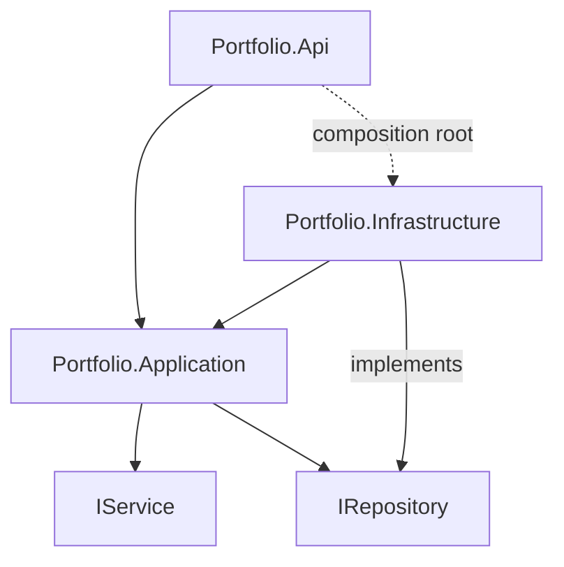
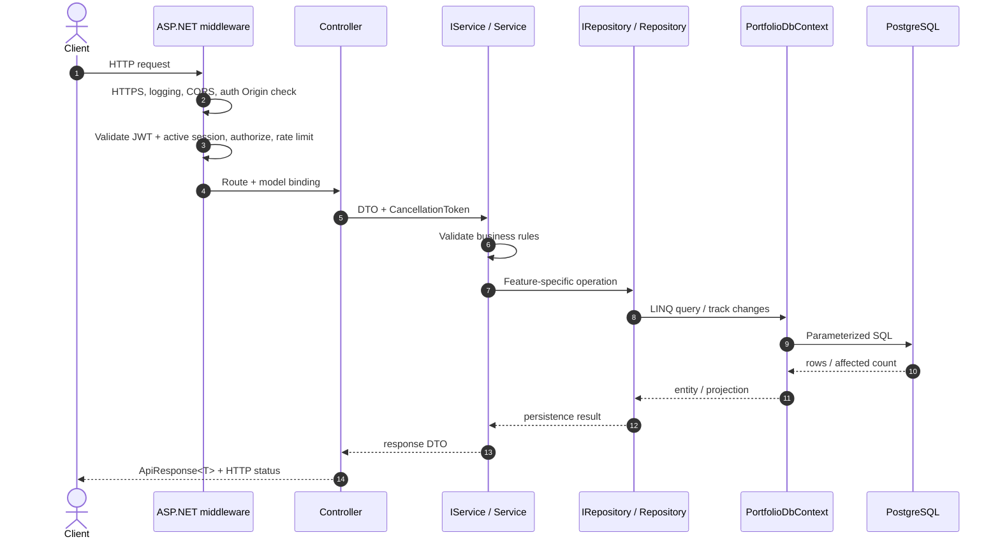
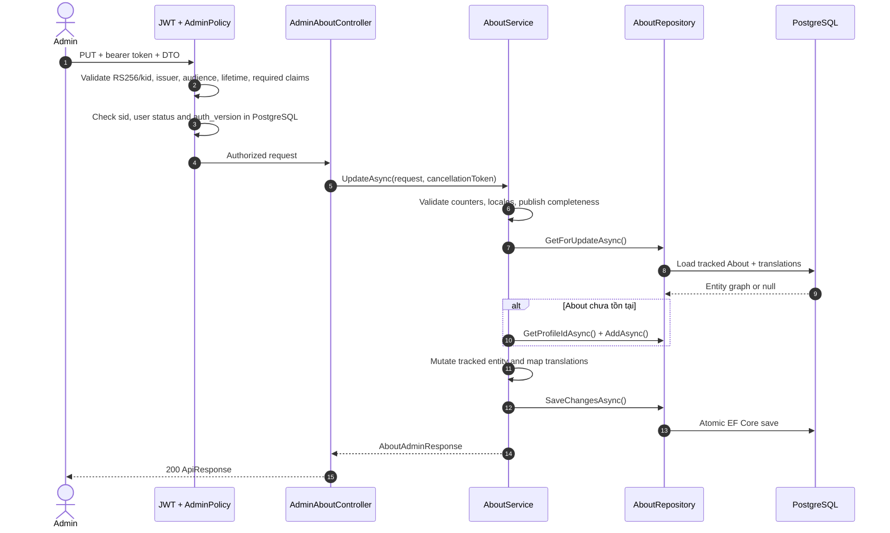
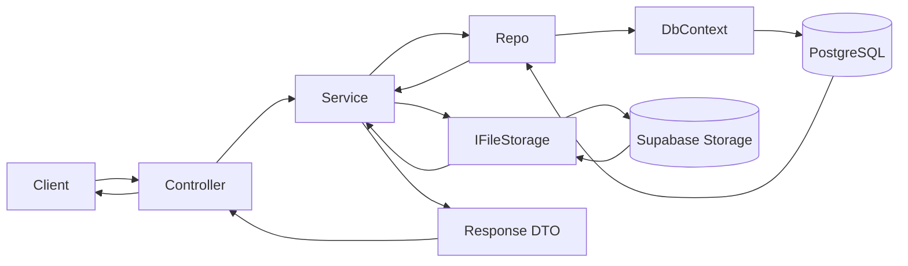

# CG03 AboutMe Backend — Hướng dẫn cho member mới

Tài liệu này giúp một member mới hiểu cấu trúc backend, lần theo một request từ HTTP đến PostgreSQL, và tự triển khai một API hoàn chỉnh theo đúng convention hiện tại. Phần xác thực được tách riêng tại [Authentication Guide](../security/AUTHENTICATION_GUIDE.md).

> Nguồn sự thật khi code: [BACKEND_SPEC](../BACKEND_SPEC.md), [Database Design](../database.md), [API Contract](../api/API_CONTRACT.md), [ADR 0001](../adr/0001-mvp-contract-decisions.md), [Threat Model](../security/THREAT_MODEL.md) và [Test Strategy](../testing/TEST_STRATEGY.md).

## 1. Bức tranh tổng thể

Backend là REST API .NET 10, dùng ASP.NET Core Controllers, Entity Framework Core 10, PostgreSQL trên Supabase và Supabase Storage. Dự án dùng Layered Architecture đơn giản, không dùng CQRS, MediatR, generic repository hoặc custom Unit of Work.

```text
Portfolio.sln
├── src/
│   ├── Portfolio.Api/             HTTP, middleware, auth policy, Swagger, DI composition
│   ├── Portfolio.Application/     use case, business rule, DTO, interface
│   └── Portfolio.Infrastructure/  EF Core, PostgreSQL, Identity, Storage adapter
├── tests/
│   ├── Portfolio.UnitTests/       business rule và logic thuần
│   └── Portfolio.IntegrationTests/ API, repository, migration, PostgreSQL, Storage
├── docs/                          contract, kiến trúc, bảo mật, vận hành
└── scripts/                       thiết lập môi trường local
```

Không có project `Domain` riêng. Các model dữ liệu/domain dùng chung hiện nằm trong `Portfolio.Application/Common/Models`. Đây là convention hiện tại của repository, không nên tự chuyển chúng sang project mới khi thêm một feature.

### Quan hệ phụ thuộc



- Controller chỉ phụ thuộc `IService`.
- Service phụ thuộc repository abstraction và các abstraction ngoại vi cần thiết.
- Repository implementation và `PortfolioDbContext` thuộc Infrastructure.
- API được phép biết Infrastructure tại composition root để ghép các implementation vào DI container; Controller không được gọi Infrastructure trực tiếp.

## 2. Mỗi project chịu trách nhiệm gì?

### `Portfolio.Api`

Các file quan trọng:

- `Program.cs`: tạo host, đăng ký ba layer, sắp xếp middleware, map controller/health check và chạy Admin bootstrap.
- `Controllers/*Controller.cs`: route, model binding, authenticated context, gọi service, chuyển kết quả thành HTTP response.
- `Extensions/ServiceCollectionExtensions.cs`: Controllers, JSON, ProblemDetails, JWT bearer, session validation, authorization policy, CORS, rate limiting, Swagger và health checks.
- `Authentication/`: refresh-cookie writer, current-user accessor và exact-Origin middleware cho auth endpoints.
- `Errors/GlobalExceptionHandler.cs`: ánh xạ application exception sang RFC Problem Details.
- `Models/ApiResponse.cs`: response envelope thành công.

Controller không chứa business rule, không inject `PortfolioDbContext`, không viết EF query và không gọi repository.

### `Portfolio.Application`

Mỗi feature thường có một thư mục, ví dụ `About/` gồm:

```text
About/
├── AboutContracts.cs       request/response/projection DTO
├── IAboutService.cs        use-case contract cho Controller
├── AboutService.cs         validation, business rules, mapping, orchestration
└── IAboutRepository.cs     persistence contract cho Service
```

Layer này quyết định “hệ thống phải làm gì”: chuẩn hóa locale/slug, kiểm tra publish, kiểm tra trạng thái, phối hợp nhiều thao tác và phát sinh exception có nghĩa nghiệp vụ.

### `Portfolio.Infrastructure`

- `Persistence/PortfolioDbContext.cs`: EF Core session và Unit of Work.
- `Persistence/Configurations`: mapping table, key, relationship, constraint, index.
- `Persistence/Migrations`: lịch sử thay đổi schema.
- `Persistence/Repositories`: EF Core query và persistence implementation.
- `Authentication`: ASP.NET Core Identity, session/refresh-token security, bootstrap Admin và RS256 JWT issuer/key ring.
- `Storage`: adapter gọi Supabase Storage.

Repository quyết định “đọc/ghi dữ liệu như thế nào”, nhưng không quyết định business rule như nội dung nào đủ điều kiện publish.

## 3. Vòng đời một request



Middleware hiện được sắp theo thứ tự chính sau:

1. centralized exception handler;
2. HTTPS redirection;
3. Serilog request logging;
4. CORS policy `Frontend`;
5. exact-Origin protection cho auth state changes;
6. authentication (RS256 JWT và active-session check);
7. authorization;
8. endpoint rate limiting;
9. Swagger trong Development;
10. health endpoints và controllers.

Nếu exception xảy ra ở Controller, Service hoặc Repository, `GlobalExceptionHandler` tạo `application/problem+json` an toàn và thêm `requestId`; Controller không cần lặp lại `try/catch`.

## 4. Walkthrough thực tế: About API

### Public read

Request:

```http
GET /api/v1/portfolio/my-portfolio/about?locale=vi
```

Luồng thực tế:

1. `AboutController.Get` nhận `slug`, `locale`, `CancellationToken`.
2. Controller gọi `IAboutService.GetPublicAsync`.
3. `AboutService` chuẩn hóa slug và locale rồi gọi `IAboutRepository.GetPublicAsync`.
4. `AboutRepository` dùng `AsNoTracking`, lọc `IsPublished`, slug và locale ngay trong SQL, sau đó project thẳng sang `AboutPublicProjection`.
5. Service áp dụng các cờ disclosure như `ShowProjectCount` và map thành `PublicAboutResponse`.
6. Controller bọc DTO bằng `ApiResponse.Success` và trả `200`.
7. Nếu không có nội dung public hợp lệ, service ném `NotFoundException`; global handler trả `404 ProblemDetails`.

Điểm cần học: public query không tải toàn bộ graph rồi lọc trong bộ nhớ; điều kiện publish và locale được đưa xuống database, dữ liệu không được phép công khai không đi qua HTTP boundary.

### Admin update

Request:

```http
PUT /api/v1/admin/about
Authorization: Bearer <access-token>
Content-Type: application/json
```



Điểm cần học:

- `[Authorize(Policy = AuthorizationPolicies.Admin)]` đặt ở admin controller; không nhận `isAdmin` từ request.
- DTO/model validation đơn giản được xử lý tại HTTP boundary; rule liên quan nhiều field/publish nằm ở Service.
- Query dùng để update phải trả entity đang được EF theo dõi; read-only query dùng `AsNoTracking()`.
- `SaveChangesAsync` được gọi một lần cho một logical use case. `PortfolioDbContext` đã là Unit of Work.

## 5. Cách tự triển khai một API Controller–Service–Repository

Trước khi code, xác nhận route, DTO, status code và disclosure rule trong `API_CONTRACT.md`; xác nhận table/constraint trong `database.md`. Nếu contract hoặc schema chưa có, cập nhật/duyệt tài liệu trước, không tự phát minh.

### Bước 1 — Viết contract và test case

Xác định rõ:

- public hay admin;
- request/response fields và validation;
- status codes: happy path, invalid, unauthorized, forbidden, not found, conflict;
- publish/disclosure và locale rules;
- có upload, transaction hoặc schema migration không.

Viết service unit test trước cho business rule quan trọng. Nếu query/constraint là phần cần chứng minh, chuẩn bị integration test với PostgreSQL thật.

### Bước 2 — Tạo DTO và model cần thiết

Đặt request/response/projection trong `Portfolio.Application/<Feature>`. Dùng DTO ở HTTP boundary; không trả trực tiếp EF entity.

```csharp
public sealed record FeatureUpdateRequest(string Name, bool IsPublished);
public sealed record FeatureResponse(Guid Id, string Name, bool IsPublished);
```

Đây chỉ là mẫu đặt tên, không phải entity/endpoint đã được phê duyệt của dự án.

### Bước 3 — Khai báo `IService`

Interface mô tả use case mà Controller cần, không phơi EF Core:

```csharp
public interface IFeatureService
{
    Task<FeatureResponse> UpdateAsync(
        Guid id,
        FeatureUpdateRequest request,
        CancellationToken cancellationToken);
}
```

### Bước 4 — Khai báo repository theo nhu cầu feature

Tránh `IRepository<T>` chung chung. Đặt tên operation có ý nghĩa:

```csharp
public interface IFeatureRepository
{
    Task<Feature?> GetForUpdateAsync(Guid id, CancellationToken cancellationToken);
    Task<bool> SlugExistsAsync(string slug, CancellationToken cancellationToken);
    Task AddAsync(Feature entity, CancellationToken cancellationToken);
    Task SaveChangesAsync(CancellationToken cancellationToken);
}
```

### Bước 5 — Implement Service

Service nên:

- nhận dependency qua constructor;
- validate business rule;
- gọi repository abstraction;
- thay đổi entity hoặc phối hợp storage/external service;
- map response DTO;
- truyền `CancellationToken` xuyên suốt;
- log ID/trạng thái an toàn, không log secret hoặc toàn bộ request nhạy cảm.

Service không viết LINQ phụ thuộc EF Core và không tự tạo repository/DbContext.

### Bước 6 — Implement Repository

Repository dùng `PortfolioDbContext`:

- public/read-only: ưu tiên projection và `AsNoTracking()`;
- update: load tracked entity cùng navigation thật sự cần;
- filter, sort, paginate trong SQL;
- tránh N+1 và `ToList()` quá sớm;
- dùng `SingleOrDefaultAsync`, `AnyAsync`, `SaveChangesAsync` bản async với token.

Nếu nhiều thay đổi phải cùng thành công hoặc cùng thất bại, dùng cùng scoped `PortfolioDbContext`; thêm EF transaction khi một lần `SaveChangesAsync` không đủ bao phủ use case.

### Bước 7 — Tạo Controller

```csharp
[ApiController]
[Authorize(Policy = AuthorizationPolicies.Admin)]
[Route("api/v1/admin/features")]
public sealed class AdminFeaturesController(IFeatureService service) : ControllerBase
{
    [HttpPut("{id:guid}")]
    [ProducesResponseType<ApiResponse<FeatureResponse>>(StatusCodes.Status200OK)]
    [ProducesResponseType<ProblemDetails>(StatusCodes.Status400BadRequest)]
    [ProducesResponseType<ProblemDetails>(StatusCodes.Status401Unauthorized)]
    [ProducesResponseType<ProblemDetails>(StatusCodes.Status403Forbidden)]
    [ProducesResponseType<ProblemDetails>(StatusCodes.Status404NotFound)]
    public async Task<ActionResult<ApiResponse<FeatureResponse>>> Put(
        Guid id,
        [FromBody] FeatureUpdateRequest request,
        CancellationToken cancellationToken)
    {
        var result = await service.UpdateAsync(id, request, cancellationToken);
        return Ok(ApiResponse.Success(result, "Feature updated."));
    }
}
```

Đoạn trên là skeleton học tập. Route và DTO thật phải theo `API_CONTRACT.md`.

### Bước 8 — Đăng ký Dependency Injection

Trong `Portfolio.Application/DependencyInjection.cs`:

```csharp
services.AddScoped<IFeatureService, FeatureService>();
```

Trong `Portfolio.Infrastructure/DependencyInjection.cs`:

```csharp
services.AddScoped<IFeatureRepository, FeatureRepository>();
```

Không `new FeatureService(...)` trong Controller. Scoped lifetime giúp Service, Repository và DbContext của một request dùng cùng scope.

### Bước 9 — Schema và migration nếu cần

1. kiểm tra `database.md`;
2. thêm/sửa model và EF configuration;
3. tạo migration mới, không sửa migration có thể đã apply;
4. kiểm tra key, nullability, FK, unique/check constraint, index, cascade và timestamp;
5. chạy migration integration tests trên PostgreSQL.

### Bước 10 — Hoàn thiện test và tài liệu

- Unit test Service bằng fake/mock `IRepository` và external abstraction.
- Integration test Repository bằng PostgreSQL tương thích thực tế; không dùng mock để chứng minh LINQ, migration hoặc constraint.
- API integration test chứng minh route, auth, serialization và ProblemDetails.
- Cập nhật OpenAPI annotations và `API_CONTRACT.md` nếu contract được duyệt thay đổi.
- Chạy `dotnet build --configuration Release` và `dotnet test --configuration Release`.

## 6. Validation và error flow

| Loại rule | Nơi xử lý | Ví dụ |
| --- | --- | --- |
| Hình dạng DTO | Data annotation / API model binding | required, email, max length |
| Business rule | Service | duplicate slug, publish đủ `en`/`vi`, state transition |
| Data invariant | PostgreSQL/EF configuration | unique, FK, check constraint |
| Authentication | JWT bearer middleware | token thiếu/sai/hết hạn |
| Authorization | policy | user có token nhưng thiếu role `Admin` |

Application exceptions được ánh xạ tập trung:

| Exception/điều kiện | HTTP |
| --- | --- |
| DTO hoặc business validation | 400 |
| Sai thông tin đăng nhập/token không hợp lệ | 401 |
| Đã đăng nhập nhưng không đủ quyền | 403 |
| Không tìm thấy | 404 |
| Xung đột | 409 |
| Upload quá lớn | 413 |
| Dependency chưa sẵn sàng | 503 |
| Lỗi không dự kiến | 500, không lộ implementation detail |

## 7. Data flow theo loại thao tác



Với upload thay thế file: validate file → upload object mới → lưu metadata database → chỉ sau đó xóa object cũ. Nếu lưu database thất bại, phải dọn object mới. Không lưu file vĩnh viễn trên container và không dùng raw filename làm storage key.

## 8. Checklist review trước khi mở PR

- Route/DTO/status code đúng API contract.
- Public endpoint không trả draft hoặc dữ liệu restricted.
- Admin endpoint dùng `AdminPolicy`; không tin `userId`/`isAdmin` từ client.
- Controller chỉ xử lý HTTP và gọi `IService`.
- Service chứa business rule, repository chỉ chứa persistence.
- Không có Controller/Service truy cập `PortfolioDbContext` sai layer.
- `CancellationToken` đi đến EF/Storage.
- Read-only query dùng projection/`AsNoTracking` khi phù hợp.
- Transaction và file-compensation đã được xem xét.
- Error đi qua ProblemDetails, không lộ secret/stack trace/SQL.
- Unit và integration tests bao phủ happy path cùng lỗi quan trọng.
- DI đã đăng ký đủ; Swagger/contract đã cập nhật.
- Build và test thực tế đã chạy.

## 9. Lộ trình đọc code khuyến nghị

1. `src/Portfolio.Api/Program.cs` — host và middleware.
2. `src/Portfolio.Api/Controllers/AboutController.cs` — public/admin HTTP boundary.
3. `src/Portfolio.Application/About/IAboutService.cs` và `AboutService.cs` — use case.
4. `src/Portfolio.Application/About/IAboutRepository.cs` — persistence boundary.
5. `src/Portfolio.Infrastructure/Persistence/Repositories/AboutRepository.cs` — EF queries.
6. `src/Portfolio.Infrastructure/Persistence/PortfolioDbContext.cs` và `Configurations/ProfileConfigurations.cs` — mapping/schema.
7. `tests/Portfolio.UnitTests/About/AboutServiceTests.cs` — business tests.
8. `tests/Portfolio.IntegrationTests/Persistence/ProfileAboutRepositoryTests.cs` và `Api/ProfileAboutApiTests.cs` — persistence/API behavior.
9. [Current Process Flows](CURRENT_PROCESS_FLOWS.md) — sequence diagram chi tiết của các luồng đã triển khai đến Sprint 2.
