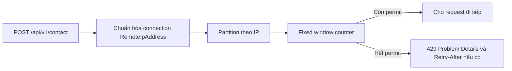
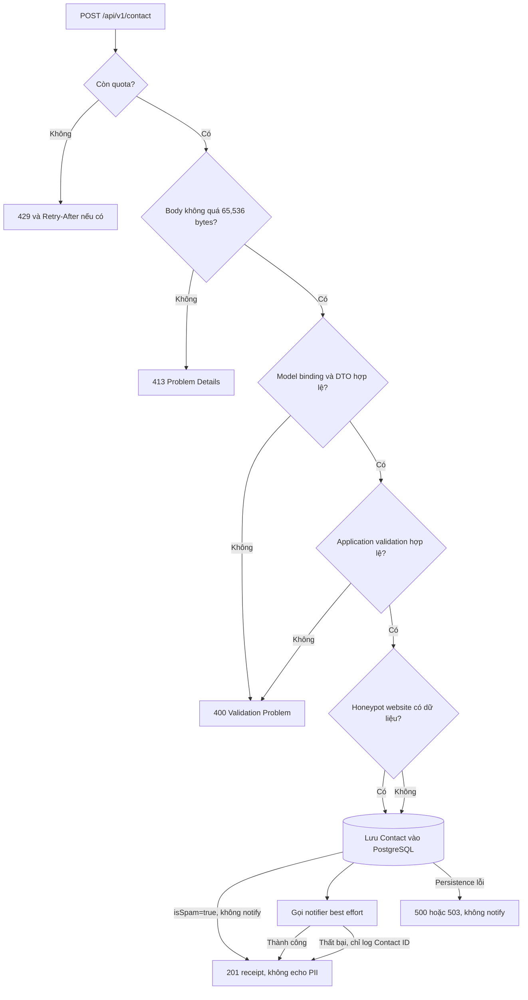

# Rate limiting trong CG03 AboutMe — hướng dẫn triển khai cho người mới

Tài liệu này giải thích rate limiting từ mô hình tư duy đến cách triển khai thực tế trong ASP.NET Core. Luồng `POST /api/v1/contact` của CG03 AboutMe được dùng làm ví dụ xuyên suốt.

Sau khi đọc xong, một member mới cần trả lời được bốn câu hỏi:

1. Rate limit bảo vệ hệ thống khỏi điều gì?
2. Một request được xếp vào “nhóm” nào và quota được tính ra sao?
3. Vì sao Contact đang dùng fixed window theo IP kết nối?
4. Phải cấu hình, kiểm thử và vận hành cơ chế này như thế nào?

## 1. Rate limiting là gì?

Rate limiting giới hạn số request mà một client hoặc một nhóm client được phép gửi trong một khoảng thời gian. Khi quota đã hết, server dừng request sớm và trả `429 Too Many Requests`.

Ví dụ cấu hình production của Contact là 5 request trong 60 giây cho mỗi IP kết nối:

```text
IP 203.0.113.10, cửa sổ 10:00:00–10:00:59

Request 1..5  -> được xử lý
Request 6     -> 429 Too Many Requests
Cửa sổ mới   -> quota trở lại 5
```

Rate limiting giúp:

- giảm spam và request tự động đơn giản;
- bảo vệ CPU, bộ nhớ, database và dịch vụ notification;
- giới hạn tác động của client bị lỗi hoặc retry quá nhanh;
- tạo phản hồi ổn định thay vì để hệ thống quá tải rồi trả lỗi ngẫu nhiên.

Rate limiting **không thay thế**:

- xác thực và phân quyền;
- giới hạn kích thước request;
- validation từng field;
- honeypot/CAPTCHA hoặc hệ thống phát hiện spam;
- giới hạn ở reverse proxy, CDN hoặc API gateway;
- monitoring và cảnh báo.

Đây là một lớp phòng vệ trong mô hình defense in depth, không phải giải pháp chống abuse duy nhất.

## 2. Năm khái niệm cần nắm

| Khái niệm | Ý nghĩa | Giá trị của Contact |
| --- | --- | --- |
| Permit | Một lần được phép đi qua limiter | Một lần submit form |
| Permit limit | Số permit tối đa trong một cửa sổ | Production mặc định `5` |
| Window | Khoảng thời gian tính quota | Production mặc định `60` giây |
| Partition key | Khóa dùng để chia quota giữa các client | IP kết nối đã chuẩn hóa |
| Queue | Request chờ khi quota hết | `0`, từ chối ngay |

Điểm quan trọng nhất là **partition key**. Nếu mọi request dùng cùng một key, tất cả người dùng chia sẻ một quota. Nếu key do client tự khai báo, attacker có thể đổi key để vượt giới hạn. Vì vậy Contact lấy key từ `HttpContext.Connection.RemoteIpAddress`, không lấy trực tiếp từ request body hay `X-Forwarded-For`.

## 3. Thiết kế đang dùng cho Contact

Contact dùng named policy `ContactSubmission` với thuật toán fixed window:



Các quyết định hiện tại:

- **Fixed window**: dễ hiểu, có sẵn trong ASP.NET Core và đủ cho traffic MVP.
- **Theo IP kết nối**: endpoint là anonymous nên chưa có user ID/API key ổn định để phân vùng.
- **Queue bằng 0**: form Contact không nên giữ request chờ trong bộ nhớ; client nhận 429 ngay và có thể thử lại sau.
- **Named policy**: chỉ endpoint Contact dùng quota Contact; không vô tình giới hạn toàn bộ API.
- **Cấu hình bằng options**: có thể thay quota theo môi trường mà không sửa code.
- **Fail-fast khi cấu hình sai**: `ValidateOnStart()` ngăn ứng dụng chạy với quota vô nghĩa.

Một hạn chế có chủ ý: limiter này lưu counter trong bộ nhớ của từng process. Nếu chạy ba instance API, cùng một IP có thể nhận quota riêng trên mỗi instance. Phần [8. Khi nào cần phương án khác?](#8-khi-nào-cần-phương-án-khác) giải thích cách nâng cấp.

## 4. Luồng request đầy đủ

Rate limiter chỉ là cửa kiểm tra đầu tiên của Contact. Một request được xử lý theo thứ tự:



Thứ tự trên tạo ra các đặc tính sau:

- Request vượt quota bị chặn trước khi đọc/buffer body và trước khi chạm database.
- Request được limiter cho qua vẫn có thể bị `413` hoặc `400`; permit đã được tiêu thụ. Đây là chủ ý để request rác cũng phải trả chi phí quota.
- Honeypot không trả lỗi khác biệt cho bot. Message vẫn được lưu với `isSpam=true`, response vẫn có cùng shape `201`, nhưng notifier không chạy.
- Contact được persist trước notification. Notification thất bại không làm mất message đã nhận.

## 5. Các thành phần trong codebase

| File | Trách nhiệm |
| --- | --- |
| `src/Portfolio.Api/Configuration/ContactRateLimitOptions.cs` | Khai báo quota, window và validation cấu hình |
| `src/Portfolio.Api/Extensions/ServiceCollectionExtensions.cs` | Đăng ký named policy, partition, fixed-window limiter và response 429 |
| `src/Portfolio.Api/Controllers/ContactsController.cs` | Gắn policy vào đúng action bằng `[EnableRateLimiting]` |
| `src/Portfolio.Api/Program.cs` | Đặt `UseRateLimiter()` trong HTTP pipeline |
| `src/Portfolio.Api/Middleware/ContactRequestSizeMiddleware.cs` | Chặn body lớn kể cả request chunked |
| `src/Portfolio.Api/appsettings.json` | Giá trị mặc định/production cho Contact |
| `src/Portfolio.Api/appsettings.Development.json` | Quota rộng hơn để phát triển local |
| `tests/Portfolio.IntegrationTests/Api/ContactsApiTests.cs` | Kiểm thử 429, spoofed forwarding header và các HTTP branch |

## 6. Triển khai từng bước

### Bước 1 — Định nghĩa options có giới hạn an toàn

```csharp
public sealed class ContactRateLimitOptions
{
    public const string SectionName = "RateLimit:Contact";

    public int PermitLimit { get; set; } = 5;
    public int WindowSeconds { get; set; } = 60;
}
```

Không chỉ bind configuration; cần validate range và `ValidateOnStart()`:

```csharp
services.AddSingleton<
    IValidateOptions<ContactRateLimitOptions>,
    ContactRateLimitOptionsValidator>();

services.AddOptions<ContactRateLimitOptions>()
    .Bind(configuration.GetSection(ContactRateLimitOptions.SectionName))
    .ValidateOnStart();
```

Project giới hạn `PermitLimit` trong `1..100` và `WindowSeconds` trong `1..3600`. Cấu hình sai làm startup thất bại rõ ràng thay vì âm thầm vô hiệu hóa bảo vệ.

### Bước 2 — Đăng ký named policy

Phần cốt lõi tương đương:

```csharp
services.AddRateLimiter(options =>
{
    options.RejectionStatusCode = StatusCodes.Status429TooManyRequests;

    options.AddPolicy("ContactSubmission", context =>
        RateLimitPartition.GetFixedWindowLimiter(
            NormalizeRemoteIp(context),
            _ => new FixedWindowRateLimiterOptions
            {
                PermitLimit = contact.PermitLimit,
                Window = TimeSpan.FromSeconds(contact.WindowSeconds),
                QueueLimit = 0,
                AutoReplenishment = true,
            }));
});
```

Tên policy là contract nội bộ giữa đăng ký DI và endpoint. Nếu đổi tên ở một nơi, phải đổi nơi còn lại.

### Bước 3 — Chọn partition key do server kiểm soát

```csharp
private static string NormalizeRemoteIp(HttpContext context)
{
    var address = context.Connection.RemoteIpAddress;
    if (address is null)
        return "unknown";

    return address.IsIPv4MappedToIPv6
        ? address.MapToIPv4().ToString()
        : address.ToString();
}
```

IPv4-mapped IPv6 được đổi về IPv4 để cùng một client không có hai partition như `::ffff:203.0.113.10` và `203.0.113.10`. Khi không có địa chỉ, mọi request vào partition hữu hạn `unknown`; không sinh key ngẫu nhiên vì cách đó sẽ vô hiệu hóa rate limit.

Không dùng trực tiếp đoạn sau:

```csharp
// Không an toàn nếu header đến trực tiếp từ Internet.
var key = context.Request.Headers["X-Forwarded-For"].ToString();
```

Client có thể tự thay header ở mỗi request. Cách xử lý reverse proxy an toàn nằm tại [7. Reverse proxy và IP thật của client](#7-reverse-proxy-và-ip-thật-của-client).

### Bước 4 — Chuẩn hóa response 429

`OnRejected` trả RFC Problem Details giống các lỗi API khác và thêm `Retry-After` khi limiter cung cấp metadata:

```http
HTTP/1.1 429 Too Many Requests
Content-Type: application/problem+json
Retry-After: 42

{
  "type": "https://httpstatuses.com/429",
  "title": "Too many requests",
  "status": 429,
  "detail": "Too many requests.",
  "instance": "/api/v1/contact",
  "requestId": "..."
}
```

Frontend nên:

1. dừng auto-retry liên tục;
2. đọc `Retry-After` nếu có;
3. khóa nút submit hoặc hiển thị thời gian chờ;
4. giữ nội dung người dùng ở client để họ không phải nhập lại.

### Bước 5 — Gắn policy vào endpoint

```csharp
[HttpPost]
[EnableRateLimiting("ContactSubmission")]
[RequestSizeLimit(ContactRequestLimits.MaxBodySize)]
public async Task<ActionResult<ApiResponse<ContactReceiptResponse>>> Post(...)
```

Đặt attribute tại action giúp reviewer nhìn ngay endpoint nào được bảo vệ. Các admin endpoint dùng authentication/authorization và không dùng quota Contact này.

### Bước 6 — Đặt middleware đúng vị trí

Pipeline hiện tại có đoạn:

```csharp
app.UseAuthentication();
app.UseAuthorization();
app.UseRateLimiter();
app.UseMiddleware<ContactRequestSizeMiddleware>();
app.MapControllers();
```

`UseRateLimiter()` phải có trong pipeline để endpoint policy hoạt động. Contact size middleware đứng sau limiter nên request đã vượt quota bị loại trước khi body được buffer.

### Bước 7 — Cấu hình theo môi trường

Giá trị mặc định/production:

```json
{
  "RateLimit": {
    "Contact": {
      "PermitLimit": 5,
      "WindowSeconds": 60
    }
  }
}
```

Development đang dùng `20/60` để member không liên tục tự khóa mình khi test form. Có thể override bằng environment variable:

```text
RateLimit__Contact__PermitLimit=5
RateLimit__Contact__WindowSeconds=60
```

Không tăng quota chỉ để làm mất cảnh báo 429. Trước tiên cần xem traffic thật, tỉ lệ 429, số message hợp lệ và mẫu spam.

### Bước 8 — Kiểm thử

Tối thiểu phải có các test sau:

- `N` request đầu trả response bình thường, request `N+1` trả 429;
- 429 có media type `application/problem+json`;
- thay đổi `X-Forwarded-For` không vượt được limiter khi ứng dụng chưa tin proxy;
- body quá 65,536 byte trả 413;
- request hợp lệ vẫn trả 201;
- test dùng quota riêng nhỏ và factory riêng để không phụ thuộc thứ tự chạy.

Ví dụ test behavior thay vì kiểm tra implementation detail:

```csharp
for (var index = 0; index < 3; index++)
{
    // Factory cấu hình PermitLimit = 2.
    responses.Add(await client.PostAsJsonAsync("/api/v1/contact", request));
}

Assert.Equal(HttpStatusCode.Created, responses[0].StatusCode);
Assert.Equal(HttpStatusCode.Created, responses[1].StatusCode);
Assert.Equal(HttpStatusCode.TooManyRequests, responses[2].StatusCode);
```

## 7. Reverse proxy và IP thật của client

Trong production, API thường đứng sau Nginx, Cloudflare hoặc load balancer. Khi đó `Connection.RemoteIpAddress` có thể là IP của proxy. Nếu không cấu hình forwarded headers, tất cả visitor đi qua cùng proxy có thể chia sẻ một quota.

Không khắc phục bằng cách đọc tùy ý `X-Forwarded-For`. Quy trình an toàn là:

1. xác định proxy/load balancer nào thực sự do hệ thống kiểm soát;
2. chặn đường truy cập trực tiếp bỏ qua proxy nếu kiến trúc yêu cầu;
3. cấu hình ASP.NET Core Forwarded Headers với `KnownProxies` hoặc `KnownNetworks` cụ thể;
4. đặt `UseForwardedHeaders()` trước middleware cần đọc IP;
5. cấu hình proxy ghi đè header từ Internet theo policy đã duyệt;
6. kiểm thử cả request qua proxy và request spoof header trực tiếp.

Repository bật Forwarded Headers Middleware khi có ít nhất một IP literal trong `ReverseProxy:KnownProxies`. Middleware chỉ nhận `X-Forwarded-For` và `X-Forwarded-Proto`, giới hạn một hop, và chạy trước rate limiting. Production từ chối khởi động khi allowlist rỗng hoặc sai; Development không cấu hình proxy thì middleware không chạy. Deployment phải giữ port ứng dụng private và cấu hình đúng IP peer trực tiếp của Nginx/Docker; không tin cậy tùy ý mọi proxy hoặc một dải mạng rộng.

## 8. Khi nào cần phương án khác?

| Phương án | Ưu điểm | Nhược điểm | Khi phù hợp |
| --- | --- | --- | --- |
| Fixed window | Đơn giản, nhanh, ít cấu hình | Có burst ở ranh giới hai window | MVP, form traffic thấp |
| Sliding window | Phân bố request mượt hơn | Nhiều counter hơn, khó giải thích hơn | Burst tại ranh giới gây vấn đề thật |
| Token bucket | Cho phép burst nhỏ nhưng giới hạn tốc độ dài hạn | Cần chọn token/replenishment cẩn thận | API có traffic không đều |
| Concurrency limiter | Giới hạn request đang xử lý đồng thời | Không giới hạn tổng request theo thời gian | Endpoint chậm/tốn tài nguyên |
| User/API-key partition | Công bằng hơn IP | Cần danh tính ổn định | Endpoint authenticated |
| Distributed limiter | Quota dùng chung giữa mọi API instance | Thêm hạ tầng, latency và failure mode | Scale-out nhiều instance, quota phải chính xác |
| Gateway/CDN/WAF | Chặn sớm trước ứng dụng | Phụ thuộc nhà cung cấp và cấu hình mạng | Production public traffic hoặc DDoS layer |

Với Contact MVP, fixed window theo IP là lựa chọn cân bằng vì endpoint anonymous, traffic dự kiến thấp, quota không cần chính xác tuyệt đối giữa nhiều node và hệ thống chưa có Redis. Khi scale-out, ưu tiên limiter ở gateway/CDN hoặc distributed store thay vì cố đồng bộ bộ nhớ giữa process.

IP-only cũng có giới hạn công bằng: nhiều người trong cùng công ty/NAT có thể chung IP, còn attacker có botnet/proxy có nhiều IP. Có thể kết hợp IP với CAPTCHA, fingerprint an toàn, email cooldown hoặc abuse scoring, nhưng mỗi tín hiệu phải được threat-model và xem xét quyền riêng tư.

## 9. Rate limit và các lớp bảo vệ Contact khác

| Lớp | Chặn vấn đề gì? | HTTP/behavior |
| --- | --- | --- |
| Rate limit | Quá nhiều lần submit từ một partition | `429` |
| Body-size limit | Payload quá lớn, kể cả chunked | `413` |
| DTO/application validation | Field thiếu, sai email, vượt độ dài | `400` |
| Honeypot `website` | Bot điền field người dùng thật không thấy | Lưu `isSpam=true`, vẫn `201`, không notify |
| Persist-before-notify | Provider notification lỗi | Message vẫn còn, vẫn `201` |
| AdminPolicy | Đọc/sửa/xóa inbox trái phép | `401` hoặc `403` |
| PII-safe response/logging | Rò nội dung contact | Receipt không echo PII; log chỉ dùng Contact ID |

Không nên chuyển toàn bộ trách nhiệm sang rate limiter. Ví dụ một request duy nhất vẫn có thể chứa body rất lớn, và năm request “được phép” vẫn có thể là spam.

## 10. Sai lầm thường gặp

- Dùng một global quota cho mọi endpoint và vô tình làm health check hoặc public read bị chặn.
- Dùng email/request field làm key trước validation; attacker chỉ cần đổi giá trị.
- Tin trực tiếp `X-Forwarded-For` từ Internet.
- Sinh partition ngẫu nhiên khi thiếu IP, khiến mọi request có quota mới.
- Đặt queue lớn cho endpoint public, làm request chiếm bộ nhớ trong lúc hệ thống đang chịu tải.
- Chỉ kiểm tra `Content-Length`; request chunked không bắt buộc có header này.
- Trả 429 bằng JSON tự phát khác format lỗi chung hoặc không có `requestId`.
- Log raw IP, email, message hoặc exception của provider có thể chứa PII.
- Dùng in-memory limiter nhưng giả định quota được chia sẻ giữa nhiều replica.
- Viết test phụ thuộc clock thật hoặc cấu hình production, làm test chậm và không ổn định.

## 11. Checklist trước khi đưa lên production

- [ ] Quota và window được chọn dựa trên traffic dự kiến hoặc dữ liệu quan sát.
- [ ] Cấu hình production nằm trong nguồn configuration được kiểm soát.
- [ ] Options sai làm startup thất bại.
- [ ] Endpoint có `[EnableRateLimiting("ContactSubmission")]`.
- [ ] `UseRateLimiter()` có mặt và đứng trước middleware buffer Contact body.
- [ ] Response 429 là Problem Details; frontend xử lý `Retry-After`.
- [ ] Reverse proxy trust boundary đã được cấu hình và kiểm thử nếu có proxy.
- [ ] Không lưu/log raw IP; `ipHash` chỉ phục vụ vận hành đã được phê duyệt.
- [ ] Dashboard/monitoring theo dõi tỉ lệ 201, 400, 413, 429 và lỗi persistence.
- [ ] Test rate limit, spoofed header, oversized body và happy path đều pass.
- [ ] Nếu chạy nhiều replica, đội ngũ đã chấp nhận quota per-instance hoặc dùng limiter phân tán/upstream.

## 12. Cách đọc tiếp trong repository

1. Đọc `ContactRateLimitOptions.cs` để hiểu contract cấu hình.
2. Tìm `ContactSubmission` trong `ServiceCollectionExtensions.cs` để xem policy và response 429.
3. Đọc `Program.cs` theo thứ tự từ trên xuống để hiểu middleware pipeline.
4. Đọc `ContactsController.cs`, sau đó `ContactService.cs` và `ContactRepository.cs`.
5. Đọc `ContactsApiTests.cs` và `ContactServiceTests.cs` để xem behavior được khóa bằng test.
6. Xem [Luồng xử lý hiện tại](CURRENT_PROCESS_FLOWS.md#25-contact-submission-và-quản-trị-inbox) để nối rate limit với toàn bộ Contact flow.

Khi sửa cơ chế này, phải đồng bộ `API_CONTRACT.md`, `THREAT_MODEL.md`, test và `CURRENT_PROCESS_FLOWS.md` nếu behavior công khai hoặc trust boundary thay đổi.
