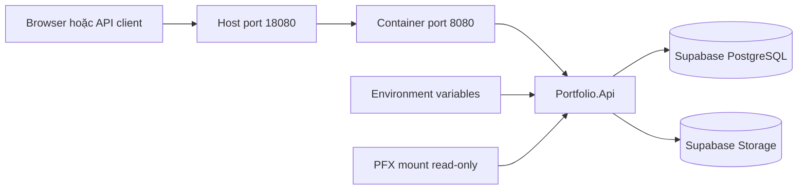
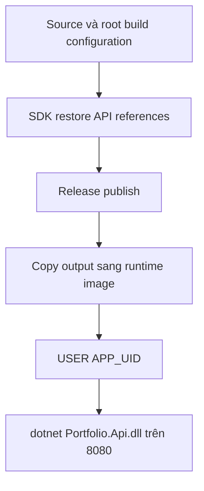
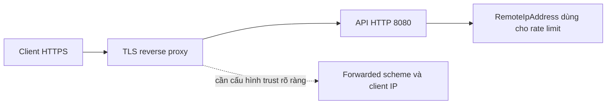

# Hướng dẫn setup và triển khai Docker — CG03 AboutMe

Tài liệu dành cho member mới, đi từ build image lần đầu đến chạy API có database/Storage và chuẩn bị phát hành. Lệnh bên dưới dùng **PowerShell**, chạy từ repository root chứa `Portfolio.sln`. Phần production là quy trình thực hiện, không phải xác nhận dự án đã được deploy lên một hosting cụ thể.

## 1. Lộ trình đọc và kết quả cần đạt

| Bạn cần làm gì? | Đọc phần | Kết quả |
| --- | --- | --- |
| Hiểu Docker của dự án | 2–3 | Biết image/container/port và nơi lưu dữ liệu |
| Build và kiểm tra không cần secret | 4 | Image build được và smoke local pass |
| Chạy API kết nối Supabase | 5–7 | Readiness 200 và dùng API với dữ liệu thật |
| Đưa lên hosting | 8–10 | Image đã kiểm tra, cấu hình Production và release evidence |
| Gặp lỗi | 11 | Xác định lỗi tại Docker, cấu hình, dependency hay HTTP |

Tài liệu liên quan: [local setup](../LOCAL_SETUP.md), [luồng xử lý](../architecture/CURRENT_PROCESS_FLOWS.md), [authentication](../security/AUTHENTICATION_GUIDE.md), [Storage policies](../supabase/STORAGE_ACCESS.md), [migration](MIGRATIONS.md), [rollback](ROLLBACK.md).

## 2. Kiến trúc Docker của dự án



**Image** là gói ứng dụng được build từ Dockerfile. **Container** là một process chạy từ image đó. Có thể xóa container và chạy lại từ cùng image; dữ liệu PostgreSQL và object Storage ở ngoài container vẫn tồn tại. Xóa dữ liệu qua API vẫn tác động lên dịch vụ thật.

`127.0.0.1:18080:8080` nghĩa là chỉ mở port 18080 trên máy bạn, chuyển request tới 8080 bên trong container. `localhost` bên trong container là chính container, không phải máy Windows và cũng không phải Supabase.

| File | Trách nhiệm |
| --- | --- |
| `Dockerfile` | Restore/publish bằng SDK .NET 10, chạy bằng ASP.NET runtime .NET 10 |
| `.dockerignore` | Loại secret, Git, bin/obj và dữ liệu không cần khỏi build context |
| `.editorconfig`, `Directory.*.props`, `global.json` | Quy tắc analyzer, dependency và SDK khi build |
| `.env.example` | Tên cấu hình và placeholder để tham khảo |
| `scripts/Setup-Local.ps1` | Tạo cấu hình/certificate development, đồng bộ User Secrets khi yêu cầu |
| `scripts/Test-Container.ps1` | Smoke image cô lập, không cần credential thật |
| `scripts/Test-Deployment.ps1` | Kiểm tra endpoint đã triển khai, một số flow cần credential/opt-in |
| `.github/workflows/backend-ci.yml` | Restore, build, test, format, Docker build và smoke trên CI |

Không có Docker Compose trong triển khai hiện tại. Docker image chứa API; PostgreSQL/Storage được cấp riêng.

## 3. Chuẩn bị máy

1. Cài Git và Docker Desktop, bật Linux containers. Trên Windows, chuẩn bị backend WSL2 theo [hướng dẫn cài đặt chính thức của Docker](https://docs.docker.com/desktop/setup/install/windows-install/).
2. Cài .NET SDK tương thích `global.json` nếu chạy test, setup hoặc migration trên host. Docker build tự dùng SDK trong build stage.
3. PowerShell 5.1 chạy được script smoke container. Script `Test-Deployment.ps1` yêu cầu PowerShell 7, gọi bằng `pwsh`.
4. Clone repository theo URL được team cấp, rồi mở PowerShell tại repository root.

```powershell
Get-Location
Test-Path ./Portfolio.sln
git --version
docker version
docker info --format '{{.OSType}}'
dotnet --version
pwsh --version
```

Mong đợi: `Test-Path` trả `True`, Docker có cả Client và Server, OS type là `linux`. Nếu Docker chưa có Server, mở Docker Desktop và chờ engine sẵn sàng trước khi làm tiếp.

## 4. Build image và smoke không cần Supabase

### 4.1. Build

```powershell
docker build --tag portfolio-api:local .
```

Dấu `.` là repository root làm build context. Lần đầu cần tải base images và NuGet packages. Build thành công phải có bước publish API và tạo image `portfolio-api:local`; có thể kiểm tra:

```powershell
docker image inspect portfolio-api:local --format 'Image={{.Id}} User={{.Config.User}}'
docker run --rm --entrypoint id portfolio-api:local -u
```

UID phải khác `0`; base image đã kiểm tra trong Sprint 10 dùng `1654`. Không thêm credential vào `Dockerfile`, `COPY`, `ARG` hoặc `RUN`. Cú pháp port, mount, user và image digest có thể tra tại [Docker run reference](https://docs.docker.com/engine/containers/run/).



### 4.2. Smoke tự động

```powershell
powershell.exe -NoProfile -ExecutionPolicy Bypass -File scripts/Test-Container.ps1 -Image portfolio-api:local
```

Nếu port bị dùng, thêm `-HostPort 18081`. Script tạo tên container ngẫu nhiên và xóa container đó sau khi chạy. Mong đợi: `Container smoke checks passed for portfolio-api:local.`

| Response | Trong smoke local có đúng không? |
| --- | --- |
| `/health` → 200 | Đúng, process phục vụ request |
| `/health/ready` → 503 | Đúng, smoke cố ý không cấp DB/Storage |
| Login `{}` với Origin hợp lệ → 400 | Đúng, validation trả ProblemDetails |
| Public profile → 503 hoặc 404 | Được script chấp nhận, chưa kiểm tra nội dung thật |
| Contact request thứ 6 → 429 | Đúng, script đặt permit limit 5 |

Đây là smoke **Development**. Nó không chứng minh login thật, upload Storage, cấu hình Production, TLS hoặc reverse proxy đã hoạt động.

### 4.3. Chạy thủ công để quan sát

```powershell
docker run --detach --name portfolio-api-demo --publish 127.0.0.1:18080:8080 --env ASPNETCORE_ENVIRONMENT=Development portfolio-api:local
docker ps --filter name=portfolio-api-demo
curl.exe -i http://127.0.0.1:18080/health
curl.exe -i http://127.0.0.1:18080/health/ready
docker logs --tail 60 portfolio-api-demo
```

Swagger Development: `http://127.0.0.1:18080/swagger`. Các API cần DB sẽ trả 503. Khi xong:

```powershell
docker stop portfolio-api-demo
docker rm portfolio-api-demo
```

Các lệnh này chỉ dừng/xóa container demo vừa tạo, không xóa image hay dữ liệu Supabase.

## 5. Chuẩn bị PostgreSQL, Storage và cấu hình local đầy đủ

### 5.1. Chuẩn bị dịch vụ

Dùng Supabase project development/staging do team cấp. Theo [local setup](../LOCAL_SETUP.md), chọn kết nối PostgreSQL theo khả năng mạng của môi trường chạy API:

| Môi trường runtime | Kết nối nên dùng | Host/port |
| --- | --- | --- |
| Docker Desktop hoặc host chỉ có IPv4 | **Shared Pooler — Session mode** | Host do Supabase Connect cung cấp, port `5432` |
| Host đã xác nhận có IPv6 hoặc có Supabase IPv4 add-on | Direct connection | `db.<project-ref>.supabase.co:5432` |

#### Cách lấy Shared Pooler — Session mode

Trong Supabase Dashboard:

1. Mở đúng project development/staging và nhấn **Connect** ở thanh trên cùng.
2. Chọn tab **Direct** (Connection string). Tên tab mô tả nhóm cấu hình kết nối; bước tiếp theo vẫn cho phép chọn pooler.
3. Trong **Connection Method**, chọn **Session pooler**.
4. Có thể giữ **Type = URI**, nhưng với ứng dụng này hãy lấy các giá trị riêng trong khối **Connection parameters** thay vì dán nguyên URI vào Npgsql.
5. Copy chính xác bốn giá trị:

   | Supabase hiển thị | Giá trị điền vào Npgsql | Dạng thường gặp |
   | --- | --- | --- |
   | `host` | `Host` | `aws-0-<region>.pooler.supabase.com` |
   | `port` | `Port` | `5432` |
   | `database` | `Database` | `postgres` |
   | `user` | `Username` | `postgres.<project-ref>` |

6. Dùng **database password** của project cho `Password`. Đây không phải anon key, publishable key hay `service_role` key. Nếu dialog hiện `[YOUR-PASSWORD]`, phải thay placeholder bằng password thật. Chỉ dùng **Reset database password** khi thật sự cần vì thao tác đó làm credential cũ của các client khác mất hiệu lực.
7. Ghép thành một dòng trong `.env.docker` bằng cú pháp Npgsql:

```dotenv
ConnectionStrings__PostgreSql=Host=aws-0-<region>.pooler.supabase.com;Port=5432;Database=postgres;Username=postgres.<project-ref>;Password="<database-password>";SSL Mode=Require
```

Không commit `.env.docker`, không chụp/gửi dòng đã điền password và không dùng nguyên URI `postgresql://...` thay cho chuỗi key-value ở trên. Sau khi đổi file, phải recreate container theo mục 7; `docker restart` không nạp lại `--env-file`.

Docker Desktop có thể chạy container trên bridge IPv4-only. [Supabase xác định direct connection dùng IPv6 nếu project không có IPv4 add-on](https://supabase.com/docs/guides/database/connecting-to-postgres); khi đó Npgsql báo `Network is unreachable` dù Storage vẫn healthy. Với Docker local, ưu tiên **Session pooler port `5432`** và copy chính xác cả hostname lẫn username dạng `postgres.<project-ref>` từ nút **Connect** của Supabase. Không dùng Transaction pooler port `6543` cho EF Core migration.

Có thể kiểm tra mà không làm lộ credential:

```powershell
docker network inspect bridge --format "DockerBridgeIPv6={{.EnableIPv6}}"
Resolve-DnsName db.<project-ref>.supabase.co -Type A -ErrorAction SilentlyContinue
Resolve-DnsName db.<project-ref>.supabase.co -Type AAAA -ErrorAction SilentlyContinue
```

Nếu bridge trả `false`, direct host chỉ có bản ghi `AAAA` và không có `A`, hãy dùng Session pooler. Storage health 200 không chứng minh PostgreSQL reachable vì hai dependency dùng endpoint và giao thức khác nhau.

Sau đó tạo đủ năm bucket:

| Bucket | Visibility | Dùng cho |
| --- | --- | --- |
| `avatars` | Public | Avatar và media Profile theo storage adapter |
| `project-images` | Public | Gallery Project |
| `skill-icons` | Public | Icon Technology |
| `certificate-files` | Private | Minh chứng Certificate |
| `cv-files` | Private | Resume versions |

Public-read không đồng nghĩa client được ghi/xóa. Thiết lập quyền theo [Storage access](../supabase/STORAGE_ACCESS.md). Adapter hiện dùng legacy `service_role` JWT, không thay bằng anon/publishable key. Production tách login runtime khỏi migration theo [database-access.sql](../supabase/database-access.sql).

### 5.2. Sinh cấu hình development

```powershell
powershell.exe -NoProfile -ExecutionPolicy Bypass -File scripts/Setup-Local.ps1 -SyncUserSecrets
```

Làm theo prompt. Nếu `.env` đã tồn tại, script dùng lại, không ghi đè. Certificate development được sinh trong `.secrets`. Xem chi tiết các prompt và migration opt-in trong [local setup](../LOCAL_SETUP.md).

ASP.NET Core không tự đọc `.env`. User Secrets dùng cho process Development chạy trên host và không tự xuất hiện trong Docker. Để chạy Docker, dùng `--env-file` và mount PFX.

Tạo bản cấu hình riêng từ `.env` để dùng local Docker:

```powershell
Copy-Item -LiteralPath .env -Destination .env.docker -ErrorAction Stop
```

Nếu `.env.docker` đã có cấu hình của bạn, sửa file hiện có thay vì copy lại. File `.env.docker` khớp `.gitignore` và `.dockerignore`. Kiểm tra mà không in secret:

```powershell
git check-ignore .env.docker
```

Sửa bằng editor:

- `Jwt__SigningCertificatePath=/run/secrets/jwt-signing.pfx` là đường dẫn **trong container**.
- Giữ password đúng với PFX development tương ứng.
- `BootstrapAdmin__Enabled=false` cho chạy bình thường.
- Frontend origins dùng exact origin của frontend trên host.
- Host DB phải là host Supabase thực tế. Nếu DB chạy trên máy Windows, dùng `host.docker.internal`; credential và port phải khớp DB đó.
- Bổ sung bucket `skill-icons` và các upload/icon limit nếu file setup cũ chưa có.

File `--env-file` của Docker dùng từng dòng `KEY=value`, không có `export`, không phải script PowerShell. Không bọc toàn bộ giá trị bằng dấu nháy chỉ để escape shell; Docker có thể giữ dấu nháy đó làm dữ liệu. Riêng dấu nháy **bên trong connection string** để quote password Npgsql phải theo đúng cú pháp connection string.

## 6. Migration và tạo Admin trước khi chạy container

Container API không chạy migration. Thực hiện bằng .NET SDK trên host hoặc một migration runner riêng. Với local development, có thể dùng opt-in đã có:

```powershell
powershell.exe -NoProfile -ExecutionPolicy Bypass -File scripts/Setup-Local.ps1 -SyncUserSecrets -ApplyMigrations
```

Lệnh này ghi vào database trong `.env`. Xác nhận đúng database development trước khi chạy. Cần role có quyền migration; không dùng runtime role bị giới hạn DML để chạy DDL.

Admin mới phải được tạo bằng ASP.NET Core Identity để password được hash đúng. Local có thể bật bootstrap một lần và chạy API trên host theo [Authentication Guide](../security/AUTHENTICATION_GUIDE.md), sau đó tắt bootstrap và restart. **Production cấm bootstrap lúc startup**; cần tài khoản Admin đã provision qua quy trình kiểm soát của team. Không bật Development trên public hosting để lách điều kiện này.

Khi dùng EF CLI trực tiếp, `PortfolioDbContextFactory` lấy `ConnectionStrings__PostgreSql` từ process environment. User Secrets không tự cấp giá trị cho factory. Có thể nhập credential runner bằng prompt để tránh ghi literal vào history:

```powershell
$migrationSecret = Read-Host 'Connection string của database cần migrate' -AsSecureString
$env:ConnectionStrings__PostgreSql = [System.Net.NetworkCredential]::new('', $migrationSecret).Password
try {
    dotnet tool restore
    if ($LASTEXITCODE -ne 0) { throw 'Tool restore failed' }
    dotnet build Portfolio.sln --configuration Release
    if ($LASTEXITCODE -ne 0) { throw 'Release build failed' }
    dotnet ef migrations list --project src/Portfolio.Infrastructure --startup-project src/Portfolio.Api --configuration Release --no-build
    if ($LASTEXITCODE -ne 0) { throw 'Migration inventory failed' }
    # Sau khi review đúng target, chạy database update ở bước release được phê duyệt.
} finally {
    Remove-Item Env:ConnectionStrings__PostgreSql -ErrorAction SilentlyContinue
    $migrationSecret = $null
}
```

Production phải có backup, kiểm tra migration history, review forward/Down và rehearsal trước `database update`; xem [runbook migration](MIGRATIONS.md). Không chạy nhiều runner cùng lúc.

## 7. Chạy container kết nối đầy đủ

Đảm bảo file PFX đúng tên và đã có migrations. Lệnh dưới resolve file trên Windows rồi mount vào đường dẫn Linux trong container:

```powershell
$jwtPfxPath = (Resolve-Path '.secrets/jwt-signing-development.pfx').Path
docker run --detach --name portfolio-api-local `
    --publish 127.0.0.1:18080:8080 `
    --env-file .env.docker `
    --env ASPNETCORE_ENVIRONMENT=Development `
    --env Jwt__SigningCertificatePath=/run/secrets/jwt-signing.pfx `
    --mount "type=bind,source=$jwtPfxPath,target=/run/secrets/jwt-signing.pfx,readonly" `
    portfolio-api:local
```

Trong PowerShell, dấu backtick cuối dòng không được có dấu cách phía sau. Lệnh `--env` cụ thể phía sau ghi đè key cùng tên từ env file. Trên Linux, quyền đọc mount phải cho phép UID runtime đọc PFX; không chmod toàn bộ secrets thành world-writable.

```powershell
docker ps --all --filter name=portfolio-api-local
docker logs --tail 80 portfolio-api-local
curl.exe -i http://127.0.0.1:18080/health
curl.exe -i http://127.0.0.1:18080/health/ready
curl.exe -i http://127.0.0.1:18080/health/supabase
```

Với cấu hình đầy đủ, cả ba probe phải 200. Nếu `/health` là 200 nhưng readiness 503, process chạy được nhưng dependency chưa đạt. Không chuyển sang kiểm thử feature cho đến khi biết dependency nào lỗi.

Public profile cần có dữ liệu và translation đúng locale:

```powershell
$portfolioSlug = 'slug-da-cau-hinh'
curl.exe -i "http://127.0.0.1:18080/api/v1/portfolio/$portfolioSlug/profile?locale=en"
```

404 có thể do chưa tạo Profile, sai slug hoặc thiếu translation `en`; không nhất thiết do Docker. Tạo nội dung bằng Admin API theo contract, không tự chèn row tùy ý vào DB.

HTTP local phù hợp để xem health/Swagger. Refresh cookies có `Secure` và prefix `__Host-`; kiểm thử browser login/refresh đầy đủ cần HTTPS local được tin cậy hoặc môi trường staging HTTPS. Không tắt Secure cookie để kiểm thử.

Sau khi sửa env file hoặc thay mount, cần **recreate container**. `docker restart` không đọc lại `--env-file`:

```powershell
docker stop portfolio-api-local
docker rm portfolio-api-local
# Chạy lại docker run ở trên với file cấu hình đã cập nhật.
```

## 8. Chuẩn bị Production

### 8.1. Cấu hình khác Development

| Cấu hình | Production cần gì? |
| --- | --- |
| `ASPNETCORE_ENVIRONMENT` | `Production` |
| `Frontend__Origins__0` | Đúng một origin HTTPS của frontend, không có path/trailing slash |
| `Frontend__Origins__1`, `__2` | Xóa hẳn, không để key rỗng |
| `ReverseProxy__KnownProxies__0` | IP literal của proxy trực tiếp; deployment Docker/Nginx hiện tại dùng gateway `172.30.0.1` |
| `BootstrapAdmin__Enabled` | `false`; user Admin đã được provision |
| PostgreSQL | Login runtime có DML theo policy, khác credential migration |
| JWT | PFX production riêng, mount đọc được bởi non-root, issuer/audience/key ID khớp |
| Refresh pepper | Secret production độc lập, giữ ổn định qua rollout và giữa các instance |
| Storage | URL/key và đủ 5 bucket với policy đúng |
| Swagger | Tắt bởi `Program.cs` ngoài Development |

`.env.example` hiện minh họa ba frontend origins. Copy nguyên file đó rồi chỉ điền secret sẽ khiến Production startup thất bại. Xóa origin 1/2 và điền đúng một HTTPS origin. Không dùng certificate hoặc pepper development cho production.

Hosting phải hỗ trợ image Linux, port 8080, HTTPS/domain, environment secrets và PFX file mount. Nếu provider không hỗ trợ file secret theo đường dẫn, chưa thể dùng nguyên cấu hình PFX hiện tại; cần thống nhất cơ chế mount trước khi deploy.

### 8.2. Reverse proxy là một bước cần xác nhận riêng



`Program.cs` xử lý `X-Forwarded-For` và `X-Forwarded-Proto` trước HSTS/HTTPS redirect, logging và rate limiting, nhưng chỉ khi `ReverseProxy:KnownProxies` có ít nhất một IP literal. Production từ chối khởi động nếu danh sách này rỗng hoặc không hợp lệ; Development không cấu hình proxy thì middleware không chạy và header giả mạo tiếp tục bị bỏ qua.

Deployment Docker/Nginx dùng network cố định `172.30.0.0/24` và cấu hình gateway trực tiếp:

```dotenv
ReverseProxy__KnownProxies__0=172.30.0.1
```

Middleware chỉ xử lý một proxy hop. Nếu subnet, network mode hoặc reverse-proxy topology thay đổi, phải xác nhận lại IP peer mà container thực sự quan sát trước khi đổi allowlist. Không mở port `8080` public và không cấu hình một CIDR rộng chỉ để làm header hoạt động.

## 9. CI, push image và rollout

### 9.1. Hiểu workflow hiện tại

CI chạy khi PR, push `main` hoặc workflow dispatch: restore → Release build → tests PostgreSQL thật → format → build `portfolio-api:<SHA>` → local smoke. PR và workflow dispatch dừng sau bước kiểm tra. Khi một commit được push vào `main`, job `verify` xuất đúng image vừa smoke-test thành artifact một ngày; job `publish` có quyền `packages: write` tải artifact đó, không rebuild, rồi push lên:

```text
ghcr.io/hoangnam-dev/cg03-aboutme-api:<commit-sha>
```

Workflow chưa scan vulnerability, chạy migration hoặc tự deploy. Base image tag `10.0` có thể thay đổi theo bản vá nên build lại cùng source vẫn có thể tạo digest khác. Rollout trên Droplet phải dùng tag SHA đã publish hoặc repository digest tương ứng; không dùng `latest`.

### 9.2. Push thủ công lên GHCR khi workflow gặp sự cố

Đây chỉ là đường dự phòng khẩn cấp. Chỉ làm sau khi code đã commit/review, CI đạt, workflow publish không thể dùng, và team cấp quyền registry. Không gắn SHA của HEAD cho working tree còn sửa chưa commit; image build lại phải được smoke-test lại trước khi push.

```powershell
git status --short
$ErrorActionPreference = 'Stop'
$releaseSha = (git rev-parse HEAD).Trim()
$localImage = "portfolio-api:$releaseSha"
$releaseImage = "ghcr.io/hoangnam-dev/cg03-aboutme-api:$releaseSha"
docker build --tag $localImage .
if ($LASTEXITCODE -ne 0) { throw 'Docker build failed' }
& ./scripts/Test-Container.ps1 -Image $localImage
docker tag $localImage $releaseImage
if ($LASTEXITCODE -ne 0) { throw 'Docker tag failed' }
```

Đăng nhập GHCR bằng phương thức credential của team trước khi push. Ví dụ token có quyền publish package được nhập bằng secure prompt và truyền qua stdin, không ghi literal vào command history:

```powershell
$registryUser = Read-Host 'GitHub username được cấp quyền publish'
$registrySecret = Read-Host 'Registry token' -AsSecureString
try {
    [System.Net.NetworkCredential]::new('', $registrySecret).Password |
        docker login ghcr.io --username $registryUser --password-stdin
    if ($LASTEXITCODE -ne 0) { throw 'Registry login failed' }
    docker push $releaseImage
    if ($LASTEXITCODE -ne 0) { throw 'Image push failed' }
} finally {
    $registrySecret = $null
}
docker image inspect $releaseImage --format '{{json .RepoDigests}}'
```

Ghi lại repository digest do registry trả, source SHA và tag. Hosting private registry cần quyền pull riêng. Giữ image release trước để rollback; không chỉ dùng `latest`.

### 9.3. Trình tự trên hosting

1. Chọn đúng image/digest vừa push và kiểm tra kiến trúc CPU phù hợp với host.
2. Cấp environment Production và secret-file PFX. Không upload `.env` vào repository hoặc nhúng vào image.
3. Chạy migration nếu có bằng một runner sau backup/rehearsal. API dùng runtime credential.
4. Chạy API với container port 8080, ánh xạ domain/TLS theo hosting.
5. Chọn `/health` làm liveness. Dùng `/health/ready` làm readiness/rollout gate; nếu hosting chỉ có một health path, operator vẫn kiểm tra readiness riêng.
6. Chờ cold start trong thời gian đã thống nhất, kiểm tra log và probes. Không restart liên tục khi chưa xác định dependency lỗi.
7. Chạy kiểm tra phần 10, ghi nhận kết quả rồi mới chấp nhận release.

## 10. Kiểm tra sau deploy và rollback

PowerShell 7, target HTTPS, frontend Origin đúng allowlist và Profile đã có dữ liệu:

```powershell
pwsh -NoProfile -File scripts/Test-Deployment.ps1 `
    -BaseUri https://api.example.com `
    -FrontendOrigin https://portfolio.example.com `
    -PortfolioSlug your-profile-slug
```

Script cơ bản cần health/readiness/public profile 200 và invalid login 400 ProblemDetails. Login thật cần credential bổ sung, nên chạy trong terminal `pwsh`:

```powershell
$adminEmail = Read-Host 'Admin email'
$adminPassword = Read-Host 'Admin password' -AsSecureString
& ./scripts/Test-Deployment.ps1 `
    -BaseUri https://api.example.com `
    -FrontendOrigin https://portfolio.example.com `
    -PortfolioSlug your-profile-slug `
    -AdminEmail $adminEmail -AdminPassword $adminPassword
$adminPassword = $null
```

Không copy token/cookie vào ticket/log. Script hiện chưa tự kiểm thử rotation/logout hoặc thu hồi session vừa login; dùng quy trình auth của team để kết thúc session kiểm thử.

`-VerifyContactRateLimit` gửi 6 body không hợp lệ và mong 429 ở cuối, không tạo Contact thành công. Chỉ dùng khi permit limit thực tế là 5 và hiểu đây là phép đo theo một client IP; với nhiều replicas/load balancing hoặc limit tùy chỉnh, phải điều chỉnh kịch bản cho đúng topology.

**Storage smoke có thay đổi dữ liệu:** thêm `-StorageFixturePath` và `-AllowStorageReplacement` sẽ thay avatar Profile. Object cũ có thể bị xóa bởi flow replacement; script không tạo bản sao và không tự restore. Ưu tiên staging; giữ bản file cũ nếu cần phục hồi, sau test upload lại file đó qua API. Không dùng phép thử này tùy tiện trên avatar production.

Ghi evidence: UTC, source SHA, registry digest, migration trước/sau, health status, kết quả các flow thực sự chạy, operator và image rollback. Checklist đầy đủ tại [RELEASE_CHECKLIST.md](RELEASE_CHECKLIST.md).

Nếu readiness/critical flow thất bại, giữ rollout. Rollback image chỉ thực hiện khi schema tương thích image cũ. Schema đã thay đổi không tương thích cần forward repair hoặc phục hồi backup; không tự động chạy migration Down. Xem [ROLLBACK.md](ROLLBACK.md).

## 11. Tra lỗi theo triệu chứng

| Triệu chứng | Kiểm tra | Hướng xử lý |
| --- | --- | --- |
| Docker chỉ có Client, thiếu Server | `docker info` | Mở Docker Desktop, chờ Linux engine |
| Port already allocated | `docker ps` và port đang dùng | Đổi host port, giữ container port 8080 |
| Container Exited ngay | `docker logs --tail 80 <name>` | Sửa options, PFX hoặc bootstrap, rồi recreate |
| Production origins error | Các key `Frontend__Origins__N` | Giữ đúng một HTTPS origin, xóa key thừa |
| Không đọc được PFX | Source mount, target path, quyền đọc, password | Mount đúng file, giữ read-only và cấp quyền UID |
| DB localhost lỗi trong container | Host trong connection string | Supabase hostname hoặc `host.docker.internal` cho DB trên Windows |
| PostgreSQL `Network is unreachable`, Storage vẫn healthy | Log Npgsql, DNS `A`/`AAAA`, `docker network inspect bridge` | Đổi Supabase direct endpoint sang Shared Pooler Session mode port `5432`, dùng đúng pooler username rồi recreate container |
| `/health` 200, readiness 503 | `/health/supabase` và log | Kiểm tra PostgreSQL, URL/key/bucket Storage |
| Login 403 với Postman/script | Header `Origin` | Gửi exact origin đã allowlist cho `/api/v1/auth` |
| Login 401 | Account/role/password/session policy | Xác nhận Identity account, không bootstrap Production |
| Refresh không có cookie | HTTPS và Secure/SameSite | Dùng HTTPS, kiểm tra credentials của browser |
| Nhiều người cùng gặp 429 | Remote IP và proxy topology | Xác minh trusted forwarding và limit per-instance |
| Docker publish CA1861 ở migration | Root `.editorconfig` trong build | Giữ COPY hiện có, không sửa applied migration |
| EF CLI dùng `portfolio_design` | Process env chưa có connection | Nạp credential runner trước EF CLI |
| Testcontainers client API quá mới | Docker version và thông báo max API | Trên máy Docker cũ của dự án dùng `$env:DOCKER_API_VERSION='1.43'` |
| Env sửa nhưng API không đổi | Container được restart hay recreate? | Dừng/xóa đúng container rồi `docker run` lại |

Không đưa toàn bộ `docker inspect` hoặc `.env` vào ticket vì có thể lộ environment secrets. Khi báo lỗi, gửi command đã che credential, status code, image tag/digest và phần log tối thiểu.

## 12. Tự kiểm tra trước khi bàn giao

- Build và smoke image thành công; biết phân biệt readiness 503 dự kiến của smoke với readiness 200 bắt buộc khi chạy đầy đủ.
- Kết nối DB/Storage thật, đủ bucket/policies, migrations đã áp dụng và Admin đã provision.
- Production có một HTTPS frontend origin, bootstrap tắt và PFX/pepper riêng.
- Proxy/TLS/client IP đã được kiểm tra theo hosting thực tế.
- Image registry có digest, release trước được giữ và rollback tương thích schema.
- Ghi rõ flow nào đã chạy, flow nào chưa chạy; chưa coi local smoke là production acceptance.
