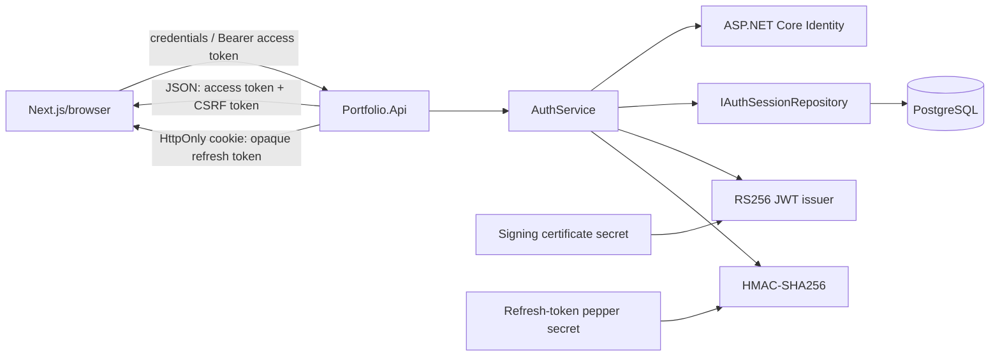
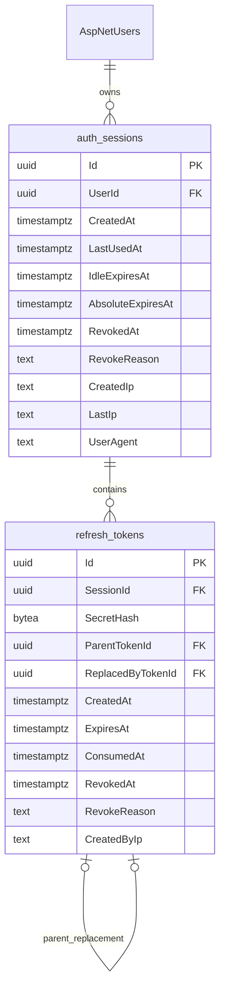

# Authentication Guide

Tài liệu này mô tả hệ thống xác thực hiện tại của CG03 AboutMe. ASP.NET Core là hệ thống duy nhất phát hành và xác thực token. Supabase chỉ cung cấp PostgreSQL và Storage; dự án không sử dụng Supabase Auth.

## 1. Tài khoản được lưu ở đâu?

Dự án dùng ASP.NET Core Identity. Vì vậy không có bảng `users` tự định nghĩa. Tài khoản, role và quan hệ role nằm trong các bảng Identity do EF Core migration quản lý:

- `AspNetUsers`: tài khoản, password hash, lockout, `AuthVersion`, `IsDisabled`;
- `AspNetRoles` và `AspNetUserRoles`: role và quan hệ user–role;
- `AspNetUserClaims`, `AspNetRoleClaims`, `AspNetUserLogins`, `AspNetUserTokens`: các bảng hỗ trợ chuẩn của Identity.

`ApplicationUser` kế thừa `IdentityUser<Guid>`. Password chỉ được lưu dưới dạng password hash do Identity tạo; API không tự hash hoặc lưu password thô.

Local setup có thể bootstrap một Admin khi `AdminBootstrap:Enabled=true`. Script `scripts/Setup-Local.ps1` hỏi email/password, lưu bằng .NET User Secrets và API tạo role/user khi khởi động sau khi database đã được migrate. Production phải provision credential qua secret store; không commit credential vào Git.

## 2. Kiến trúc token



### Access token

- JWT ký bằng RS256; header có `kid` để hỗ trợ xoay key.
- Thời hạn mặc định 10 phút.
- Chỉ trả trong JSON và frontend chỉ giữ trong memory.
- Claims bắt buộc: `iss`, `aud`, `sub`, `sid`, `jti`, `iat`, `nbf`, `exp`, `role`, `auth_version`.
- Không chứa password, phone, refresh token hoặc dữ liệu bí mật.
- Bearer validation bắt buộc signature, known `kid`, RS256, issuer, audience, type `JWT`, lifetime và các claim bắt buộc. Clock skew mặc định 30 giây.
- Sau bước cryptographic validation, API kiểm tra `sid`, trạng thái session/user và `auth_version` trong database. Cách này cho immediate session revocation nhưng đổi lại mỗi request authenticated cần một database read.

### Refresh token

Refresh token không phải JWT. Giá trị client nhận có dạng:

```text
{tokenId}.{secret}
```

`tokenId` là UUID selector. `secret` có 256 bit entropy từ `RandomNumberGenerator`. Database chỉ lưu HMAC-SHA256 của secret; pepper dùng để HMAC nằm trong secret configuration, không nằm trong database. Việc so sánh dùng constant-time comparison.

Cookie mặc định:

```text
Name: __Host-refresh
HttpOnly: true
Secure: true
Path: /
Domain: không đặt
SameSite: Lax (cấu hình được)
```

API đồng thời đặt signed double-submit cookie `__Host-csrf` với `Secure`, `Path=/`, cùng `SameSite` và không có `Domain`. Cookie CSRF cố ý không `HttpOnly` để frontend đọc rồi gửi lại bằng `X-CSRF-Token`; nó không phải authentication credential. Giá trị tương tự cũng có trong response login/refresh.

Idle lifetime mặc định 7 ngày và absolute lifetime 30 ngày. IP/User-Agent chỉ là audit/risk signal, không phải credential và không hard-bind session.

## 3. Database session model

`auth_sessions` đại diện cho một lần đăng nhập/browser session. `refresh_tokens` lưu chuỗi token đã rotate của session. Partial unique index PostgreSQL bảo đảm mỗi session chỉ có tối đa một token chưa consumed/revoked.



Không lưu raw refresh token hoặc full access token.

## 4. Login flow

```mermaid
sequenceDiagram
    participant FE as Next.js
    participant API as AuthController
    participant S as AuthService
    participant ID as ASP.NET Identity
    participant DB as PostgreSQL
    participant JWT as RS256 issuer

    FE->>API: POST /api/v1/auth/login + Origin
    API->>API: IP rate limit, model validation
    API->>S: Login(email, password, client context)
    S->>ID: Verify password, lockout, disabled, Admin role
    alt invalid account or password
        ID-->>S: failed
        S-->>API: generic authentication failure
        API-->>FE: 401 ProblemDetails
    else valid
        S->>DB: create auth_session + hashed refresh token
        S->>JWT: issue access token with sid/auth_version
        S-->>API: access + raw refresh + session-bound CSRF
        API-->>FE: Set-Cookie HttpOnly; JSON accessToken/expiresAt/csrfToken
    end
```

Responses của auth endpoints có `Cache-Control: no-store` và `Pragma: no-cache`. Login bị giới hạn theo IP bằng ASP.NET Core Rate Limiter; Identity lockout là account-specific credential limiter. Client luôn nhận thông báo credential chung để không lộ account tồn tại hay không.

## 5. Refresh rotation và replay detection

```mermaid
sequenceDiagram
    participant FE as Next.js
    participant API as AuthController
    participant S as AuthService
    participant DB as PostgreSQL

    FE->>API: POST /api/v1/auth/refresh + cookie + Origin + X-CSRF-Token
    API->>S: Refresh(raw cookie, CSRF, client context)
    S->>S: parse selector, hash secret, verify session-bound CSRF
    S->>DB: BEGIN; SELECT refresh token FOR UPDATE
    DB-->>S: token + session + user
    alt valid active token/session/user
        S->>DB: mark old ConsumedAt
        S->>DB: insert replacement; link parent/replacement
        S->>DB: update LastUsedAt/LastIp/IdleExpiresAt; COMMIT
        S-->>API: new access + refresh + CSRF
        API-->>FE: replace cookie; return JSON
    else consumed or revoked token reused
        S->>DB: revoke whole session and active token; COMMIT
        S-->>API: generic failure
        API-->>FE: delete cookie; 401 ProblemDetails
    else invalid/expired/revoked/disabled
        S->>DB: ROLLBACK or revoke as applicable
        S-->>API: generic failure
        API-->>FE: delete cookie; 401 ProblemDetails
    end
```

Row lock và transaction bảo đảm hai request dùng cùng một refresh token không thể cùng rotate thành công. Chính sách hiện tại là strict reuse detection, không có grace window: request thứ hai bị xem là replay và revoke toàn session. Frontend phải dùng single-flight refresh để tránh tự tạo replay khi nhiều API cùng trả 401.

## 6. Logout và quản lý session

- `POST /api/v1/auth/logout`: revoke session trong claim `sid`, revoke token active, xóa cookie; idempotent.
- `POST /api/v1/auth/logout-all`: revoke mọi session của current user, tăng `AuthVersion`, xóa cookie hiện tại.
- `GET /api/v1/auth/sessions`: chỉ trả session của current user; `isCurrent` dựa trên `sid`; không trả hash/token.
- `DELETE /api/v1/auth/sessions/{sessionId}`: query luôn scope theo current `UserId`, nên không thể revoke session của user khác.

Đổi/reset password, disable account hoặc đổi quyền nhạy cảm phải gọi cơ chế revoke-all/tăng `AuthVersion`. Các use case đó chưa có endpoint trong MVP; đây là invariant bắt buộc khi bổ sung chúng.

## 7. CSRF, Origin và CORS

Refresh token là cookie nên CORS không đủ để chống CSRF. Defense-in-depth hiện tại gồm:

- auth state changes chỉ dùng POST/DELETE;
- middleware so khớp chính xác header `Origin` với `Frontend:Origin`;
- refresh/logout/logout-all/revoke-session yêu cầu `X-CSRF-Token` HMAC gắn với `sid`;
- CORS chỉ allow configured frontend origin và cho phép credentials;
- không dùng wildcard origin cùng credentials.

Login cũng bắt buộc Origin để giảm login-CSRF. Nếu frontend/API thật sự cross-site, đặt `RefreshToken:CookieSameSite=None`; `Secure=true` luôn được giữ. Cùng site nên ưu tiên `Lax` hoặc `Strict`.

## 8. Contract frontend Next.js

Repository hiện không chứa frontend. Integration tối thiểu:

```ts
let accessToken: string | null = null;
let csrfToken: string | null = null;
let refreshFlight: Promise<void> | null = null;

function readCsrfCookie() {
  return document.cookie.split('; ')
    .find(value => value.startsWith('__Host-csrf='))
    ?.split('=', 2)[1] ?? null;
}

async function refreshOnce() {
  refreshFlight ??= axios.post('/api/v1/auth/refresh', undefined, {
    withCredentials: true,
    headers: { 'X-CSRF-Token': csrfToken ?? readCsrfCookie() ?? '' },
  }).then(({ data }) => {
    accessToken = data.accessToken;
    csrfToken = data.csrfToken;
  }).finally(() => { refreshFlight = null; });

  return refreshFlight;
}
```

Axios request interceptor gắn `Authorization: Bearer` từ memory. Response interceptor chỉ refresh khi 401, bỏ qua chính endpoint refresh, đánh dấu request đã retry và retry tối đa một lần. Không refresh khi 403. Refresh 401 thì xóa auth state và chuyển về login. Dùng `BroadcastChannel` để đồng bộ logout giữa tabs; không broadcast raw refresh token. Không lưu access token trong localStorage, sessionStorage, IndexedDB, Redux Persist hoặc JavaScript-readable cookie.

## 9. Configuration

```text
Jwt__Issuer=
Jwt__Audience=
Jwt__AccessTokenMinutes=10
Jwt__ClockSkewSeconds=30
Jwt__ActiveKeyId=
Jwt__SigningCertificatePath=
Jwt__SigningCertificatePassword=
Jwt__ValidationCertificatePaths__<kid>=

RefreshToken__IdleLifetimeDays=7
RefreshToken__AbsoluteLifetimeDays=30
RefreshToken__Pepper=
RefreshToken__CookieName=__Host-refresh
RefreshToken__CsrfCookieName=__Host-csrf
RefreshToken__CookieSameSite=Lax

Frontend__Origin=
RateLimit__Auth__LoginPermitLimit=5
RateLimit__Auth__RefreshPermitLimit=30
RateLimit__Auth__WindowSeconds=60
```

Không đặt private-key certificate, certificate password hoặc pepper thật trong `appsettings.json`. Local setup lưu chúng trong User Secrets và `.secrets/` đã được gitignore. Production dùng environment variables, mounted secret hoặc secret manager.

`appsettings.Development.json` và `appsettings.Production.json` chỉ chứa lifetime, cookie policy và rate-limit không bí mật. `Frontend:Origin`, certificate path/password và pepper production vẫn phải được deployment inject. Nếu frontend/API là cross-site thật sự, override production `RefreshToken__CookieSameSite=None`; nếu cùng site, giữ `Lax` hoặc chuyển `Strict` sau khi kiểm thử luồng điều hướng.

## 10. Local setup và migration

```powershell
.\scripts\Setup-Local.ps1
dotnet ef database update --project src\Portfolio.Infrastructure --startup-project src\Portfolio.Api
dotnet run --project src\Portfolio.Api
```

Script tạo RSA development certificate, random certificate password, random refresh pepper và tùy chọn bootstrap Admin. Không dùng certificate development trong production.

## 11. Production key rotation

1. Tạo RSA certificate mới trong secret infrastructure.
2. Mount certificate public/private mới và chọn `Jwt:ActiveKeyId` mới.
3. Giữ public certificate của key cũ trong `Jwt:ValidationCertificatePaths:<old-kid>` ít nhất bằng maximum access-token lifetime cộng clock skew.
4. Deploy và xác minh token mới mang `kid` mới, token chưa hết hạn với `kid` cũ vẫn validate.
5. Sau cửa sổ trên, bỏ validation certificate cũ và deploy lại.

Không cho phép JWT header tự cung cấp `jku`/`x5u`; server chỉ resolve key từ key ring cấu hình cục bộ.

## 12. Production deployment checklist

- Inject connection string, `Frontend:Origin`, refresh pepper và RSA PFX/password bằng secret store hoặc mounted secret; không bake vào image.
- Xác nhận production frontend/API là same-site hay cross-site rồi đặt `CookieSameSite`; `None` luôn đi cùng `Secure=true`.
- Terminate TLS an toàn, giữ `UseHttpsRedirection`/HSTS và cấu hình trusted forwarded headers/proxy ở deployment boundary.
- Áp dụng migration `20260906132748_AddRefreshTokenSessions` sau backup và kiểm tra migration history.
- Đặt `BootstrapAdmin:Enabled=false` sau provisioning.
- Xác minh CORS chỉ có production frontend origin và credentialed preflight thành công; không wildcard.
- Xác minh reverse proxy/log collector redact `Authorization`, `Cookie`, password và response token body.
- Chạy health checks, login/refresh/logout smoke test và xác nhận cookie attributes trên HTTPS thật.
- Ghi ngày hết hạn certificate và chuẩn bị validation certificate cũ trước mỗi lần key rotation.

## 13. Security operations và giới hạn còn lại

Security events được ghi cho login success/failure, refresh success/reuse, logout, logout-all và session revoke. Log chỉ chứa ID/context an toàn; không ghi password, Authorization header, cookie, raw token hay full token hash.

Production cần HTTPS và HSTS. Admin nên được bảo vệ thêm bằng MFA/WebAuthn trong phase sau. Việc kiểm tra session database trên mỗi authenticated request ưu tiên immediate revocation và đơn giản vận hành; nếu tải tăng, có thể cache trạng thái session/auth-version ngắn hạn, nhưng phải đánh giá cửa sổ revocation và cache invalidation trước khi thay đổi.
