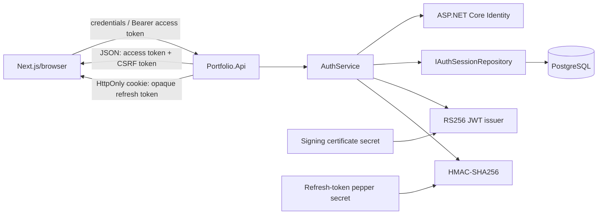
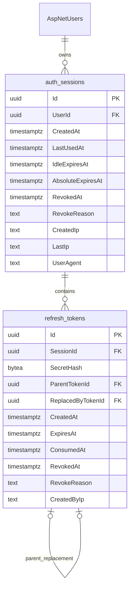
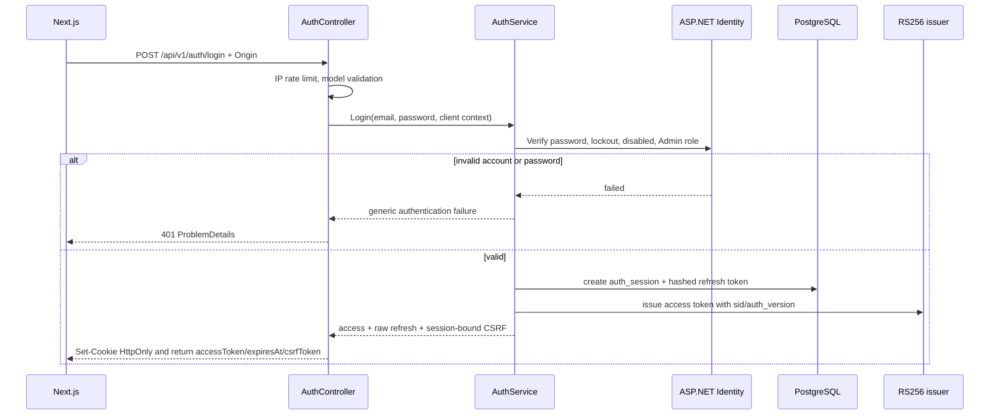
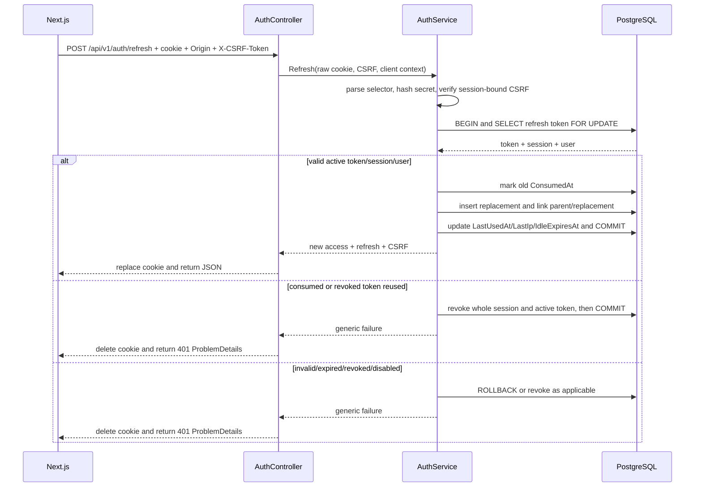
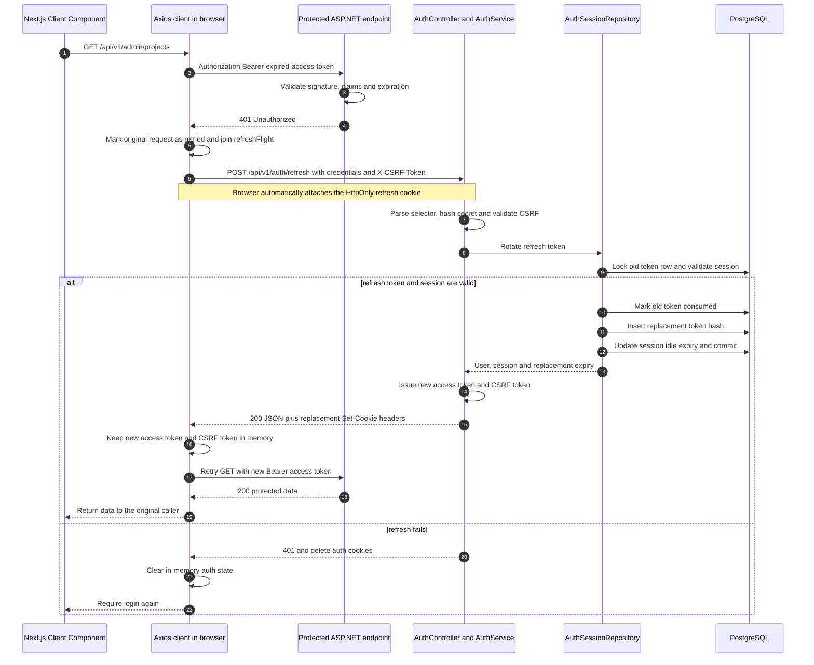

# Authentication Guide

Tài liệu này mô tả hệ thống xác thực hiện tại của CG03 AboutMe. ASP.NET Core là hệ thống duy nhất phát hành và xác thực token. Supabase chỉ cung cấp PostgreSQL và Storage; dự án không sử dụng Supabase Auth.

## 1. Tài khoản được lưu ở đâu?

Dự án dùng ASP.NET Core Identity. Vì vậy không có bảng `users` tự định nghĩa. Tài khoản, role và quan hệ role nằm trong các bảng Identity do EF Core migration quản lý:

- `AspNetUsers`: tài khoản, password hash, lockout, `AuthVersion`, `IsDisabled`;
- `AspNetRoles` và `AspNetUserRoles`: role và quan hệ user–role;
- `AspNetUserClaims`, `AspNetRoleClaims`, `AspNetUserLogins`, `AspNetUserTokens`: các bảng hỗ trợ chuẩn của Identity.

`ApplicationUser` kế thừa `IdentityUser<Guid>`. Password chỉ được lưu dưới dạng password hash do Identity tạo; API không tự hash hoặc lưu password thô.

Local setup có thể bootstrap một Admin khi `AdminBootstrap:Enabled=true`. Script `scripts/Setup-Local.ps1` hỏi email/password, lưu bằng .NET User Secrets và API tạo role/user khi khởi động sau khi database đã được migrate. Production phải provision credential qua secret store; không commit credential vào Git.

## 2. Kiến trúc token



### Access token

- JWT ký bằng RS256; header có `kid` để hỗ trợ xoay key.
- Thời hạn mặc định 10 phút.
- Chỉ trả trong JSON và frontend chỉ giữ trong memory.
- Claims bắt buộc: `iss`, `aud`, `sub`, `sid`, `jti`, `iat`, `nbf`, `exp`, `role`, `auth_version`.
- Không chứa password, phone, refresh token hoặc dữ liệu bí mật.
- Bearer validation bắt buộc signature, known `kid`, RS256, issuer, audience, type `JWT`, lifetime và các claim bắt buộc. Clock skew mặc định 30 giây.
- Sau bước cryptographic validation, API kiểm tra `sid`, trạng thái session/user và `auth_version` trong database. Cách này cho immediate session revocation nhưng đổi lại mỗi request authenticated cần một database read.

### Refresh token

Refresh token không phải JWT. Giá trị client nhận có dạng:

```text
{tokenId}.{secret}
```

`tokenId` là UUID selector. `secret` có 256 bit entropy từ `RandomNumberGenerator`. Database chỉ lưu HMAC-SHA256 của secret; pepper dùng để HMAC nằm trong secret configuration, không nằm trong database. Việc so sánh dùng constant-time comparison.

Cookie mặc định:

```text
Name: __Host-refresh
HttpOnly: true
Secure: true
Path: /
Domain: không đặt
SameSite: Lax (cấu hình được)
```

API đồng thời đặt signed double-submit cookie `__Host-csrf` với `Secure`, `Path=/`, cùng `SameSite` và không có `Domain`. Cookie CSRF cố ý không `HttpOnly` để frontend đọc rồi gửi lại bằng `X-CSRF-Token`; nó không phải authentication credential. Giá trị tương tự cũng có trong response login/refresh.

Idle lifetime mặc định 7 ngày và absolute lifetime 30 ngày. IP/User-Agent chỉ là audit/risk signal, không phải credential và không hard-bind session.

## 3. Database session model

`auth_sessions` đại diện cho một lần đăng nhập/browser session. `refresh_tokens` lưu chuỗi token đã rotate của session. Partial unique index PostgreSQL bảo đảm mỗi session chỉ có tối đa một token chưa consumed/revoked.



Không lưu raw refresh token hoặc full access token.

## 4. Login flow



Responses của auth endpoints có `Cache-Control: no-store` và `Pragma: no-cache`. Login bị giới hạn theo IP bằng ASP.NET Core Rate Limiter; Identity lockout là account-specific credential limiter. Client luôn nhận thông báo credential chung để không lộ account tồn tại hay không.

## 5. Refresh rotation và replay detection



Row lock và transaction bảo đảm hai request dùng cùng một refresh token không thể cùng rotate thành công. Chính sách hiện tại là strict reuse detection, không có grace window: request thứ hai bị xem là replay và revoke toàn session. Frontend phải dùng single-flight refresh để tránh tự tạo replay khi nhiều API cùng trả 401.

### 5.1 Ví dụ end-to-end khi access token hết hạn

Điểm quan trọng nhất: protected endpoint **không tự gọi** `POST /api/v1/auth/refresh`. JWT Bearer middleware của ASP.NET Core chỉ kiểm tra access token và trả `401` khi token hết hạn hoặc không hợp lệ. HTTP client chạy trong browser của Next.js nhận `401`, chủ động gọi refresh endpoint, lưu access token mới trong memory rồi gửi lại request ban đầu đúng một lần.



Các thành phần trong luồng:

| Thành phần | Trách nhiệm |
| --- | --- |
| Next.js Client Component | Gọi hàm API và hiển thị loading, data hoặc trạng thái hết phiên. Component không tự xử lý rotation. |
| Axios client | Gắn access token, nhận `401`, điều phối một refresh request duy nhất và retry request ban đầu. |
| JWT Bearer middleware | Xác minh chữ ký RS256, `kid`, issuer, audience, lifetime và claims của access token. Sau đó hệ thống còn kiểm tra `sid` và `auth_version` trong database. |
| `AuthController` | Đọc refresh cookie và CSRF header, gọi `AuthService`, ghi cookie thay thế và trả response không được cache. |
| `AuthService` | Xác thực CSRF, tạo token thay thế, yêu cầu repository rotate và phát access token mới. |
| `AuthSessionRepository` | Dùng transaction và `SELECT ... FOR UPDATE` để chỉ một rotation có thể xử lý token cũ. |
| PostgreSQL | Lưu session, hash của refresh token cũ/mới và quan hệ parent/replacement. Không lưu raw refresh token. |

#### Request đầu tiên thất bại như thế nào?

Browser gửi access token trong header:

```http
GET /api/v1/admin/projects HTTP/1.1
Host: api.example.com
Authorization: Bearer <expired-access-token>
```

Khi access token đã hết hạn, API trả `401 Unauthorized`. `401` có nghĩa là thiếu hoặc không còn authentication hợp lệ. `403 Forbidden` có nghĩa là token đã hợp lệ nhưng user không đủ quyền, vì vậy client **không được refresh khi gặp `403`**.

#### Client gọi refresh endpoint như thế nào?

Client JavaScript không đọc được `__Host-refresh` vì cookie có `HttpOnly`. Client chỉ cần gọi endpoint với `withCredentials: true`; browser tự gắn cookie vào request nếu origin, `SameSite`, `Secure`, CORS và cookie scope đều hợp lệ.

```http
POST /api/v1/auth/refresh HTTP/1.1
Host: api.example.com
Origin: https://portfolio.example.com
Cookie: __Host-refresh=<opaque-token>; __Host-csrf=<signed-csrf-token>
X-CSRF-Token: <same-session-bound-csrf-token>
Content-Length: 0
```

Refresh request:

- không có JSON body;
- không cần access token còn hạn;
- bắt buộc refresh cookie, exact `Origin` và `X-CSRF-Token`;
- bị rate limit;
- phải dùng HTTPS trong production.

`__Host-csrf` cố ý không có `HttpOnly`, nên client có thể đọc cookie này và copy giá trị sang `X-CSRF-Token`. Client cũng có thể giữ `csrfToken` trả về từ login/refresh trong memory. Header và signed token phải thuộc đúng `sid` của session.

#### Server rotate refresh token trong database như thế nào?

Trong một PostgreSQL transaction, repository thực hiện các bước sau:

1. Dùng UUID selector trong raw token để tìm row và khóa row bằng `FOR UPDATE`.
2. Hash phần secret bằng HMAC-SHA256 với server-side pepper rồi so sánh constant-time với hash trong database.
3. Kiểm tra token chưa consumed/revoked/expired, session chưa revoked/expired và user chưa disabled/lockout.
4. Đặt `ConsumedAt` cho token cũ.
5. Tạo raw refresh token hoàn toàn mới, nhưng chỉ lưu hash của secret mới vào row mới.
6. Liên kết row cũ và mới bằng `ParentTokenId`/`ReplacedByTokenId`.
7. Cập nhật `LastUsedAt`, `LastIp`, `IdleExpiresAt` và commit.
8. Phát access token và CSRF token mới.

Sau rotation thành công, trạng thái khái niệm trong database là:

| Dữ liệu | Sau refresh |
| --- | --- |
| Refresh token cũ | Vẫn giữ để phát hiện replay, có `ConsumedAt` và trỏ tới token thay thế. |
| Refresh token mới | Có selector/hash mới, trỏ về token cha và là token active duy nhất của session. |
| Raw refresh token mới | Chỉ được gửi bằng `Set-Cookie`; không xuất hiện trong JSON và không được lưu raw trong database. |
| Access token mới | JWT mới có lifetime mặc định 10 phút, trả trong JSON để browser giữ trong memory. |
| Session | Giữ nguyên `Id` và `AbsoluteExpiresAt`, đồng thời cập nhật hoạt động gần nhất và idle expiry. |

#### “Thời hạn refresh token không đổi” được hiểu thế nào?

Implementation hiện tại không copy nguyên `ExpiresAt` của token cũ và cũng không cấp lại một session 30 ngày mới. Nó tính:

```text
replacement.ExpiresAt = min(now + IdleLifetime, session.AbsoluteExpiresAt)
```

Với cấu hình mặc định, mỗi lần dùng hợp lệ có thể đẩy idle expiry tới 7 ngày kể từ thời điểm refresh, nhưng không bao giờ vượt `AbsoluteExpiresAt` là 30 ngày kể từ lần login ban đầu. Vì vậy:

- idle window có thể trượt;
- mốc sống tối đa của session không đổi;
- refresh không thể giữ user đăng nhập vô hạn.

#### Response refresh thành công

```http
HTTP/1.1 200 OK
Cache-Control: no-store
Pragma: no-cache
Set-Cookie: __Host-refresh=<new-opaque-token>; HttpOnly; Secure; Path=/; SameSite=Lax
Set-Cookie: __Host-csrf=<new-csrf-token>; Secure; Path=/; SameSite=Lax
Content-Type: application/json

{
  "data": {
    "accessToken": "<new-jwt>",
    "tokenType": "Bearer",
    "expiresAt": "2026-09-08T10:10:00Z",
    "csrfToken": "<new-session-bound-token>"
  },
  "message": "Token refreshed.",
  "meta": null
}
```

Browser tự thay cookie cũ bằng cookie mới từ `Set-Cookie`. Axios lấy `response.data.data.accessToken`, cập nhật memory rồi gọi lại request ban đầu với `Authorization: Bearer <new-jwt>`.

## 6. Logout và quản lý session

- `POST /api/v1/auth/logout`: revoke session trong claim `sid`, revoke token active, xóa cookie; idempotent.
- `POST /api/v1/auth/logout-all`: revoke mọi session của current user, tăng `AuthVersion`, xóa cookie hiện tại.
- `GET /api/v1/auth/sessions`: chỉ trả session của current user; `isCurrent` dựa trên `sid`; không trả hash/token.
- `DELETE /api/v1/auth/sessions/{sessionId}`: query luôn scope theo current `UserId`, nên không thể revoke session của user khác.

Đổi/reset password, disable account hoặc đổi quyền nhạy cảm phải gọi cơ chế revoke-all/tăng `AuthVersion`. Các use case đó chưa có endpoint trong MVP; đây là invariant bắt buộc khi bổ sung chúng.

## 7. CSRF, Origin và CORS

Refresh token là cookie nên CORS không đủ để chống CSRF. Defense-in-depth hiện tại gồm:

- auth state changes chỉ dùng POST/DELETE;
- middleware so khớp chính xác header `Origin` với một entry trong `Frontend:Origins`;
- refresh/logout/logout-all/revoke-session yêu cầu `X-CSRF-Token` HMAC gắn với `sid`;
- CORS chỉ allow configured frontend origin và cho phép credentials;
- không dùng wildcard origin cùng credentials.

Login cũng bắt buộc Origin để giảm login-CSRF. Nếu frontend/API thật sự cross-site, đặt `RefreshToken:CookieSameSite=None`; `Secure=true` luôn được giữ. Cùng site nên ưu tiên `Lax` hoặc `Strict`.

## 8. Contract frontend Next.js

Repository hiện không chứa frontend. Contract hiện tại được thiết kế cho **code chạy trong browser của Next.js gọi thẳng ASP.NET API**. Nên đặt HTTP client sau trong module client-only và chỉ dùng nó từ Client Components.

```ts
"use client";

import axios, {
  AxiosError,
  type InternalAxiosRequestConfig,
} from "axios";

type ApiResponse<T> = {
  data: T;
  message: string | null;
  meta: unknown;
};

type LoginResponse = {
  accessToken: string;
  tokenType: "Bearer";
  expiresAt: string;
  csrfToken: string;
};

type RetryableRequest = InternalAxiosRequestConfig & {
  _retry?: boolean;
};

const baseURL = process.env.NEXT_PUBLIC_API_URL + "/api/v1";

export const api = axios.create({
  baseURL,
  withCredentials: true,
});

// Tách client refresh để lỗi của chính /auth/refresh không đi vào interceptor retry.
const refreshClient = axios.create({
  baseURL,
  withCredentials: true,
});

let accessToken: string | null = null;
let csrfToken: string | null = null;
let refreshFlight: Promise<void> | null = null;

function readCookie(name: string): string | null {
  const prefix = `${name}=`;
  const value = document.cookie
    .split("; ")
    .find((part) => part.startsWith(prefix));

  return value ? decodeURIComponent(value.slice(prefix.length)) : null;
}

export function acceptLogin(response: LoginResponse): void {
  accessToken = response.accessToken;
  csrfToken = response.csrfToken;
}

function clearAuthentication(): void {
  accessToken = null;
  csrfToken = null;
}

async function refreshOnce(): Promise<void> {
  if (!refreshFlight) {
    refreshFlight = refreshClient
      .post<ApiResponse<LoginResponse>>("/auth/refresh", undefined, {
        headers: {
          "X-CSRF-Token": csrfToken ?? readCookie("__Host-csrf") ?? "",
        },
      })
      .then((response) => {
        // API dùng envelope nên payload thật nằm ở response.data.data.
        accessToken = response.data.data.accessToken;
        csrfToken = response.data.data.csrfToken;
      })
      .finally(() => {
        refreshFlight = null;
      });
  }

  return refreshFlight;
}

api.interceptors.request.use((config) => {
  if (accessToken) {
    config.headers.Authorization = `Bearer ${accessToken}`;
  }

  return config;
});

api.interceptors.response.use(
  (response) => response,
  async (error: AxiosError) => {
    const original = error.config as RetryableRequest | undefined;

    if (!original || error.response?.status !== 401 || original._retry) {
      return Promise.reject(error);
    }

    original._retry = true;

    try {
      await refreshOnce();
      return api(original);
    } catch (refreshError) {
      clearAuthentication();
      // App có thể redirect về /login hoặc cập nhật auth context tại đây.
      return Promise.reject(refreshError);
    }
  },
);
```

Ví dụ gọi từ Client Component:

```tsx
"use client";

import { api } from "@/lib/api-client";

export async function loadProjects() {
  const response = await api.get("/admin/projects");
  return response.data.data;
}
```

Khi năm component cùng nhận `401` gần như đồng thời, cả năm đều gọi `refreshOnce()`, nhưng chúng nhận cùng một `refreshFlight`. Chỉ request đầu tiên thực sự gửi `/auth/refresh`; các request còn lại chờ cùng promise rồi retry bằng access token mới. Điều này đặc biệt quan trọng vì backend dùng strict reuse detection.

Các quy tắc production cho client:

- chỉ refresh khi nhận `401`, không refresh khi nhận `403`;
- đánh dấu `_retry` và retry request gốc tối đa một lần để tránh vòng lặp vô hạn;
- dùng một HTTP client riêng cho refresh để refresh failure không tự kích hoạt refresh lần nữa;
- luôn bật `withCredentials: true` khi browser và API khác origin;
- không tự set header `Origin`; browser quản lý header này;
- giữ access token và CSRF token trong memory, không lưu access token trong localStorage, sessionStorage, IndexedDB, Redux Persist hoặc JavaScript-readable cookie;
- không đọc, log, broadcast hoặc đưa raw refresh token vào JavaScript;
- khi refresh trả `401`, xóa auth state và yêu cầu login lại;
- khi refresh trả `403`, kiểm tra Origin/CSRF configuration thay vì retry;
- khi refresh trả `429`, áp dụng backoff và không tạo thêm refresh request song song;
- hủy hoặc bỏ qua retry nếu request gốc không còn cần thiết do user đã chuyển trang hoặc logout.

### 8.1 Nhiều tab browser

Biến `refreshFlight` chỉ chống race trong cùng một JavaScript runtime. Hai tab có hai biến khác nhau và có thể cùng rotate một cookie. Nếu ứng dụng cần hỗ trợ nhiều tab ổn định, phải điều phối refresh ở cấp origin bằng Web Locks, SharedWorker hoặc một BFF duy nhất. `BroadcastChannel` có thể dùng để đồng bộ logout/trạng thái, nhưng tuyệt đối không broadcast raw refresh token.

### 8.2 Next.js Server Components và BFF

Không dùng biến module-level `accessToken` ở Next.js server. Server process phục vụ nhiều user, nên state dùng chung có thể làm lẫn token giữa request hoặc giữa người dùng.

Với contract hiện tại, hướng đơn giản nhất là Client Component gọi thẳng API như ví dụ trên. Nếu muốn SSR hoặc mô hình Backend-for-Frontend:

1. Browser gọi Next.js Route Handler thay vì gọi ASP.NET API trực tiếp.
2. Next.js phải quản lý session/cookie theo từng browser request và forward cookie có chủ đích.
3. Next.js phải chuyển các `Set-Cookie` mới từ ASP.NET response về browser.
4. Không được biến refresh token thành JSON hoặc expose nó cho Client Component.
5. Cần threat-model và test riêng cho CSRF, cookie domain, reverse proxy và nhiều instance Next.js.

Đó là một kiến trúc khác với direct-browser contract hiện tại, không chỉ là đổi URL Axios. Không triển khai BFF nửa vời bằng cách lưu token vào biến global của Next.js server.

## 9. Configuration

```text
Jwt__Issuer=
Jwt__Audience=
Jwt__AccessTokenMinutes=10
Jwt__ClockSkewSeconds=30
Jwt__ActiveKeyId=
Jwt__SigningCertificatePath=
Jwt__SigningCertificatePassword=
Jwt__ValidationCertificatePaths__<kid>=

RefreshToken__IdleLifetimeDays=7
RefreshToken__AbsoluteLifetimeDays=30
RefreshToken__Pepper=
RefreshToken__CookieName=__Host-refresh
RefreshToken__CsrfCookieName=__Host-csrf
RefreshToken__CookieSameSite=Lax

Frontend__Origins__0=https://portfolio.example.com
RateLimit__Auth__LoginPermitLimit=5
RateLimit__Auth__RefreshPermitLimit=30
RateLimit__Auth__WindowSeconds=60
```

Không đặt private-key certificate, certificate password hoặc pepper thật trong `appsettings.json`. Local setup lưu chúng trong User Secrets và `.secrets/` đã được gitignore. Production dùng environment variables, mounted secret hoặc secret manager.

`appsettings.Development.json` cho phép sẵn Next.js `http://localhost:3000`, IIS Express Swagger `https://localhost:44313` và Kestrel Swagger `https://localhost:7097`. Có thể thêm origin bằng các index kế tiếp như `Frontend__Origins__3=https://localhost:other-port`, sau đó restart API vì options được bind khi startup. Nếu thêm vào file `.env`, phải chạy `Setup-Local.ps1 -NonInteractive -SyncUserSecrets` trước khi restart vì `dotnet run` không tự đọc `.env`; nếu IDE/Docker đã inject environment variables thật thì chỉ cần restart process. Production chỉ inject các origin thật sự tin cậy và không mang localhost allowlist sang production. Certificate path/password và pepper production vẫn phải được deployment inject. Nếu frontend/API là cross-site thật sự, override production `RefreshToken__CookieSameSite=None`; nếu cùng site, giữ `Lax` hoặc chuyển `Strict` sau khi kiểm thử luồng điều hướng.

## 10. Local setup và migration

```powershell
.\scripts\Setup-Local.ps1
dotnet ef database update --project src\Portfolio.Infrastructure --startup-project src\Portfolio.Api
dotnet run --project src\Portfolio.Api
```

Script tạo RSA development certificate, random certificate password, random refresh pepper và tùy chọn bootstrap Admin. Không dùng certificate development trong production.

## 11. Production key rotation

1. Tạo RSA certificate mới trong secret infrastructure.
2. Mount certificate public/private mới và chọn `Jwt:ActiveKeyId` mới.
3. Giữ public certificate của key cũ trong `Jwt:ValidationCertificatePaths:<old-kid>` ít nhất bằng maximum access-token lifetime cộng clock skew.
4. Deploy và xác minh token mới mang `kid` mới, token chưa hết hạn với `kid` cũ vẫn validate.
5. Sau cửa sổ trên, bỏ validation certificate cũ và deploy lại.

Không cho phép JWT header tự cung cấp `jku`/`x5u`; server chỉ resolve key từ key ring cấu hình cục bộ.

## 12. Production deployment checklist

- Inject connection string, `Frontend:Origins`, refresh pepper và RSA PFX/password bằng secret store hoặc mounted secret; không bake vào image.
- Xác nhận production frontend/API là same-site hay cross-site rồi đặt `CookieSameSite`; `None` luôn đi cùng `Secure=true`.
- Terminate TLS an toàn, giữ `UseHttpsRedirection`/HSTS và cấu hình trusted forwarded headers/proxy ở deployment boundary.
- Áp dụng migration `20260906132748_AddRefreshTokenSessions` sau backup và kiểm tra migration history.
- Đặt `BootstrapAdmin:Enabled=false` sau provisioning.
- Xác minh CORS chỉ có production frontend origin và credentialed preflight thành công; không wildcard.
- Xác minh reverse proxy/log collector redact `Authorization`, `Cookie`, password và response token body.
- Chạy health checks, login/refresh/logout smoke test và xác nhận cookie attributes trên HTTPS thật.
- Ghi ngày hết hạn certificate và chuẩn bị validation certificate cũ trước mỗi lần key rotation.

## 13. Security operations và giới hạn còn lại

Security events được ghi cho login success/failure, refresh success/reuse, logout, logout-all và session revoke. Log chỉ chứa ID/context an toàn; không ghi password, Authorization header, cookie, raw token hay full token hash.

Production cần HTTPS và HSTS. Admin nên được bảo vệ thêm bằng MFA/WebAuthn trong phase sau. Việc kiểm tra session database trên mỗi authenticated request ưu tiên immediate revocation và đơn giản vận hành; nếu tải tăng, có thể cache trạng thái session/auth-version ngắn hạn, nhưng phải đánh giá cửa sổ revocation và cache invalidation trước khi thay đổi.
